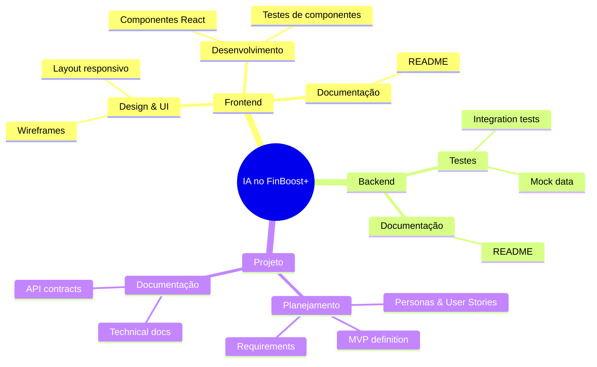

# Desenvolvimento com Inteligência Artificial - FinBoost+

Esta seção documenta o uso responsável e transparente de ferramentas de Inteligência Artificial durante o desenvolvimento do projeto FinBoost+.

---

## Objetivo da Documentação

Garantir transparência sobre como e quando ferramentas de IA foram utilizadas como auxiliares no desenvolvimento, seguindo as melhores práticas da indústria e requisitos acadêmicos.

---

## Mini Guia

Durante o desenvolvimento deste projeto, foram utilizadas ferramentas de IA para apoiar o planejamento, organização e metodologias ágeis. O mini guia criado reúne perguntas, respostas e aprendizados organizados durante o desenvolvimento de um projeto fullstack real, servindo como referência prática para iniciantes.

**Conteúdo do Mini Guia:**
- Definição de escopo e criação de personas
- Organização de equipes e uso de metodologias ágeis
- Estruturação de MVP e requisitos
- Templates de personas e user stories

**Links:**
- Repositório: https://github.com/Alan-oliveir/mini-guia-fullstack
- Site: alan-oliveir.github.io/mini-guia-fullstack/

---

## Princípios do Uso de IA

**Práticas Adotadas:**
- Transparência: todo uso de IA é documentado
- Responsabilidade: decisões finais são dos desenvolvedores
- Revisão: todo código gerado é revisado e testado
- Aprendizado: IA como ferramenta de capacitação

**Práticas Não Adotadas:**
- Não copiar código sem entendimento
- Não submeter trabalho puramente gerado por IA
- Não ocultar o uso de ferramentas auxiliares
- Não delegar decisões críticas para IA

---

## Ferramentas Utilizadas

| Ferramenta | Fornecedor | Uso Principal |
|------------|------------|---------------|
| **ChatGPT** | OpenAI | Geração de código, definição de escopo, naming |
| **Claude** | Anthropic | Design, paletas de cores, arquitetura |
| **DeepSeek** | DeepSeek | Estado, persistência, mocks, contratos |
| **GitHub Copilot** | Microsoft | Autocomplete, testes, configurações |
| **Stitch** | Stitch AI | Wireframes e sugestões de design |

---

## **Áreas de Aplicação**

---

## **Benefícios Alcançados**

### **Para o Projeto**
- **Aceleração do desenvolvimento** - Redução de 30-40% no tempo de tarefas repetitivas
- **Qualidade do código** - Sugestões de boas práticas e padrões
- **Documentação rica** - Geração estruturada de docs técnicas
- **Design consistente** - Paletas e layouts profissionais

### **Para a Equipe**
- **Produtividade aumentada** - Foco em lógica de negócio
- **Capacitação técnica** - Conhecimento de ferramentas modernas

---

## **Metodologia de Trabalho**

### **1. Geração com IA**
- Prompt claro e contextualizado
- Especificação de requisitos técnicos
- Solicitação de múltiplas alternativas

### **2. Revisão Humana**
- Análise crítica do código gerado
- Verificação de boas práticas
- Adaptação ao contexto do projeto

### **3. Teste e Validação**
- Execução de testes unitários
- Validação em ambiente local
- Verificação de integração

### **4. Documentação**
- Registro do prompt utilizado
- Justificativa da escolha
- Impacto no projeto

---

## Áreas de Aplicação

- Frontend: design, wireframes, componentes React, testes, documentação
- Backend: testes, mock data, documentação
- Projeto: planejamento, definição de MVP, personas, user stories, requisitos, documentação técnica e contratos de API

---

## Benefícios Alcançados

**Para o Projeto:**
- Aceleração do desenvolvimento
- Melhoria na qualidade do código
- Apoio na documentação técnica
- Facilidade na prototipação de interfaces

**Para a Equipe:**
- Aprendizado contínuo
- Redução de dúvidas técnicas
- Melhoria na organização do trabalho

---

## Considerações Finais

O uso de IA foi realizado de forma ética, transparente e responsável, sempre com revisão humana e foco no aprendizado da equipe. Todas as contribuições geradas por IA foram validadas e adaptadas conforme as necessidades do projeto.
