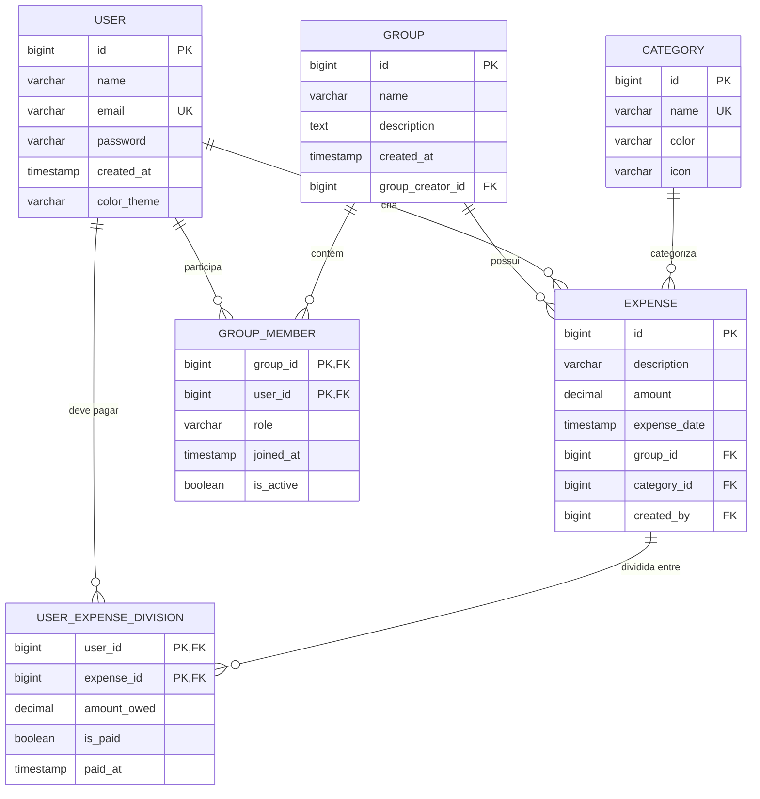

# Modelos e Schemas - Backend FinBoost+

## Visão Geral

O modelo de dados do FinBoost+ é baseado em **Domain Driven Design (DDD)** e implementado com **JPA/Hibernate**. O esquema relacional suporta gestão de usuários, grupos financeiros, despesas compartilhadas e divisões automáticas entre membros.

!!! info "Arquitetura do Domínio"
**Entidades Principais:** User, Group, Expense, Category, Role  
**Relacionamentos:** GroupMember, UserExpenseDivision  
**Padrões:** JPA Auditing, Bean Validation, Lazy Loading

## Diagrama de Relacionamentos



## Entidades Principais

### User (Usuário)

Representa os usuários do sistema com autenticação e autorização.

=== "Entidade"
    ```java
    @Entity
    @Table(name = "users")
    @Data
    @NoArgsConstructor
    @AllArgsConstructor
    @Builder
    public class User implements UserDetails {
    
            @Id
            @GeneratedValue(strategy = GenerationType.IDENTITY)
            private Long id;
            
            @Column(name = "user_name", nullable = false, length = 100)
            @Size(min = 2, max = 100)
            private String name;
            
            @Column(name = "e_mail", nullable = false, unique = true, length = 150)
            @Email
            private String email;
            
            @Column(nullable = false)
            private String password;
            
            @CreationTimestamp
            @Column(name = "created_at", nullable = false)
            private Instant createdAt;
            
            @Column(name = "color_theme", nullable = false, length = 20)
            @Builder.Default
            private String colorTheme = "light";
            
            // Relacionamentos
            @ManyToMany(fetch = FetchType.EAGER)
            @JoinTable(name = "users_roles",
                       joinColumns = @JoinColumn(name = "user_id"),
                       inverseJoinColumns = @JoinColumn(name = "role_id"))
            @Builder.Default
            private Set<Role> roles = new HashSet<>();
            
            @OneToMany(mappedBy = "user", cascade = CascadeType.ALL)
            private Set<GroupMember> groupMemberships = new HashSet<>();
            
            // UserDetails implementation
            @Override
            public Collection<? extends GrantedAuthority> getAuthorities() {
                return roles.stream()
                    .map(role -> new SimpleGrantedAuthority("ROLE_" + role.getName()))
                    .collect(Collectors.toSet());
            }
            
            @Override
            public String getUsername() { return email; }
        }
    ```

=== "Campos & Relacionamentos"
    **Campos:**

    - `id`: Identificador único (BIGINT, AUTO_INCREMENT)
    - `name`: Nome completo (VARCHAR 100, NOT NULL)
    - `email`: Email único para login (VARCHAR 150, UNIQUE)
    - `password`: Hash BCrypt da senha
    - `createdAt`: Data de criação (TIMESTAMP)
    - `colorTheme`: Tema preferido (light/dark/auto)
    
    **Relacionamentos:**

    - **N:N** com `Role` através de `users_roles`
    - **1:N** com `GroupMember` (participa de vários grupos)
    - **1:N** com `Expense` (cria várias despesas)

### Group (Grupo Financeiro)

Representa grupos financeiros compartilhados entre usuários.

```java
@Entity
@Table(name = "tb_group")
@Data
@NoArgsConstructor
@AllArgsConstructor
@Builder
@EntityListeners(AuditingEntityListener.class)
public class Group {
    
    @Id
    @GeneratedValue(strategy = GenerationType.SEQUENCE, generator = "seq_group")
    private Long id;
    
    @Column(nullable = false, length = 100)
    @Size(min = 2, max = 100)
    private String name;
    
    @Column(columnDefinition = "TEXT")
    @Size(max = 500)
    private String description;
    
    @CreatedDate
    @Column(name = "created_at")
    private LocalDateTime createdAt;
    
    @Column(name = "group_creator_id", nullable = false)
    private Long groupCreatorId;
    
    // Relacionamentos
    @OneToMany(mappedBy = "group", cascade = CascadeType.ALL, orphanRemoval = true)
    private Set<GroupMember> members = new HashSet<>();
    
    @OneToMany(mappedBy = "group", cascade = CascadeType.ALL, orphanRemoval = true)
    private Set<Expense> expenses = new HashSet<>();
    
    // Métodos de negócio
    public void addMember(User user, MemberRole role) {
        var membership = GroupMember.builder()
            .group(this)
            .user(user)
            .role(role)
            .joinedAt(LocalDateTime.now())
            .isActive(true)
            .build();
        members.add(membership);
    }
    
    public boolean isUserAdmin(Long userId) {
        return members.stream()
            .anyMatch(member -> member.getUser().getId().equals(userId)
                            && MemberRole.ADMIN.equals(member.getRole())
                            && member.getIsActive());
    }
}
```

### Expense (Despesa)

Representa despesas registradas nos grupos com divisão automática.

=== "Entidade Principal"
    ```java
    @Entity
    @Table(name = "expenses")
    @Data
    @NoArgsConstructor
    @AllArgsConstructor
    @Builder
    public class Expense {
    
            @Id
            @GeneratedValue(strategy = GenerationType.SEQUENCE, generator = "seq_expense")
            private Long id;
            
            @Column(nullable = false, length = 200)
            @Size(min = 2, max = 200)
            private String description;
            
            @Column(nullable = false, precision = 10, scale = 2)
            @DecimalMin(value = "0.01")
            @Digits(integer = 8, fraction = 2)
            private BigDecimal amount;
            
            @Column(name = "expense_date", nullable = false)
            private LocalDateTime expenseDate;
            
            @CreationTimestamp
            @Column(name = "created_at")
            private LocalDateTime createdAt;
            
            // Relacionamentos
            @ManyToOne(fetch = FetchType.LAZY)
            @JoinColumn(name = "group_id", nullable = false)
            private Group group;
            
            @ManyToOne(fetch = FetchType.LAZY)
            @JoinColumn(name = "category_id", nullable = false)
            private Category category;
            
            @ManyToOne(fetch = FetchType.LAZY)
            @JoinColumn(name = "created_by", nullable = false)
            private User createdBy;
            
            @OneToMany(mappedBy = "expense", cascade = CascadeType.ALL, orphanRemoval = true)
            private Set<UserExpenseDivision> divisions = new HashSet<>();
        }
    ```

=== "Lógica de Divisão"
    ```java
    public enum DivisionType {
    EQUAL, PROPORTIONAL, CUSTOM
    }
    
        // Métodos de negócio na entidade Expense
        public void divideAmongMembers(Set<User> members, DivisionType type) {
            divisions.clear();
            
            switch (type) {
                case EQUAL -> divideEqually(members);
                case PROPORTIONAL -> divideProportionally(members);
                case CUSTOM -> {} // Implementar divisão customizada
            }
        }
        
        private void divideEqually(Set<User> members) {
            BigDecimal amountPerPerson = amount.divide(
                BigDecimal.valueOf(members.size()), 2, RoundingMode.HALF_UP);
            
            members.forEach(member -> {
                var division = UserExpenseDivision.builder()
                    .user(member)
                    .expense(this)
                    .amountOwed(amountPerPerson)
                    .isPaid(member.equals(createdBy)) // Criador já "pagou"
                    .build();
                divisions.add(division);
            });
        }
        
        public BigDecimal getTotalPaid() {
            return divisions.stream()
                .filter(UserExpenseDivision::getIsPaid)
                .map(UserExpenseDivision::getAmountOwed)
                .reduce(BigDecimal.ZERO, BigDecimal::add);
        }
    ```

### Category (Categoria)

Categorização e organização das despesas.

```java
@Entity
@Table(name = "categories")
@Data
@NoArgsConstructor
@AllArgsConstructor
@Builder
public class Category {
    
    @Id
    @GeneratedValue(strategy = GenerationType.IDENTITY)
    private Long id;
    
    @Column(nullable = false, unique = true, length = 50)
    private String name;
    
    @Column(length = 7) // Hex color code
    @Pattern(regexp = "^#[0-9A-Fa-f]{6}$")
    private String color;
    
    @Column(length = 50)
    private String icon;
    
    @Builder.Default
    private Boolean isDefault = false;
    
    @OneToMany(mappedBy = "category", cascade = CascadeType.ALL)
    private Set<Expense> expenses = new HashSet<>();
    
    // Categorias padrão
    public static final String FOOD = "Alimentação";
    public static final String TRANSPORT = "Transporte";
    public static final String ENTERTAINMENT = "Lazer";
    public static final String HEALTH = "Saúde";
    public static final String HOUSING = "Moradia";
    public static final String OTHER = "Outros";
}
```

## Entidades de Relacionamento

### GroupMember (Membro do Grupo)

Relacionamento N:N entre usuários e grupos com metadados.

```java
@Entity
@Table(name = "group_members")
@Data
@NoArgsConstructor
@AllArgsConstructor
@Builder
@IdClass(GroupMemberId.class)
public class GroupMember {
    
    @Id
    @ManyToOne(fetch = FetchType.LAZY)
    @JoinColumn(name = "group_id")
    private Group group;
    
    @Id
    @ManyToOne(fetch = FetchType.LAZY)
    @JoinColumn(name = "user_id")
    private User user;
    
    @Enumerated(EnumType.STRING)
    @Column(nullable = false, length = 20)
    private MemberRole role;
    
    @Column(name = "joined_at", nullable = false)
    private LocalDateTime joinedAt;
    
    @Column(name = "is_active", nullable = false)
    @Builder.Default
    private Boolean isActive = true;
    
    // Enum para roles
    public enum MemberRole {
        ADMIN("Administrador"),
        MEMBER("Membro"),
        VIEWER("Visualizador");
        
        private final String description;
        
        MemberRole(String description) {
            this.description = description;
        }
    }
}
```

### UserExpenseDivision (Divisão de Despesa)

Controla como despesas são divididas entre usuários.

```java
@Entity
@Table(name = "user_expense_divisions")
@Data
@NoArgsConstructor
@AllArgsConstructor
@Builder
@IdClass(UserExpenseDivisionId.class)
public class UserExpenseDivision {
    
    @Id
    @ManyToOne(fetch = FetchType.LAZY)
    @JoinColumn(name = "user_id")
    private User user;
    
    @Id
    @ManyToOne(fetch = FetchType.LAZY)
    @JoinColumn(name = "expense_id")
    private Expense expense;
    
    @Column(name = "amount_owed", nullable = false, precision = 10, scale = 2)
    @DecimalMin(value = "0.00")
    private BigDecimal amountOwed;
    
    @Column(name = "is_paid", nullable = false)
    @Builder.Default
    private Boolean isPaid = false;
    
    @Column(name = "paid_at")
    private LocalDateTime paidAt;
    
    @Column(name = "payment_method", length = 50)
    private String paymentMethod;
    
    // Métodos de negócio
    public void markAsPaid(String paymentMethod) {
        this.isPaid = true;
        this.paidAt = LocalDateTime.now();
        this.paymentMethod = paymentMethod;
    }
}
```

## Projeções para Performance

### Interface-based Projections

```java
public interface GroupSummaryProjection {
    Long getId();
    String getName();
    Long getMemberCount();
    BigDecimal getTotalExpenses();
    LocalDateTime getCreatedAt();
}

public interface UserBalanceProjection {
    Long getUserId();
    String getUserName();
    BigDecimal getTotalOwed();
    BigDecimal getTotalPaid();
    BigDecimal getBalance(); // Calculated field
}
```

### Class-based Projections

```java
@Data
@AllArgsConstructor
public class ExpenseSummaryProjection {
    private Long groupId;
    private String groupName;
    private BigDecimal totalAmount;
    private Long expenseCount;
    private BigDecimal avgExpense;
    private LocalDateTime lastExpense;
}

// Uso em Repository
@Query(value = """
    SELECT g.id as groupId, g.name as groupName,
           COALESCE(SUM(e.amount), 0) as totalAmount,
           COUNT(e.id) as expenseCount,
           COALESCE(AVG(e.amount), 0) as avgExpense,
           MAX(e.expense_date) as lastExpense
    FROM tb_group g
    LEFT JOIN expenses e ON g.id = e.group_id
    WHERE g.id IN :groupIds
    GROUP BY g.id, g.name
    """, nativeQuery = true)
List<ExpenseSummaryProjection> findExpenseSummaryByGroups(List<Long> groupIds);
```

## Validações e Constraints

### Bean Validation

```java
// Validação customizada
@Target({ElementType.FIELD})
@Retention(RetentionPolicy.RUNTIME)
@Constraint(validatedBy = ValidCurrencyValidator.class)
public @interface ValidCurrency {
    String message() default "Valor deve ser uma moeda válida";
    Class<?>[] groups() default {};
    Class<? extends Payload>[] payload() default {};
}

// Validator
@Component
public class ValidCurrencyValidator implements ConstraintValidator<ValidCurrency, BigDecimal> {
    @Override
    public boolean isValid(BigDecimal value, ConstraintValidatorContext context) {
        if (value == null) return true;
        return value.compareTo(BigDecimal.ZERO) > 0 && 
               value.scale() <= 2 &&
               value.compareTo(new BigDecimal("999999.99")) <= 0;
    }
}
```

### Database Constraints

!!! tip "Principais Constraints"
```sql
-- Usuários
ALTER TABLE users ADD CONSTRAINT uk_users_email UNIQUE (e_mail);
ALTER TABLE users ADD CONSTRAINT ck_color_theme
CHECK (color_theme IN ('light', 'dark', 'auto'));

    -- Despesas
    ALTER TABLE expenses ADD CONSTRAINT ck_expense_amount CHECK (amount > 0);
    ALTER TABLE expenses ADD CONSTRAINT ck_expense_date 
        CHECK (expense_date <= CURRENT_TIMESTAMP);

    -- Divisões
    ALTER TABLE user_expense_divisions 
        ADD CONSTRAINT ck_amount_owed_positive CHECK (amount_owed >= 0);
```

## Auditoria e Timestamping

### JPA Auditing

```java
@MappedSuperclass
@EntityListeners(AuditingEntityListener.class)
@Data
public abstract class AuditableEntity {
    
    @CreatedDate
    @Column(name = "created_at", updatable = false)
    private LocalDateTime createdAt;
    
    @LastModifiedDate
    @Column(name = "updated_at")
    private LocalDateTime updatedAt;
    
    @CreatedBy
    @Column(name = "created_by", updatable = false)
    private String createdBy;
    
    @LastModifiedBy
    @Column(name = "updated_by")
    private String updatedBy;
}

// Configuração
@Configuration
@EnableJpaAuditing
public class AuditConfig {
    
    @Bean
    public AuditorAware<String> auditorProvider() {
        return () -> {
            Authentication auth = SecurityContextHolder.getContext().getAuthentication();
            return Optional.ofNullable(auth)
                .filter(Authentication::isAuthenticated)
                .map(Authentication::getName)
                .filter(name -> !"anonymousUser".equals(name))
                .or(() -> Optional.of("system"));
        };
    }
}
```

## Estratégias de Performance

### Fetch Strategies

=== "Lazy Loading"
    ```java
    // Padrão para relacionamentos grandes
    @OneToMany(mappedBy = "group", fetch = FetchType.LAZY)
    private Set<Expense> expenses;
    
        @ManyToOne(fetch = FetchType.LAZY)
        @JoinColumn(name = "group_id")
        private Group group;
    ```

=== "Eager Loading"
    ```java
    // Para dados sempre necessários
    @ManyToMany(fetch = FetchType.EAGER)
    @JoinTable(name = "users_roles")
    private Set<Role> roles;
    ```

=== "Join Fetching"
    ```java
    // Em queries específicas
    @Query("SELECT g FROM Group g JOIN FETCH g.members WHERE g.id = :id")
    Optional<Group> findByIdWithMembers(Long id);
    
        @Query("SELECT DISTINCT e FROM Expense e " +
               "JOIN FETCH e.divisions d " +
               "JOIN FETCH d.user " +
               "WHERE e.group.id = :groupId")
        List<Expense> findExpensesWithDivisions(Long groupId);
    ```

## Resumo das Entidades

| Entidade | Responsabilidade | Relacionamentos Principais |
|----------|------------------|---------------------------|
| **User** | Autenticação e perfil | N:N Role, 1:N GroupMember |
| **Group** | Grupos financeiros | 1:N GroupMember, 1:N Expense |
| **Expense** | Despesas compartilhadas | N:1 Group, 1:N UserExpenseDivision |
| **Category** | Categorização | 1:N Expense |
| **GroupMember** | Participação em grupos | N:1 User, N:1 Group |
| **UserExpenseDivision** | Divisão de despesas | N:1 User, N:1 Expense |

---

!!! success "Benefícios da Modelagem"
- **Integridade**: Constraints garantem consistência dos dados
- **Performance**: Índices e projeções otimizam consultas
- **Flexibilidade**: Divisão customizada de despesas
- **Auditoria**: Rastreamento completo de mudanças
- **Escalabilidade**: Lazy loading e pagination nativa