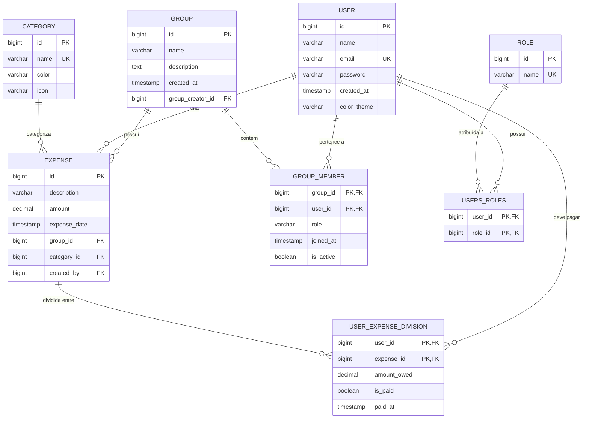

# Modelos e Schemas - Backend FinBoost+

## Visão Geral

O modelo de dados do FinBoost+ é baseado em **Domain Driven Design (DDD)** e implementado com **JPA/Hibernate**. O esquema relacional suporta gestão de usuários, grupos financeiros, despesas compartilhadas e divisões automáticas entre membros.

## Arquitetura do Domínio

### Entidades Principais
- **User**: Usuários do sistema com autenticação
- **Group**: Grupos financeiros compartilhados
- **Expense**: Despesas registradas nos grupos
- **Category**: Categorização de despesas
- **Role**: Papéis de autorização

### Entidades de Relacionamento
- **GroupMember**: Relacionamento N:N entre usuários e grupos
- **UserExpenseDivision**: Divisão de despesas entre usuários

## Diagrama de Relacionamentos



## Entidades do Domínio

### User (Usuário)

**Responsabilidade:** Representa os usuários do sistema com autenticação e autorização.

```java
@Entity
@Table(name = "users")
@Data
@NoArgsConstructor
@AllArgsConstructor
@Builder
@SequenceGenerator(name = "seq_user", sequenceName = "seq_user", 
                   allocationSize = 1, initialValue = 1)
public class User implements UserDetails {
    
    @Id
    @GeneratedValue(strategy = GenerationType.IDENTITY)
    private Long id;
    
    @Column(name = "user_name", nullable = false, length = 100)
    @Size(min = 2, max = 100, message = "Nome deve ter entre 2 e 100 caracteres")
    private String name;
    
    @Column(name = "e_mail", nullable = false, unique = true, length = 150)
    @Email(message = "Email deve ser válido")
    private String email;
    
    @Column(nullable = false)
    @Size(min = 6, message = "Senha deve ter pelo menos 6 caracteres")
    private String password;
    
    @CreationTimestamp
    @Column(name = "created_at", nullable = false)
    private Instant createdAt;
    
    @Column(name = "color_theme", nullable = false, length = 20)
    @Builder.Default
    private String colorTheme = "light";
    
    // Relacionamentos
    @ManyToMany(fetch = FetchType.EAGER)
    @JoinTable(name = "users_roles",
               joinColumns = @JoinColumn(name = "user_id"),
               inverseJoinColumns = @JoinColumn(name = "role_id"))
    @Builder.Default
    private Set<Role> roles = new HashSet<>();
    
    @OneToMany(mappedBy = "user", cascade = CascadeType.ALL)
    private Set<GroupMember> groupMemberships = new HashSet<>();
    
    @OneToMany(mappedBy = "createdBy", cascade = CascadeType.ALL)
    private Set<Expense> expensesCreated = new HashSet<>();
    
    // UserDetails implementation
    @Override
    public Collection<? extends GrantedAuthority> getAuthorities() {
        return roles.stream()
            .map(role -> new SimpleGrantedAuthority("ROLE_" + role.getName()))
            .collect(Collectors.toSet());
    }
    
    @Override
    public String getUsername() { return email; }
    @Override
    public boolean isAccountNonExpired() { return true; }
    @Override
    public boolean isAccountNonLocked() { return true; }
    @Override
    public boolean isCredentialsNonExpired() { return true; }
    @Override
    public boolean isEnabled() { return true; }
}
```

**Campos:**
- `id`: Identificador único (BIGINT, AUTO_INCREMENT)
- `name`: Nome completo do usuário (VARCHAR 100, NOT NULL)
- `email`: Email único para login (VARCHAR 150, UNIQUE, NOT NULL)
- `password`: Hash BCrypt da senha (TEXT, NOT NULL)
- `createdAt`: Data de criação (TIMESTAMP, NOT NULL)
- `colorTheme`: Tema preferido (VARCHAR 20, DEFAULT 'light')

**Relacionamentos:**
- **N:N** com `Role` através de `users_roles`
- **1:N** com `GroupMember` (usuário participa de vários grupos)
- **1:N** com `Expense` (usuário cria várias despesas)

**Validações:**
- Nome: 2-100 caracteres
- Email: formato válido e único
- Senha: mínimo 6 caracteres (hash BCrypt armazenado)

### Group (Grupo)

**Responsabilidade:** Representa grupos financeiros compartilhados entre usuários.

```java
@Entity
@Table(name = "tb_group")
@Data
@NoArgsConstructor
@AllArgsConstructor
@Builder
@SequenceGenerator(name = "seq_group", sequenceName = "seq_group", 
                   allocationSize = 1, initialValue = 1)
@EntityListeners(AuditingEntityListener.class)
public class Group {
    
    @Id
    @GeneratedValue(strategy = GenerationType.SEQUENCE, generator = "seq_group")
    private Long id;
    
    @Column(nullable = false, length = 100)
    @Size(min = 2, max = 100, message = "Nome deve ter entre 2 e 100 caracteres")
    private String name;
    
    @Column(columnDefinition = "TEXT")
    @Size(max = 500, message = "Descrição deve ter no máximo 500 caracteres")
    private String description;
    
    @CreatedDate
    @Column(name = "created_at")
    private LocalDateTime createdAt;
    
    @Column(name = "group_creator_id", nullable = false)
    private Long groupCreatorId;
    
    // Relacionamentos
    @OneToMany(mappedBy = "group", cascade = CascadeType.ALL, orphanRemoval = true)
    private Set<GroupMember> members = new HashSet<>();
    
    @OneToMany(mappedBy = "group", cascade = CascadeType.ALL, orphanRemoval = true)
    private Set<Expense> expenses = new HashSet<>();
    
    // Métodos de negócio
    public void addMember(User user, String role) {
        var membership = GroupMember.builder()
            .group(this)
            .user(user)
            .role(role)
            .joinedAt(LocalDateTime.now())
            .isActive(true)
            .build();
        members.add(membership);
    }
    
    public void removeMember(User user) {
        members.removeIf(member -> member.getUser().equals(user));
    }
    
    public boolean isUserMember(Long userId) {
        return members.stream()
            .anyMatch(member -> member.getUser().getId().equals(userId) 
                            && member.getIsActive());
    }
    
    public boolean isUserAdmin(Long userId) {
        return members.stream()
            .anyMatch(member -> member.getUser().getId().equals(userId)
                            && "ADMIN".equals(member.getRole())
                            && member.getIsActive());
    }
}
```

**Campos:**
- `id`: Identificador único (BIGINT, SEQUENCE)
- `name`: Nome do grupo (VARCHAR 100, NOT NULL)
- `description`: Descrição opcional (TEXT)
- `createdAt`: Data de criação (TIMESTAMP, AUTO)
- `groupCreatorId`: ID do criador (BIGINT, NOT NULL)

**Relacionamentos:**
- **1:N** com `GroupMember` (grupo tem vários membros)
- **1:N** com `Expense` (grupo tem várias despesas)

### Expense (Despesa)

**Responsabilidade:** Representa despesas registradas nos grupos com divisão automática.

```java
@Entity
@Table(name = "expenses")
@Data
@NoArgsConstructor
@AllArgsConstructor
@Builder
@SequenceGenerator(name = "seq_expense", sequenceName = "seq_expense", 
                   allocationSize = 1, initialValue = 1)
public class Expense {
    
    @Id
    @GeneratedValue(strategy = GenerationType.SEQUENCE, generator = "seq_expense")
    private Long id;
    
    @Column(nullable = false, length = 200)
    @Size(min = 2, max = 200, message = "Descrição deve ter entre 2 e 200 caracteres")
    private String description;
    
    @Column(nullable = false, precision = 10, scale = 2)
    @DecimalMin(value = "0.01", message = "Valor deve ser maior que zero")
    @Digits(integer = 8, fraction = 2, message = "Valor deve ter no máximo 8 dígitos inteiros e 2 decimais")
    private BigDecimal amount;
    
    @Column(name = "expense_date", nullable = false)
    private LocalDateTime expenseDate;
    
    @CreationTimestamp
    @Column(name = "created_at")
    private LocalDateTime createdAt;
    
    // Relacionamentos
    @ManyToOne(fetch = FetchType.LAZY)
    @JoinColumn(name = "group_id", nullable = false)
    private Group group;
    
    @ManyToOne(fetch = FetchType.LAZY)
    @JoinColumn(name = "category_id", nullable = false)
    private Category category;
    
    @ManyToOne(fetch = FetchType.LAZY)
    @JoinColumn(name = "created_by", nullable = false)
    private User createdBy;
    
    @OneToMany(mappedBy = "expense", cascade = CascadeType.ALL, orphanRemoval = true)
    private Set<UserExpenseDivision> divisions = new HashSet<>();
    
    // Métodos de negócio
    public void divideAmongMembers(Set<User> members, DivisionType type) {
        divisions.clear();
        
        switch (type) {
            case EQUAL -> divideEqually(members);
            case PROPORTIONAL -> divideProportionally(members);
            case CUSTOM -> {} // Implementar divisão customizada
        }
    }
    
    private void divideEqually(Set<User> members) {
        BigDecimal amountPerPerson = amount.divide(
            BigDecimal.valueOf(members.size()), 2, RoundingMode.HALF_UP);
        
        members.forEach(member -> {
            var division = UserExpenseDivision.builder()
                .user(member)
                .expense(this)
                .amountOwed(amountPerPerson)
                .isPaid(member.equals(createdBy)) // Criador já "pagou"
                .build();
            divisions.add(division);
        });
    }
    
    public BigDecimal getTotalPaid() {
        return divisions.stream()
            .filter(UserExpenseDivision::getIsPaid)
            .map(UserExpenseDivision::getAmountOwed)
            .reduce(BigDecimal.ZERO, BigDecimal::add);
    }
    
    public BigDecimal getTotalPending() {
        return amount.subtract(getTotalPaid());
    }
}
```

**Campos:**
- `id`: Identificador único (BIGINT, SEQUENCE)
- `description`: Descrição da despesa (VARCHAR 200, NOT NULL)
- `amount`: Valor da despesa (DECIMAL 10,2, NOT NULL)
- `expenseDate`: Data da despesa (TIMESTAMP, NOT NULL)
- `createdAt`: Data de criação (TIMESTAMP, AUTO)

**Relacionamentos:**
- **N:1** com `Group` (despesa pertence a um grupo)
- **N:1** com `Category` (despesa tem uma categoria)
- **N:1** com `User` (despesa criada por um usuário)
- **1:N** com `UserExpenseDivision` (despesa dividida entre usuários)

### Category (Categoria)

**Responsabilidade:** Categorização e organização das despesas.

```java
@Entity
@Table(name = "categories")
@Data
@NoArgsConstructor
@AllArgsConstructor
@Builder
public class Category {
    
    @Id
    @GeneratedValue(strategy = GenerationType.IDENTITY)
    private Long id;
    
    @Column(nullable = false, unique = true, length = 50)
    private String name;
    
    @Column(length = 7) // Hex color code
    @Pattern(regexp = "^#[0-9A-Fa-f]{6}$", message = "Cor deve ser um código hex válido")
    private String color;
    
    @Column(length = 50)
    private String icon;
    
    @Column(columnDefinition = "TEXT")
    private String description;
    
    @Builder.Default
    private Boolean isDefault = false;
    
    // Relacionamentos
    @OneToMany(mappedBy = "category", cascade = CascadeType.ALL)
    private Set<Expense> expenses = new HashSet<>();
    
    // Categorias padrão
    public static final String FOOD = "Alimentação";
    public static final String TRANSPORT = "Transporte";
    public static final String ENTERTAINMENT = "Lazer";
    public static final String HEALTH = "Saúde";
    public static final String EDUCATION = "Educação";
    public static final String HOUSING = "Moradia";
    public static final String SHOPPING = "Compras";
    public static final String OTHER = "Outros";
}
```

**Campos:**
- `id`: Identificador único (BIGINT, AUTO_INCREMENT)
- `name`: Nome da categoria (VARCHAR 50, UNIQUE, NOT NULL)
- `color`: Cor em hex (VARCHAR 7, padrão #RRGGBB)
- `icon`: Nome do ícone (VARCHAR 50)
- `description`: Descrição opcional (TEXT)
- `isDefault`: Se é categoria padrão do sistema (BOOLEAN)

### GroupMember (Membro do Grupo)

**Responsabilidade:** Relacionamento N:N entre usuários e grupos com metadados.

```java
@Entity
@Table(name = "group_members")
@Data
@NoArgsConstructor
@AllArgsConstructor
@Builder
@IdClass(GroupMemberId.class)
public class GroupMember {
    
    @Id
    @ManyToOne(fetch = FetchType.LAZY)
    @JoinColumn(name = "group_id")
    private Group group;
    
    @Id
    @ManyToOne(fetch = FetchType.LAZY)
    @JoinColumn(name = "user_id")
    private User user;
    
    @Enumerated(EnumType.STRING)
    @Column(nullable = false, length = 20)
    private MemberRole role;
    
    @Column(name = "joined_at", nullable = false)
    private LocalDateTime joinedAt;
    
    @Column(name = "is_active", nullable = false)
    @Builder.Default
    private Boolean isActive = true;
    
    @Column(name = "left_at")
    private LocalDateTime leftAt;
    
    // Enum para roles
    public enum MemberRole {
        ADMIN("Administrador"),
        MEMBER("Membro"),
        VIEWER("Visualizador");
        
        private final String description;
        
        MemberRole(String description) {
            this.description = description;
        }
        
        public String getDescription() { return description; }
    }
}

// Classe de ID composta
@Data
@NoArgsConstructor
@AllArgsConstructor
public class GroupMemberId implements Serializable {
    private Long group;
    private Long user;
}
```

### UserExpenseDivision (Divisão de Despesa)

**Responsabilidade:** Controla como despesas são divididas entre usuários.

```java
@Entity
@Table(name = "user_expense_divisions")
@Data
@NoArgsConstructor
@AllArgsConstructor
@Builder
@IdClass(UserExpenseDivisionId.class)
public class UserExpenseDivision {
    
    @Id
    @ManyToOne(fetch = FetchType.LAZY)
    @JoinColumn(name = "user_id")
    private User user;
    
    @Id
    @ManyToOne(fetch = FetchType.LAZY)
    @JoinColumn(name = "expense_id")
    private Expense expense;
    
    @Column(name = "amount_owed", nullable = false, precision = 10, scale = 2)
    @DecimalMin(value = "0.00", message = "Valor deve ser positivo")
    private BigDecimal amountOwed;
    
    @Column(name = "is_paid", nullable = false)
    @Builder.Default
    private Boolean isPaid = false;
    
    @Column(name = "paid_at")
    private LocalDateTime paidAt;
    
    @Column(name = "payment_method", length = 50)
    private String paymentMethod;
    
    // Métodos de negócio
    public void markAsPaid(String paymentMethod) {
        this.isPaid = true;
        this.paidAt = LocalDateTime.now();
        this.paymentMethod = paymentMethod;
    }
    
    public void markAsUnpaid() {
        this.isPaid = false;
        this.paidAt = null;
        this.paymentMethod = null;
    }
}

// Classe de ID composta
@Data
@NoArgsConstructor
@AllArgsConstructor
public class UserExpenseDivisionId implements Serializable {
    private Long user;
    private Long expense;
}
```

### Role (Papéis de Autorização)

**Responsabilidade:** Controle de acesso e autorização no sistema.

```java
@Entity
@Table(name = "roles")
@Data
@NoArgsConstructor
@AllArgsConstructor
@Builder
public class Role {
    
    @Id
    @GeneratedValue(strategy = GenerationType.IDENTITY)
    private Long id;
    
    @Column(nullable = false, unique = true, length = 50)
    private String name;
    
    @Column(columnDefinition = "TEXT")
    private String description;
    
    // Relacionamentos
    @ManyToMany(mappedBy = "roles")
    private Set<User> users = new HashSet<>();
    
    // Constantes para roles padrão
    public static final String USER = "USER";
    public static final String ADMIN = "ADMIN";
    public static final String MODERATOR = "MODERATOR";
}
```

## Projeções JPA

### Projeções para Performance

```java
// Interface-based projection
public interface GroupSummaryProjection {
    Long getId();
    String getName();
    Long getMemberCount();
    BigDecimal getTotalExpenses();
    LocalDateTime getCreatedAt();
}

// Class-based projection
@Data
@AllArgsConstructor
public class UserSummaryProjection {
    private Long id;
    private String name;
    private String email;
    private Long activeGroupsCount;
    private BigDecimal totalExpenses;
    private BigDecimal totalOwed;
    
    // Constructor para query nativa
    public UserSummaryProjection(Long id, String name, String email,
                               Long activeGroupsCount, BigDecimal totalExpenses,
                               BigDecimal totalOwed) {
        this.id = id;
        this.name = name;
        this.email = email;
        this.activeGroupsCount = activeGroupsCount;
        this.totalExpenses = totalExpenses;
        this.totalOwed = totalOwed;
    }
}

// Uso em Repository
@Query(value = """
    SELECT g.id, g.name, COUNT(gm.user_id) as memberCount,
           COALESCE(SUM(e.amount), 0) as totalExpenses, g.created_at as createdAt
    FROM tb_group g
    LEFT JOIN group_members gm ON g.id = gm.group_id AND gm.is_active = true
    LEFT JOIN expenses e ON g.id = e.group_id
    WHERE gm.user_id = :userId
    GROUP BY g.id, g.name, g.created_at
    """, nativeQuery = true)
List<GroupSummaryProjection> findGroupSummaryByUserId(Long userId);
```

## Validações e Constraints

### Bean Validation (JSR-303)

```java
// Validações customizadas
@Target({ElementType.TYPE})
@Retention(RetentionPolicy.RUNTIME)
@Constraint(validatedBy = UniqueEmailValidator.class)
public @interface UniqueEmail {
    String message() default "Email já está em uso";
    Class<?>[] groups() default {};
    Class<? extends Payload>[] payload() default {};
}

// Implementação do validator
@Component
public class UniqueEmailValidator implements ConstraintValidator<UniqueEmail, String> {
    
    @Autowired
    private UserRepository userRepository;
    
    @Override
    public boolean isValid(String email, ConstraintValidatorContext context) {
        if (email == null) return true;
        return !userRepository.existsByEmail(email);
    }
}
```

### Database Constraints

```sql
-- Constraints importantes aplicadas via JPA

-- Usuários
ALTER TABLE users ADD CONSTRAINT uk_users_email UNIQUE (e_mail);
ALTER TABLE users ADD CONSTRAINT ck_users_color_theme 
    CHECK (color_theme IN ('light', 'dark', 'auto'));

-- Grupos
ALTER TABLE tb_group ADD CONSTRAINT fk_group_creator 
    FOREIGN KEY (group_creator_id) REFERENCES users(id);

-- Membros do grupo
ALTER TABLE group_members ADD CONSTRAINT pk_group_members 
    PRIMARY KEY (group_id, user_id);
ALTER TABLE group_members ADD CONSTRAINT ck_member_role 
    CHECK (role IN ('ADMIN', 'MEMBER', 'VIEWER'));

-- Despesas
ALTER TABLE expenses ADD CONSTRAINT ck_expense_amount 
    CHECK (amount > 0);
ALTER TABLE expenses ADD CONSTRAINT fk_expense_group 
    FOREIGN KEY (group_id) REFERENCES tb_group(id);
ALTER TABLE expenses ADD CONSTRAINT fk_expense_category 
    FOREIGN KEY (category_id) REFERENCES categories(id);

-- Divisões de despesa
ALTER TABLE user_expense_divisions ADD CONSTRAINT pk_expense_divisions 
    PRIMARY KEY (user_id, expense_id);
ALTER TABLE user_expense_divisions ADD CONSTRAINT ck_amount_owed_positive 
    CHECK (amount_owed >= 0);
```

## Auditoria e Timestamping

### JPA Auditing

```java
@MappedSuperclass
@EntityListeners(AuditingEntityListener.class)
@Data
public abstract class AuditableEntity {
    
    @CreatedDate
    @Column(name = "created_at", updatable = false)
    private LocalDateTime createdAt;
    
    @LastModifiedDate
    @Column(name = "updated_at")
    private LocalDateTime updatedAt;
    
    @CreatedBy
    @Column(name = "created_by", updatable = false)
    private String createdBy;
    
    @LastModifiedBy
    @Column(name = "updated_by")
    private String updatedBy;
}

// Configuração para auditoria
@Configuration
@EnableJpaAuditing
public class AuditConfig {
    
    @Bean
    public AuditorAware<String> auditorProvider() {
        return () -> {
            Authentication auth = SecurityContextHolder.getContext().getAuthentication();
            if (auth != null && auth.isAuthenticated() && !"anonymousUser".equals(auth.getName())) {
                return Optional.of(auth.getName());
            }
            return Optional.of("system");
        };
    }
}
```

## Estratégias de Performance

### Lazy Loading e Fetching

```java
// Configuração de fetch strategies
@Entity
public class Group {
    // Lazy loading padrão para relacionamentos
    @OneToMany(mappedBy = "group", fetch = FetchType.LAZY)
    private Set<Expense> expenses;
    
    // Eager loading quando sempre necessário
    @ManyToOne(fetch = FetchType.EAGER)
    @JoinColumn(name = "creator_id")
    private User creator;
}

// Join fetching em queries
@Query("SELECT g FROM Group g JOIN FETCH g.members WHERE g.id = :id")
Optional<Group> findByIdWithMembers(Long id);

// DTO projection para performance
@Query("SELECT new com.finboostplus.DTO.GroupSummaryDTO(g.id, g.name, COUNT(m)) " +
       "FROM Group g LEFT JOIN g.members m WHERE m.isActive = true GROUP BY g.id, g.name")
List<GroupSummaryDTO> findAllGroupSummaries();
```

### Índices de Banco

```sql
-- Índices recomendados para performance

-- Usuários
CREATE INDEX idx_users_email ON users(e_mail);
CREATE INDEX idx_users_created_at ON users(created_at);

-- Grupos
CREATE INDEX idx_groups_creator ON tb_group(group_creator_id);
CREATE INDEX idx_groups_created_at ON tb_group(created_at);

-- Membros
CREATE INDEX idx_group_members_user ON group_members(user_id);
CREATE INDEX idx_group_members_active ON group_members(is_active);

-- Despesas
CREATE INDEX idx_expenses_group_date ON expenses(group_id, expense_date);
CREATE INDEX idx_expenses_category ON expenses(category_id);
CREATE INDEX idx_expenses_created_by ON expenses(created_by);
CREATE INDEX idx_expenses_amount ON expenses(amount);

-- Divisões
CREATE INDEX idx_divisions_user_paid ON user_expense_divisions(user_id, is_paid);
CREATE INDEX idx_divisions_expense ON user_expense_divisions(expense_id);
```

---

Este modelo de dados oferece flexibilidade, performance e integridade para suportar todas as funcionalidades do FinBoost+, desde gestão básica de usuários até divisão complexa de despesas em grupos colaborativos.
