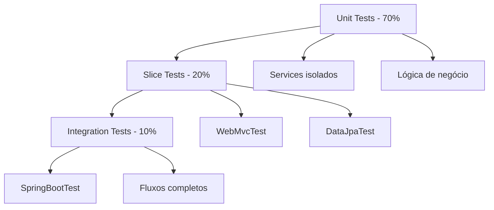

# Testes Automatizados - Backend FinBoost+

## Visão Geral

O backend do FinBoost+ implementa uma estratégia robusta de testes automatizados usando **JUnit 5**, **Mockito** e **Spring Boot Test**. A arquitetura segue a pirâmide de testes, garantindo cobertura > 70% e qualidade de código.

## Stack de Testes

### Frameworks e Ferramentas

- **JUnit 5**: Framework principal de testes unitários
- **Mockito**: Framework de mocking para isolamento
- **Spring Boot Test**: Testes de integração e slice testing
- **AssertJ**: Assertions fluentes e expressivas
- **JaCoCo**: Cobertura de código
- **H2**: Banco em memória para testes

### Dependências Principais

```xml
<dependencies>
    <!-- Starter de testes (inclui JUnit 5, Mockito, AssertJ) -->
    <dependency>
        <groupId>org.springframework.boot</groupId>
        <artifactId>spring-boot-starter-test</artifactId>
        <scope>test</scope>
    </dependency>
    
    <!-- Testes de segurança -->
    <dependency>
        <groupId>org.springframework.security</groupId>
        <artifactId>spring-security-test</artifactId>
        <scope>test</scope>
    </dependency>
</dependencies>
```

## Arquitetura de Testes

### Pirâmide de Testes



### Categorias de Testes

1. **Unit Tests (70%)**: Testam classes isoladamente
2. **Slice Tests (20%)**: Testam fatias específicas da aplicação
3. **Integration Tests (10%)**: Testam fluxos completos

## Estrutura de Testes

```
src/test/java/com/finboostplus/
├── config/                     # Configurações de teste
│   ├── TestConfig.java         # Beans para testes
│   └── TestSecurityConfig.java # Configuração de segurança
├── factory/                    # Factories de dados de teste
│   ├── UserTestFactory.java    # Criação de usuários
│   ├── GroupTestFactory.java   # Criação de grupos
│   └── ExpenseTestFactory.java # Criação de despesas
├── controller/                 # Testes de Controller
├── service/                    # Testes de Service
├── repository/                 # Testes de Repository
├── integration/                # Testes de Integração
└── util/                      # Utilitários de teste
```

## Tipos de Testes

### 1. Testes Unitários (Service Layer)

**Características:**

- Testam lógica de negócio isolada
- Usam mocks para dependências
- Execução rápida e independente

```java
@ExtendWith(MockitoExtension.class)
class UserServiceTest {
    
    @Mock
    private UserRepository userRepository;
    
    @Mock 
    private PasswordEncoder passwordEncoder;
    
    @InjectMocks
    private UserService userService;
    
    @Test
    @DisplayName("Deve criar usuário com dados válidos")
    void shouldCreateUserWithValidData() {
        // Arrange
        var createDTO = UserTestFactory.createValidUserDTO();
        var encodedPassword = "encoded_password";
        var savedUser = UserTestFactory.createUserEntity(createDTO);
        savedUser.setId(1L);
        
        when(userRepository.existsByEmail(createDTO.email())).thenReturn(false);
        when(passwordEncoder.encode(createDTO.password())).thenReturn(encodedPassword);
        when(userRepository.save(any(User.class))).thenReturn(savedUser);
        
        // Act
        var result = userService.create(createDTO);
        
        // Assert
        assertThat(result).isNotNull();
        assertThat(result.id()).isEqualTo(1L);
        assertThat(result.name()).isEqualTo(createDTO.name());
        
        verify(userRepository).existsByEmail(createDTO.email());
        verify(passwordEncoder).encode(createDTO.password());
    }
    
    @Test
    @DisplayName("Deve lançar exceção para email duplicado")
    void shouldThrowExceptionForDuplicateEmail() {
        // Arrange
        var createDTO = UserTestFactory.createValidUserDTO();
        when(userRepository.existsByEmail(createDTO.email())).thenReturn(true);
        
        // Act & Assert
        assertThatThrownBy(() -> userService.create(createDTO))
            .isInstanceOf(BusinessException.class)
            .hasMessageContaining("Email já está em uso");
    }
}
```

### 2. Testes de Controller (Slice Tests)

**Características:**

- Testam camada web isoladamente
- Mockam services
- Testam serialização/deserialização JSON

```java
@WebMvcTest(UserController.class)
class UserControllerTest {
    
    @Autowired
    private MockMvc mockMvc;
    
    @MockBean
    private UserService userService;
    
    @Test
    @DisplayName("Deve criar usuário com sucesso")
    void shouldCreateUserSuccessfully() throws Exception {
        // Arrange
        var createDTO = UserTestFactory.createValidUserDTO();
        var responseDTO = UserTestFactory.createUserResponseDTO();
        
        when(userService.create(any(UserCreateDTO.class))).thenReturn(responseDTO);
        
        // Act & Assert
        mockMvc.perform(post("/api/users")
                .contentType(MediaType.APPLICATION_JSON)
                .content(objectMapper.writeValueAsString(createDTO)))
                .andExpect(status().isCreated())
                .andExpect(jsonPath("$.id").value(responseDTO.id()))
                .andExpect(jsonPath("$.name").value(responseDTO.name()));
        
        verify(userService).create(any(UserCreateDTO.class));
    }
    
    @Test
    @WithMockUser(roles = "ADMIN")
    @DisplayName("Deve listar usuários com perfil admin")
    void shouldListUsersWithAdminRole() throws Exception {
        var users = List.of(
            UserTestFactory.createUserResponseDTO("João", "joao@test.com"),
            UserTestFactory.createUserResponseDTO("Maria", "maria@test.com")
        );
        var page = new PageImpl<>(users);
        
        when(userService.findAll(any(Pageable.class), isNull())).thenReturn(page);
        
        mockMvc.perform(get("/api/users"))
                .andExpect(status().isOk())
                .andExpected(jsonPath("$.content", hasSize(2)));
    }
}
```

### 3. Testes de Repository (Data Layer)

**Características:**

- Testam acesso a dados
- Usam banco H2 em memória
- Testam queries customizadas

```java
@DataJpaTest
class UserRepositoryTest {
    
    @Autowired
    private TestEntityManager entityManager;
    
    @Autowired
    private UserRepository userRepository;
    
    @Test
    @DisplayName("Deve encontrar usuário por email")
    void shouldFindUserByEmail() {
        // Arrange
        var user = UserTestFactory.createUserEntity();
        entityManager.persistAndFlush(user);
        
        // Act
        var foundUser = userRepository.findByEmail(user.getEmail());
        
        // Assert
        assertThat(foundUser).isPresent();
        assertThat(foundUser.get().getName()).isEqualTo(user.getName());
    }
    
    @Test
    @DisplayName("Deve verificar se email existe")
    void shouldCheckIfEmailExists() {
        var user = UserTestFactory.createUserEntity();
        entityManager.persistAndFlush(user);
        
        assertThat(userRepository.existsByEmail(user.getEmail())).isTrue();
        assertThat(userRepository.existsByEmail("inexistente@test.com")).isFalse();
    }
}
```

### 4. Testes de Integração

**Características:**

- Testam fluxos completos
- Usam contexto Spring completo
- Simulam cenários reais

```java
@SpringBootTest
@AutoConfigureMockMvc
@Transactional
class AuthFlowIT {
    
    @Autowired
    private MockMvc mockMvc;
    
    @Autowired
    private ObjectMapper objectMapper;
    
    @Test
    @DisplayName("Deve realizar fluxo completo de registro e login")
    void shouldPerformCompleteRegistrationAndLoginFlow() throws Exception {
        // 1. Registrar usuário
        var registerDTO = UserTestFactory.createValidUserDTO();
        
        mockMvc.perform(post("/api/auth/register")
                .contentType(MediaType.APPLICATION_JSON)
                .content(objectMapper.writeValueAsString(registerDTO)))
                .andExpect(status().isCreated())
                .andExpect(jsonPath("$.email").value(registerDTO.email()));
        
        // 2. Fazer login
        var loginDTO = new LoginRequestDTO(registerDTO.email(), registerDTO.password());
        
        var loginResult = mockMvc.perform(post("/api/auth/login")
                .contentType(MediaType.APPLICATION_JSON)
                .content(objectMapper.writeValueAsString(loginDTO)))
                .andExpect(status().isOk())
                .andExpect(jsonPath("$.token").exists())
                .andReturn();
        
        // 3. Usar token para acessar endpoint protegido
        var loginResponse = objectMapper.readValue(
            loginResult.getResponse().getContentAsString(),
            TokenResponseDTO.class
        );
        
        mockMvc.perform(get("/api/users/profile")
                .header("Authorization", "Bearer " + loginResponse.token()))
                .andExpect(status().isOk())
                .andExpect(jsonPath("$.email").value(registerDTO.email()));
    }
}
```

## Configuração de Testes

### Configuração de Propriedades

```yaml
# application-test.yml
spring:
  datasource:
    url: jdbc:h2:mem:testdb
    driver-class-name: org.h2.Driver
    username: sa
    password: 
  
  jpa:
    hibernate:
      ddl-auto: create-drop
    show-sql: false
    properties:
      hibernate:
        dialect: org.hibernate.dialect.H2Dialect

# JWT para testes
jwt:
  secret: test-secret-key-for-testing-only
  expiration: 3600000
```

### Test Data Factories

```java
public class UserTestFactory {
    
    public static UserCreateDTO createValidUserDTO() {
        return createValidUserDTO("João Silva", "joao@test.com");
    }
    
    public static UserCreateDTO createValidUserDTO(String name, String email) {
        return new UserCreateDTO(name, email, "password123");
    }
    
    public static User createUserEntity() {
        return User.builder()
            .name("João Silva")
            .email("joao@test.com")
            .password("$2a$10$encoded.password.hash")
            .colorTheme("light")
            .createdAt(Instant.now())
            .roles(Set.of(createUserRole()))
            .build();
    }
    
    public static UserResponseDTO createUserResponseDTO(String name, String email) {
        return new UserResponseDTO(1L, name, email, Instant.now(), Set.of("USER"));
    }
    
    private static Role createUserRole() {
        return Role.builder()
            .id(1L)
            .name("USER")
            .description("Usuário padrão")
            .build();
    }
}
```

## Comandos e Execução

### Comandos Maven Essenciais

```bash
# Executar todos os testes
./mvnw test

# Executar com cobertura
./mvnw test jacoco:report

# Executar testes específicos
./mvnw test -Dtest=UserServiceTest
./mvnw test -Dtest="**/*Test"      # Apenas unitários
./mvnw test -Dtest="**/*IT"        # Apenas integração

# Ver relatório de cobertura
open target/site/jacoco/index.html
```

## Configuração JaCoCo

### Plugin de Cobertura

```xml
<plugin>
    <groupId>org.jacoco</groupId>
    <artifactId>jacoco-maven-plugin</artifactId>
    <version>0.8.12</version>
    <configuration>
        <excludes>
            <exclude>**/*Application.class</exclude>
            <exclude>**/config/**</exclude>
            <exclude>**/dto/**</exclude>
            <exclude>**/entity/**</exclude>
        </excludes>
    </configuration>
    <executions>
        <execution>
            <id>prepare-agent</id>
            <goals>
                <goal>prepare-agent</goal>
            </goals>
        </execution>
        <execution>
            <id>report</id>
            <phase>test</phase>
            <goals>
                <goal>report</goal>
            </goals>
        </execution>
        <execution>
            <id>check</id>
            <phase>verify</phase>
            <goals>
                <goal>check</goal>
            </goals>
            <configuration>
                <rules>
                    <rule>
                        <element>BUNDLE</element>
                        <limits>
                            <limit>
                                <counter>INSTRUCTION</counter>
                                <value>COVEREDRATIO</value>
                                <minimum>0.70</minimum>
                            </limit>
                        </limits>
                    </rule>
                </rules>
            </configuration>
        </execution>
    </executions>
</plugin>
```

## Boas Práticas

### Naming Conventions

```java
// Padrão AAA (Arrange, Act, Assert)
@Test
@DisplayName("Deve criar usuário quando dados válidos fornecidos")
void shouldCreateUser_WhenValidDataProvided() {
    // Arrange - Preparar dados
    var createDTO = UserTestFactory.createValidUserDTO();
    
    // Act - Executar ação
    var result = userService.create(createDTO);
    
    // Assert - Verificar resultado
    assertThat(result).isNotNull();
}

// Testes de exceção
@Test
@DisplayName("Deve lançar BusinessException quando email duplicado")
void shouldThrowBusinessException_WhenEmailAlreadyExists() {
    // Arrange & Act & Assert
    assertThatThrownBy(() -> userService.create(createDTO))
        .isInstanceOf(BusinessException.class)
        .hasMessageContaining("Email já está em uso");
}
```

### Organização de Testes

1. **Um assert principal por teste**
2. **Usar @DisplayName descritivo**
3. **Agrupar testes relacionados com @Nested**
4. **Usar factories para dados de teste**
5. **Limpar estado entre testes**

```java
@Nested
@DisplayName("Criação de Usuário")
class UserCreationTests {
    
    @Test
    @DisplayName("Deve criar usuário com dados válidos")
    void shouldCreateWithValidData() { /* ... */ }
    
    @Test 
    @DisplayName("Deve falhar com email duplicado")
    void shouldFailWithDuplicateEmail() { /* ... */ }
}
```

### Performance dos Testes

1. **Usar @MockitoExtension para testes unitários**
2. **@DataJpaTest apenas para repositories**
3. **@WebMvcTest apenas para controllers**
4. **@SpringBootTest apenas quando necessário**
5. **Reutilizar contexto Spring quando possível**

## Métricas de Qualidade

- **Cobertura mínima**: 70%
- **Tempo de execução**: < 2 minutos para suite completa
- **Testes unitários**: < 30 segundos
- **Testes de integração**: < 90 segundos

---

Esta estratégia garante confiabilidade, manutenibilidade e cobertura adequada para o backend do FinBoost+, seguindo as melhores práticas da comunidade Spring Boot e Java.