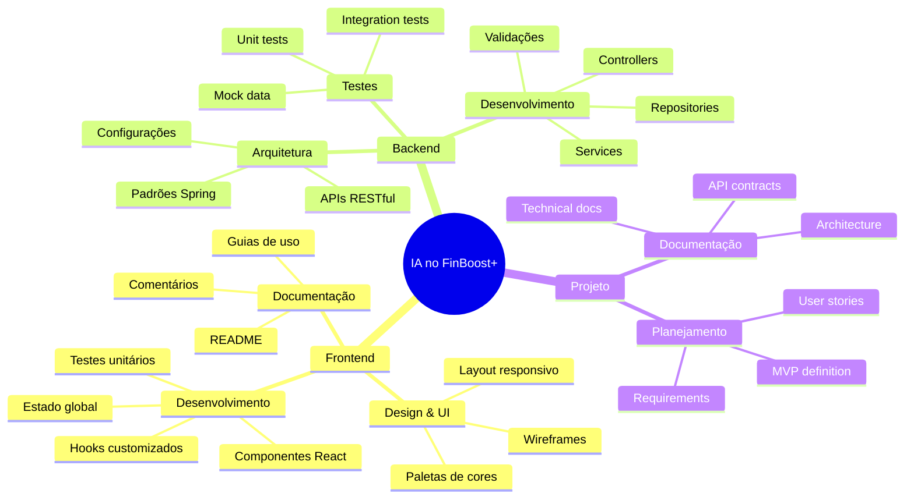

# 🤖 Desenvolvimento com IA - FinBoost+

Esta seção documenta o uso responsável e transparente de ferramentas de Inteligência Artificial durante o desenvolvimento do projeto FinBoost+.

---

## 🎯 **Objetivo da Documentação**

Garantir **transparência total** sobre como e quando ferramentas de IA foram utilizadas como auxiliares no desenvolvimento, seguindo as melhores práticas da indústria e requisitos acadêmicos.

---

## 📋 **Princípios do Uso de IA**

### ✅ **O que Fazemos**
- **Transparência completa:** Documentamos todo uso de IA
- **Responsabilidade humana:** Decisões finais sempre por desenvolvedores
- **Revisão rigorosa:** Todo código gerado é revisado e testado
- **Aprendizado contínuo:** IA como ferramenta de capacitação da equipe

### ❌ **O que NÃO Fazemos**
- Copiar código sem entender
- Submeter trabalho puramente gerado por IA
- Ocultar o uso de ferramentas auxiliares
- Delegar decisões críticas para IA

---

## 🛠️ **Ferramentas Utilizadas**

| Ferramenta | Fornecedor | Uso Principal |
|------------|------------|---------------|
| **ChatGPT** | OpenAI | Geração de código, definição de escopo, naming |
| **Claude** | Anthropic | Design, paletas de cores, arquitetura |
| **DeepSeek** | DeepSeek | Estado, persistência, mocks, contratos |
| **GitHub Copilot** | Microsoft | Autocomplete, testes, configurações |
| **Stitch** | Stitch AI | Wireframes e sugestões de design |

---

## 📊 **Áreas de Aplicação**

---

## 📈 **Benefícios Alcançados**

### **Para o Projeto**
- ⚡ **Aceleração do desenvolvimento** - Redução de 30-40% no tempo de tarefas repetitivas
- 🔍 **Qualidade do código** - Sugestões de boas práticas e padrões
- 📚 **Documentação rica** - Geração estruturada de docs técnicas
- 🎨 **Design consistente** - Paletas e layouts profissionais

### **Para a Equipe**
- 🚀 **Aprendizado acelerado** - Exposição a padrões avançados
- 💡 **Criatividade estimulada** - Brainstorming de soluções
- 🔧 **Produtividade aumentada** - Foco em lógica de negócio
- 📖 **Capacitação técnica** - Conhecimento de ferramentas modernas

---

## 🔍 **Metodologia de Trabalho**

### **1. Geração com IA**
- Prompt claro e contextualizado
- Especificação de requisitos técnicos
- Solicitação de múltiplas alternativas

### **2. Revisão Humana**
- Análise crítica do código gerado
- Verificação de boas práticas
- Adaptação ao contexto do projeto

### **3. Teste e Validação**
- Execução de testes unitários
- Validação em ambiente local
- Verificação de integração

### **4. Documentação**
- Registro do prompt utilizado
- Justificativa da escolha
- Impacto no projeto

---

## 📝 **Estrutura da Documentação**

### **Por Área**
- **Frontend:** [Uso de IA](../frontend/ai_usage.md) | [Log de Prompts](../frontend/ai_prompts_log.md)
- **Backend:** [Uso de IA](../backend/ai_usage.md) | [Log de Prompts](../backend/ai_prompts_log.md)

### **Conteúdo de Cada Documento**
- **ai_usage.md:** Resumo executivo e casos de uso principais
- **ai_prompts_log.md:** Registro detalhado de prompts e resultados

---

## 🎓 **Contexto Acadêmico**

### **Conformidade com Políticas**
- ✅ Transparência total sobre uso de IA
- ✅ Trabalho original com assistência declarada
- ✅ Aprendizado comprovado da equipe
- ✅ Contribuição individual identificável

### **Valor Educacional**
- Experiência com ferramentas modernas da indústria
- Desenvolvimento de senso crítico sobre IA
- Prática de documentação profissional
- Preparação para mercado de trabalho

---

## 🔄 **Processo de Atualização**

Esta documentação é **atualizada continuamente** sempre que:
- Nova ferramenta de IA é utilizada
- Casos de uso significativos são implementados
- Metodologia de trabalho evolui
- Novos padrões são adotados

---

## 🤝 **Responsabilidade e Ética**

> **Declaração de Responsabilidade**
> 
> Todos os membros da equipe FinBoost+ assumem responsabilidade integral pelo código e documentação produzidos. As ferramentas de IA foram utilizadas exclusivamente como auxiliares, com supervisão humana constante e validação rigorosa de todos os resultados.

---

  <strong>🤖 IA como ferramenta, humanos como responsáveis</strong> 
  <em>Desenvolvimento transparente e responsável</em>

