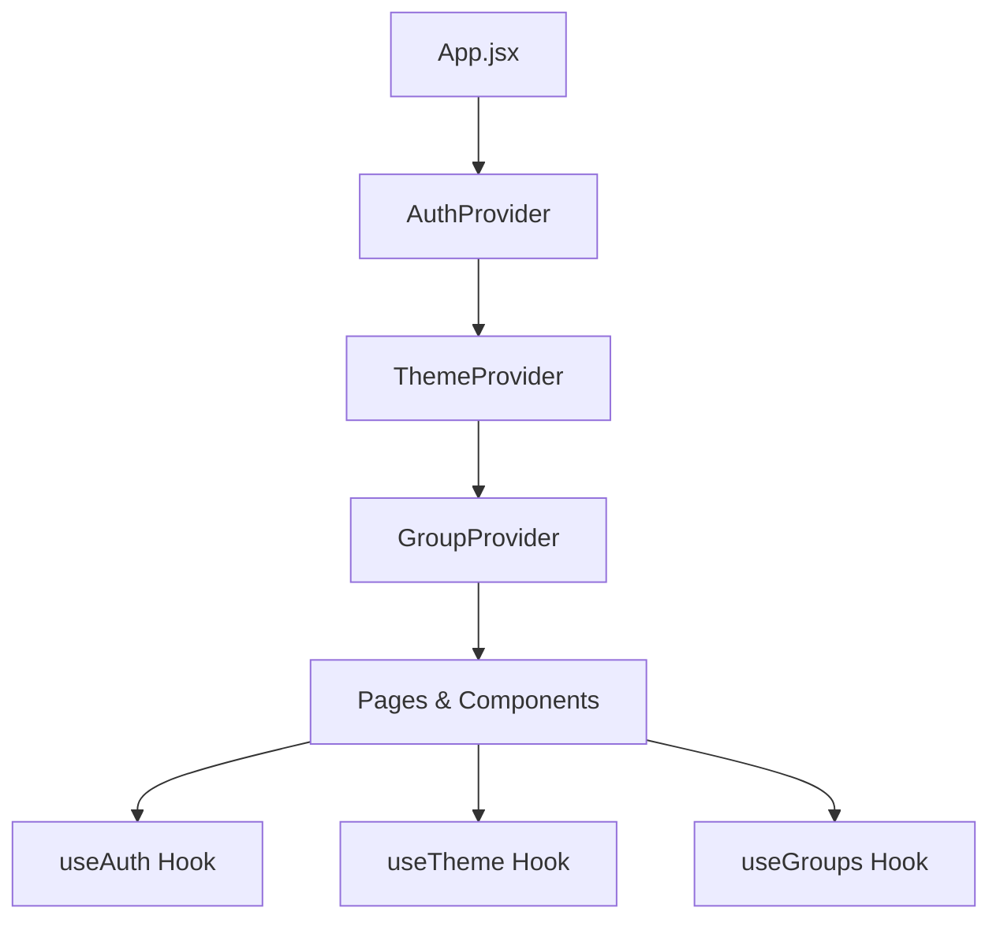
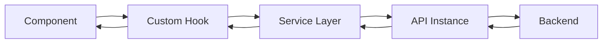

# 🏗️ Arquitetura - Frontend FinBoost+

## 📋 Visão Geral da Arquitetura

O frontend do **FinBoost+** segue uma arquitetura **Component-Based** moderna, construída com React e organizada de forma modular e escalável. A aplicação adota padrões de desenvolvimento que promovem **reutilização**, **manutenibilidade** e **testabilidade**.

## 🎯 Princípios Arquiteturais

### 1. **Single Responsibility Principle (SRP)**
- Cada componente tem uma responsabilidade específica e bem definida
- Separação clara entre lógica de negócio, apresentação e estado

### 2. **Composition over Inheritance**
- Preferência por composição de componentes
- Uso de Higher-Order Components (HOCs) e Render Props quando necessário

### 3. **Unidirectional Data Flow**
- Fluxo de dados sempre de cima para baixo (top-down)
- Estado gerenciado centralmente com Context API

### 4. **Separation of Concerns**
- Separação clara entre:
  - **UI Components**: Apresentação visual
  - **Business Logic**: Regras de negócio em hooks
  - **Data Layer**: Comunicação com APIs em services

## 🧩 Padrões de Design Implementados

### **1. Container/Presentational Pattern**

```
📦 Pages (Container Components)
├── Lógica de estado e efeitos
├── Comunicação com APIs
└── Passa dados para Presentational Components

📦 Components (Presentational Components)
├── Recebem dados via props
├── Focados na apresentação
└── Reutilizáveis e testáveis
```

### **2. Custom Hooks Pattern**

```javascript
// Encapsulamento de lógica reutilizável
const useAuth = () => {
  // Estado local
  // Efeitos colaterais
  // Lógica de negócio
  // Retorna interface limpa
}
```

### **3. Provider Pattern**

```javascript
// Contextos globais para estado compartilhado
<AuthProvider>
  <ThemeProvider>
    <GroupProvider>
      <App />
    </GroupProvider>
  </ThemeProvider>
</AuthProvider>
```

## 📁 Arquitetura de Pastas

### **Estrutura Hierárquica por Função**

```
src/
├── 🧩 components/        # Componentes reutilizáveis
│   ├── ui/                # Componentes básicos (Button, Input)
│   ├── forms/             # Componentes de formulário
│   ├── layout/            # Componentes de layout
│   └── specialized/       # Componentes especializados
├── 📄 pages/              # Páginas da aplicação (Containers)
├── 🪝 hooks/              # Hooks personalizados
├── 🧠 context/            # Contextos globais
├── 🔌 services/           # Comunicação com APIs
├── ⚙️ utils/              # Funções utilitárias
├── 🎨 styles/             # Estilos globais
├── 🌐 routes/             # Configuração de rotas
└── 🧪 mockData/           # Dados de desenvolvimento
```

### **Vantagens desta Organização**

- **Escalabilidade**: Fácil adicionar novos recursos
- **Manutenibilidade**: Localização rápida de código
- **Reusabilidade**: Componentes independentes
- **Testabilidade**: Isolamento de responsabilidades

## 🔄 Fluxo de Dados

### **1. Estado Global (Context API)**



### **2. Comunicação com API**



### **3. Estado Local vs Global**

| **Estado Local** | **Estado Global** |
|------------------|-------------------|
| Formulários | Autenticação |
| UI State (modals, dropdowns) | Tema da aplicação |
| Loading states específicos | Dados de grupos |
| Validações temporárias | Preferências do usuário |

## 🎨 Arquitetura de Estilização

### **Design System com TailwindCSS**

```
🎨 Design System
├── 🎯 Tokens de Design
│   ├── Colors (Primary, Secondary, Neutral)
│   ├── Typography (Font sizes, weights)
│   ├── Spacing (Margins, paddings)
│   └── Breakpoints (Responsive)
├── 🧩 Component Library
│   ├── Button variants
│   ├── Input types
│   ├── Card layouts
│   └── Modal patterns
└── 🌓 Theme System
    ├── Light mode
    ├── Dark mode
    └── Theme switching
```

### **Estratégia Mobile-First**

```css
/* Base: Mobile (default) */
.component { /* mobile styles */ }

/* Tablet */
@screen md { .component { /* tablet styles */ } }

/* Desktop */
@screen lg { .component { /* desktop styles */ } }
```

## 🧠 Gerenciamento de Estado

### **Arquitetura de Estado Multi-Camada**

```
📊 Estado da Aplicação
├── 🌐 Global State (Context API)
│   ├── AuthContext - Autenticação do usuário
│   ├── ThemeContext - Preferências visuais
│   └── GroupContext - Dados de grupos
├── 📄 Page State (useState)
│   ├── Form data
│   ├── Loading states
│   └── Error handling
└── 🔄 Server State (Custom Hooks)
    ├── API responses
    ├── Cache management
    └── Sync with backend
```

### **Context API Strategy**

```javascript
// Padrão de Context Provider
const AuthContext = createContext();

export const AuthProvider = ({ children }) => {
  const [user, setUser] = useState(null);
  const [token, setToken] = useState(null);
  
  const login = async (credentials) => {
    // Lógica de login
  };
  
  const logout = () => {
    // Lógica de logout
  };
  
  const value = {
    user,
    token,
    login,
    logout,
    isAuthenticated: !!token
  };
  
  return (
    <AuthContext.Provider value={value}>
      {children}
    </AuthContext.Provider>
  );
};
```

## 🌐 Arquitetura de Roteamento

### **Estrutura de Rotas**

```javascript
// Hierarquia de rotas
const routes = {
  public: [
    '/',           // Redirect to login
    '/login',      // Login page
    '/register'    // Register page
  ],
  protected: [
    '/dashboard',  // Main dashboard
    '/expenses',   // Expense management
    '/groups',     // Group management
    '/profile'     // User profile
  ],
  error: [
    '/404',        // Not found
    '*'            // Catch all
  ]
};
```

### **Proteção de Rotas**

```javascript
// ProtectedRoute Component
const ProtectedRoute = ({ children }) => {
  const { isAuthenticated } = useAuth();
  
  return isAuthenticated ? (
    children
  ) : (
    <Navigate to="/login" replace />
  );
};
```

## 🔌 Arquitetura de Services

### **Camada de Comunicação com API**

```
🔌 Services Layer
├── 📡 api.js - Configuração base do Axios
├── 🔐 auth.js - Autenticação e autorização
├── 💰 expenses.js - Gestão de despesas
├── 👥 groups.js - Gestão de grupos
└── 👤 users.js - Gestão de usuários
```

### **Ferramentas de Teste**

- **Vitest**: Test runner e assertions
- **Testing Library**: Component testing

## ⚡ Otimizações de Performance

### **Estratégias Implementadas**

1. **Code Splitting**: Divisão do bundle por rotas
2. **Lazy Loading**: Carregamento sob demanda
3. **Memoization**: React.memo e useMemo
4. **Virtual Scrolling**: Para listas grandes
5. **Image Optimization**: Lazy loading de imagens

## 🔒 Arquitetura de Segurança

### **Medidas de Segurança Frontend**

1. **Token Management**: JWT armazenado de forma segura
2. **Route Protection**: Rotas protegidas por autenticação
3. **Input Validation**: Validação client-side
4. **XSS Prevention**: Sanitização de inputs
5. **HTTPS Only**: Conexões seguras apenas
