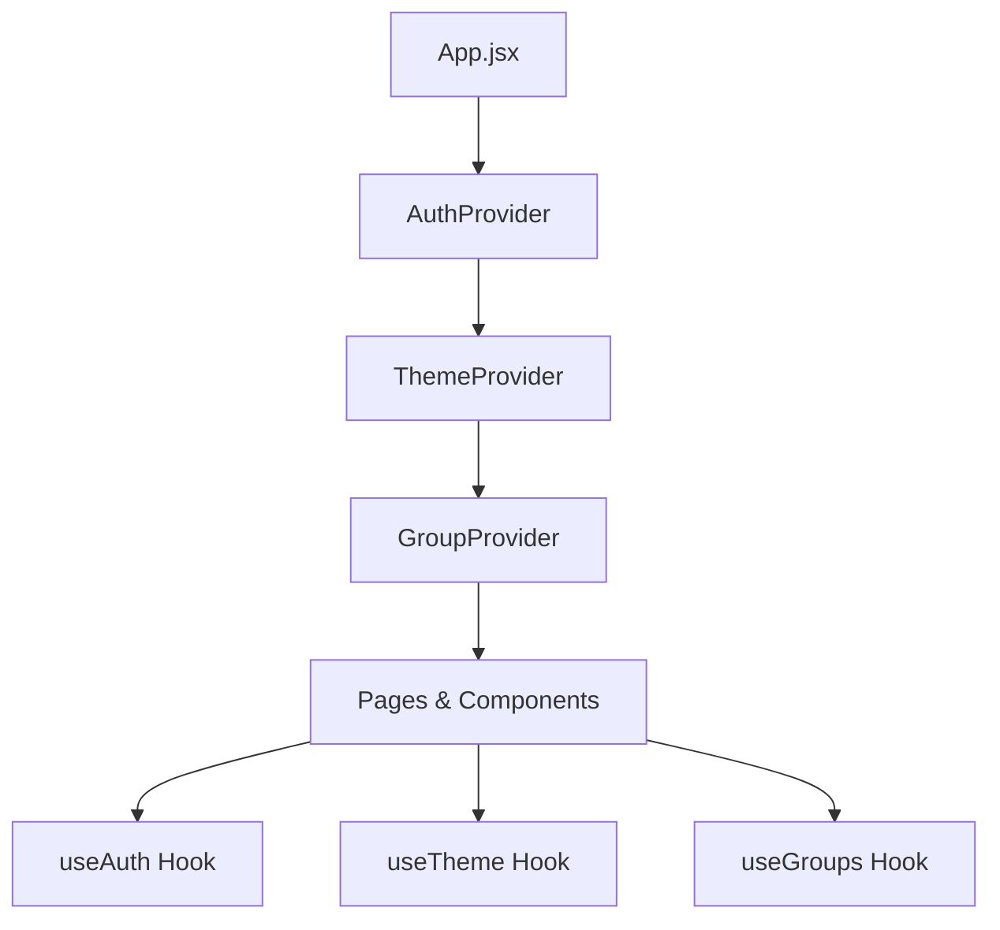

# Arquitetura - Frontend FinBoost+

## Visão Geral

O frontend do **FinBoost+** segue uma arquitetura baseada em componentes, construída com React e organizada de forma modular e escalável. A estrutura adota padrões que promovem reutilização, manutenibilidade e testabilidade.

## Princípios Arquiteturais

1. **Single Responsibility Principle (SRP)**
   - Cada componente tem uma responsabilidade específica
   - Separação entre lógica de negócio, apresentação e estado
2. **Composição sobre Herança**
   - Preferência por composição de componentes
   - Uso de HOCs e Render Props quando necessário
3. **Fluxo Unidirecional de Dados**
   - Dados fluem de cima para baixo (top-down)
   - Estado global via Context API
4. **Separação de Responsabilidades**
   - UI Components: apresentação visual
   - Business Logic: hooks personalizados
   - Data Layer: comunicação com APIs em services

## Padrões de Design

### Container/Presentational Pattern

```
Pages (Containers)
├── Lógica de estado e efeitos
├── Comunicação com APIs
└── Passa dados para Presentational Components

Components (Presentational)
├── Recebem dados via props
├── Focados na apresentação
└── Reutilizáveis e testáveis
```

### Custom Hooks Pattern

```javascript
// Encapsulamento de lógica reutilizável
const useAuth = () => {
  // Estado local, efeitos, lógica de negócio
  // Retorna interface limpa
}
```

### Provider Pattern

```javascript
// Contextos globais para estado compartilhado
<AuthProvider>
  <ThemeProvider>
    <GroupProvider>
      <App />
    </GroupProvider>
  </ThemeProvider>
</AuthProvider>
```

## Estrutura de Pastas

```
src/
├── components/        # Componentes reutilizáveis
│   ├── ui/            # Componentes básicos (Button, Input)
│   ├── forms/         # Formulários
│   ├── layout/        # Layout
│   └── specialized/   # Componentes especializados
├── pages/             # Páginas (Containers)
├── hooks/             # Hooks personalizados
├── context/           # Contextos globais
├── services/          # Comunicação com APIs
├── utils/             # Funções utilitárias
├── styles/            # Estilos globais
├── routes/            # Configuração de rotas
└── mockData/          # Dados de desenvolvimento
```

**Vantagens:**
- Escalabilidade
- Manutenibilidade
- Reusabilidade
- Testabilidade

## Fluxo de Dados

### Estado Global (Context API)


```mermaid
graph TD
    A[App.jsx] --> B[AuthProvider]
    B --> C[ThemeProvider]
    C --> D[GroupProvider]
    D --> E[Pages & Components]
    E --> F[useAuth Hook]
    E --> G[useTheme Hook]
    E --> H[useGroups Hook]
```

### Comunicação com API


```mermaid
graph LR
    A[Component] --> B[Custom Hook]
    B --> C[Service Layer]
    C --> D[API Instance]
    D --> E[Backend]
    E --> D
    D --> C
    C --> B
    B --> A
```

### Estado Local vs Global

| Estado Local           | Estado Global           |
|-----------------------|------------------------|
| Formulários           | Autenticação           |
| UI State (modals etc) | Tema da aplicação      |
| Loading específicos    | Dados de grupos        |
| Validações temporárias | Preferências do usuário|

## Estilização

### Design System com TailwindCSS

```
Design System
├── Tokens de Design (cores, tipografia, espaçamento, breakpoints)
├── Component Library (Button, Input, Card, Modal)
└── Theme System (Light/Dark, troca de tema)
```

### Estratégia Mobile-First

```css
/* Base: Mobile (default) */
.component { /* mobile styles */ }
/* Tablet */
@screen md { .component { /* tablet styles */ } }
/* Desktop */
@screen lg { .component { /* desktop styles */ } }
```

## Gerenciamento de Estado

### Arquitetura Multi-Camada

```
Estado da Aplicação
├── Global State (Context API)
│   ├── AuthContext
│   ├── ThemeContext
│   └── GroupContext
├── Page State (useState)
│   ├── Form data
│   ├── Loading states
│   └── Error handling
└── Server State (Custom Hooks)
    ├── API responses
    ├── Cache management
    └── Sync with backend
```

### Exemplo de Context Provider

```javascript
const AuthContext = createContext();
export const AuthProvider = ({ children }) => {
  const [user, setUser] = useState(null);
  const [token, setToken] = useState(null);
  const login = async (credentials) => {
    // Lógica de login
  };
  // ...
  return (
    <AuthContext.Provider value={{ user, token, login }}>
      {children}
    </AuthContext.Provider>
  );
};
```
