# 🚀 Deploy - Frontend FinBoost+

Esta documentação descreve o processo de deploy e configuração de ambiente para o frontend da aplicação FinBoost+.

---

## 🏗️ **Estratégia de Deploy**

### **Ambientes**

```mermaid
graph LR
    Development[💻 Development] --> Staging[🧪 Staging]
    Staging --> Production[🚀 Production]
    
    Development -.-> LocalTesting[Local Testing]
    Staging -.-> QA[QA Testing]
    Production -.-> Users[👥 Users]
```


1. **Development** - Ambiente local de desenvolvimento
2. **Staging** - Ambiente de testes e homologação
3. **Production** - Ambiente de produção

---

## 📦 **Build e Otimização**

### **Configuração de Build**

#### **vite.config.js**
```javascript
import { defineConfig } from 'vite'
import react from '@vitejs/plugin-react-swc'
import { resolve } from 'path'

export default defineConfig({
  plugins: [react()],
  
  // Configurações de build
  build: {
    outDir: 'dist',
    assetsDir: 'assets',
    sourcemap: false, // true apenas para staging
    minify: 'terser',
    terserOptions: {
      compress: {
        drop_console: true, // Remove console.logs em produção
        drop_debugger: true,
      },
    },
    rollupOptions: {
      output: {
        manualChunks: {
          vendor: ['react', 'react-dom'],
          router: ['react-router-dom'],
          charts: ['recharts'],
        },
      },
    },
    chunkSizeWarningLimit: 1000,
  },
  
  // Aliases para imports
  resolve: {
    alias: {
      '@': resolve(__dirname, 'src'),
      '@components': resolve(__dirname, 'src/components'),
      '@pages': resolve(__dirname, 'src/pages'),
      '@services': resolve(__dirname, 'src/services'),
      '@hooks': resolve(__dirname, 'src/hooks'),
    },
  },
  
  // Configurações para diferentes ambientes
  define: {
    __APP_VERSION__: JSON.stringify(process.env.npm_package_version),
    __BUILD_DATE__: JSON.stringify(new Date().toISOString()),
  },
})
```

### **Scripts de Build**
```json
{
  "scripts": {
    "dev": "vite",
    "build": "vite build",
    "build:staging": "vite build --mode staging",
    "build:production": "vite build --mode production",
    "preview": "vite preview",
    "analyze": "vite build --mode analyze && npx vite-bundle-analyzer dist/stats.html",
    "clean": "rm -rf dist",
    "prebuild": "npm run clean && npm run lint && npm run test:run"
  }
}
```

---

## 🌐 **Variáveis de Ambiente**

### **Configuração por Ambiente**

#### **.env.development**
```env
# API Configuration
VITE_API_BASE_URL=http://localhost:8080/api
VITE_APP_NAME=FinBoost+ (Dev)
VITE_APP_VERSION=development

# Feature Flags
VITE_ENABLE_ANALYTICS=false
VITE_ENABLE_DEBUG=true
VITE_ENABLE_SERVICE_WORKER=false

# External Services
VITE_SENTRY_DSN=
VITE_GOOGLE_ANALYTICS_ID=
```

#### **.env.staging**
```env
# API Configuration
VITE_API_BASE_URL=https://api-staging.finboostplus.com/api
VITE_APP_NAME=FinBoost+ (Staging)
VITE_APP_VERSION=staging

# Feature Flags
VITE_ENABLE_ANALYTICS=true
VITE_ENABLE_DEBUG=true
VITE_ENABLE_SERVICE_WORKER=true

# External Services
VITE_SENTRY_DSN=https://staging-sentry-dsn@sentry.io/project
VITE_GOOGLE_ANALYTICS_ID=GA-STAGING-ID
```

#### **.env.production**
```env
# API Configuration
VITE_API_BASE_URL=https://api.finboostplus.com/api
VITE_APP_NAME=FinBoost+
VITE_APP_VERSION=1.0.0

# Feature Flags
VITE_ENABLE_ANALYTICS=true
VITE_ENABLE_DEBUG=false
VITE_ENABLE_SERVICE_WORKER=true

# External Services
VITE_SENTRY_DSN=https://production-sentry-dsn@sentry.io/project
VITE_GOOGLE_ANALYTICS_ID=GA-PRODUCTION-ID
```

### **Validação de Ambiente**
```javascript
// src/config/environment.js
const requiredEnvVars = [
  'VITE_API_BASE_URL',
  'VITE_APP_NAME',
]

const validateEnvironment = () => {
  const missing = requiredEnvVars.filter(
    envVar => !import.meta.env[envVar]
  )
  
  if (missing.length > 0) {
    throw new Error(
      `Missing required environment variables: ${missing.join(', ')}`
    )
  }
}

export const config = {
  API_BASE_URL: import.meta.env.VITE_API_BASE_URL,
  APP_NAME: import.meta.env.VITE_APP_NAME,
  APP_VERSION: import.meta.env.VITE_APP_VERSION,
  ENABLE_ANALYTICS: import.meta.env.VITE_ENABLE_ANALYTICS === 'true',
  ENABLE_DEBUG: import.meta.env.VITE_ENABLE_DEBUG === 'true',
  SENTRY_DSN: import.meta.env.VITE_SENTRY_DSN,
}

// Validar na inicialização
if (import.meta.env.PROD) {
  validateEnvironment()
}

export default config
```

---

## 🚀 **Plataformas de Deploy**

### **1. Vercel (Recomendado para MVP)**

#### **vercel.json**
```json
{
  "version": 2,
  "builds": [
    {
      "src": "package.json",
      "use": "@vercel/static-build",
      "config": {
        "distDir": "dist"
      }
    }
  ],
  "routes": [
    {
      "src": "/assets/(.*)",
      "headers": {
        "cache-control": "public, max-age=31536000, immutable"
      }
    },
    {
      "src": "/(.*)",
      "dest": "/index.html"
    }
  ],
  "env": {
    "VITE_API_BASE_URL": "@api_base_url",
    "VITE_APP_NAME": "@app_name",
    "VITE_SENTRY_DSN": "@sentry_dsn"
  }
}
```

#### **Deploy Commands**
```bash
# Install Vercel CLI
npm i -g vercel

# Deploy to staging
vercel --env-file .env.staging

# Deploy to production
vercel --prod --env-file .env.production

# Configurar secrets
vercel env add API_BASE_URL production
vercel env add SENTRY_DSN production
```

### **2. Netlify**

#### **netlify.toml**
```toml
[build]
  base = "frontend/"
  publish = "dist/"
  command = "npm run build:production"

[build.environment]
  NODE_VERSION = "18"
  NPM_FLAGS = "--production=false"

[[redirects]]
  from = "/*"
  to = "/index.html"
  status = 200

[[headers]]
  for = "/assets/*"
  [headers.values]
    Cache-Control = "public, max-age=31536000, immutable"

[[headers]]
  for = "/*.js"
  [headers.values]
    Cache-Control = "public, max-age=31536000, immutable"

[[headers]]
  for = "/*.css"
  [headers.values]
    Cache-Control = "public, max-age=31536000, immutable"

# Preview deploys
[context.deploy-preview]
  command = "npm run build:staging"

# Branch deploys
[context.branch-deploy]
  command = "npm run build:staging"
```

### **3. AWS S3 + CloudFront**

#### **Deploy Script**
```bash
#!/bin/bash
# deploy-aws.sh

set -e

ENVIRONMENT=${1:-staging}
BUCKET_NAME="finboostplus-frontend-$ENVIRONMENT"
DISTRIBUTION_ID="your-cloudfront-distribution-id"

echo "Building for $ENVIRONMENT..."
npm run build:$ENVIRONMENT

echo "Uploading to S3..."
aws s3 sync dist/ s3://$BUCKET_NAME --delete \
  --cache-control "public, max-age=31536000" \
  --exclude "*.html" \
  --exclude "*.json"

# HTML files with shorter cache
aws s3 sync dist/ s3://$BUCKET_NAME \
  --cache-control "public, max-age=3600" \
  --include "*.html" \
  --include "*.json"

echo "Creating CloudFront invalidation..."
aws cloudfront create-invalidation \
  --distribution-id $DISTRIBUTION_ID \
  --paths "/*"

echo "Deploy completed!"
```

---

## 🔄 **CI/CD Pipeline**

### **GitHub Actions**

#### **.github/workflows/deploy.yml**
```yaml
name: Deploy Frontend

on:
  push:
    branches: [ main, develop ]
  pull_request:
    branches: [ main ]

env:
  NODE_VERSION: '18'

jobs:
  test:
    runs-on: ubuntu-latest
    steps:
      - name: Checkout code
        uses: actions/checkout@v3

      - name: Setup Node.js
        uses: actions/setup-node@v3
        with:
          node-version: ${{ env.NODE_VERSION }}
          cache: 'npm'
          cache-dependency-path: frontend/package-lock.json

      - name: Install dependencies
        working-directory: ./frontend
        run: npm ci

      - name: Run linter
        working-directory: ./frontend
        run: npm run lint

      - name: Run tests
        working-directory: ./frontend
        run: npm run test:run

      - name: Run coverage
        working-directory: ./frontend
        run: npm run test:coverage

      - name: Upload coverage
        uses: codecov/codecov-action@v3
        with:
          file: ./frontend/coverage/lcov.info

  build:
    needs: test
    runs-on: ubuntu-latest
    strategy:
      matrix:
        environment: [staging, production]
    steps:
      - name: Checkout code
        uses: actions/checkout@v3

      - name: Setup Node.js
        uses: actions/setup-node@v3
        with:
          node-version: ${{ env.NODE_VERSION }}
          cache: 'npm'
          cache-dependency-path: frontend/package-lock.json

      - name: Install dependencies
        working-directory: ./frontend
        run: npm ci

      - name: Build application
        working-directory: ./frontend
        run: npm run build:${{ matrix.environment }}
        env:
          VITE_API_BASE_URL: ${{ secrets.API_BASE_URL }}
          VITE_SENTRY_DSN: ${{ secrets.SENTRY_DSN }}

      - name: Upload build artifacts
        uses: actions/upload-artifact@v3
        with:
          name: build-${{ matrix.environment }}
          path: frontend/dist
          retention-days: 30

  deploy-staging:
    needs: build
    runs-on: ubuntu-latest
    if: github.ref == 'refs/heads/develop'
    environment: staging
    steps:
      - name: Download build artifacts
        uses: actions/download-artifact@v3
        with:
          name: build-staging
          path: dist

      - name: Deploy to Vercel
        uses: amondnet/vercel-action@v20
        with:
          vercel-token: ${{ secrets.VERCEL_TOKEN }}
          vercel-org-id: ${{ secrets.VERCEL_ORG_ID }}
          vercel-project-id: ${{ secrets.VERCEL_PROJECT_ID }}
          working-directory: ./
          scope: finboostplus

  deploy-production:
    needs: build
    runs-on: ubuntu-latest
    if: github.ref == 'refs/heads/main'
    environment: production
    steps:
      - name: Download build artifacts
        uses: actions/download-artifact@v3
        with:
          name: build-production
          path: dist

      - name: Deploy to Vercel
        uses: amondnet/vercel-action@v20
        with:
          vercel-token: ${{ secrets.VERCEL_TOKEN }}
          vercel-org-id: ${{ secrets.VERCEL_ORG_ID }}
          vercel-project-id: ${{ secrets.VERCEL_PROJECT_ID }}
          vercel-args: '--prod'
          working-directory: ./
          scope: finboostplus
```

---

## 📊 **Monitoramento e Observabilidade**

### **Error Tracking com Sentry**
```javascript
// src/services/monitoring.js
import * as Sentry from '@sentry/react'
import { BrowserTracing } from '@sentry/tracing'
import config from '../config/environment'

export const initMonitoring = () => {
  if (config.SENTRY_DSN && import.meta.env.PROD) {
    Sentry.init({
      dsn: config.SENTRY_DSN,
      environment: import.meta.env.MODE,
      integrations: [
        new BrowserTracing(),
      ],
      tracesSampleRate: 0.1,
      beforeSend(event, hint) {
        // Filtrar erros conhecidos
        if (event.exception) {
          const error = hint.originalException
          if (error && error.message.includes('ResizeObserver')) {
            return null
          }
        }
        return event
      },
    })
  }
}

export const trackError = (error, context = {}) => {
  if (config.ENABLE_DEBUG) {
    console.error('Error tracked:', error, context)
  }
  
  Sentry.captureException(error, {
    extra: context,
  })
}

export const trackEvent = (name, data = {}) => {
  if (config.ENABLE_DEBUG) {
    console.log('Event tracked:', name, data)
  }
  
  // Google Analytics ou outra ferramenta
  if (window.gtag) {
    window.gtag('event', name, data)
  }
}
```

### **Performance Monitoring**
```javascript
// src/utils/performance.js
export const measurePerformance = (name, fn) => {
  return async (...args) => {
    const start = performance.now()
    try {
      const result = await fn(...args)
      const duration = performance.now() - start
      
      if (duration > 1000) {
        console.warn(`Slow operation detected: ${name} took ${duration}ms`)
      }
      
      // Track to analytics
      if (window.gtag) {
        window.gtag('event', 'performance', {
          event_category: 'timing',
          event_label: name,
          value: Math.round(duration)
        })
      }
      
      return result
    } catch (error) {
      const duration = performance.now() - start
      console.error(`Operation failed: ${name} after ${duration}ms`, error)
      throw error
    }
  }
}

// Web Vitals
export const trackWebVitals = () => {
  if ('PerformanceObserver' in window) {
    // Core Web Vitals
    import('web-vitals').then(({ getCLS, getFID, getFCP, getLCP, getTTFB }) => {
      getCLS(console.log)
      getFID(console.log)
      getFCP(console.log)
      getLCP(console.log)
      getTTFB(console.log)
    })
  }
}
```

---

## 🔧 **Otimizações de Deploy**

### **Service Worker**
```javascript
// public/sw.js
const CACHE_NAME = 'finboostplus-v1'
const STATIC_ASSETS = [
  '/',
  '/index.html',
  '/assets/index.js',
  '/assets/index.css',
]

self.addEventListener('install', (event) => {
  event.waitUntil(
    caches.open(CACHE_NAME)
      .then((cache) => cache.addAll(STATIC_ASSETS))
  )
})

self.addEventListener('fetch', (event) => {
  event.respondWith(
    caches.match(event.request)
      .then((response) => {
        return response || fetch(event.request)
      })
  )
})
```

### **Compressão e Caching**
```nginx
# nginx.conf
server {
    listen 80;
    server_name finboostplus.com;
    root /usr/share/nginx/html;
    index index.html;

    # Gzip compression
    gzip on;
    gzip_types
        text/plain
        text/css
        text/js
        text/xml
        text/javascript
        application/javascript
        application/xml+rss
        application/json;

    # Static assets caching
    location /assets/ {
        expires 1y;
        add_header Cache-Control "public, immutable";
    }

    # HTML caching
    location / {
        try_files $uri $uri/ /index.html;
        expires 1h;
        add_header Cache-Control "public";
    }

    # API proxy
    location /api/ {
        proxy_pass http://backend:8080;
        proxy_set_header Host $host;
        proxy_set_header X-Real-IP $remote_addr;
    }
}
```

---

## 📈 **Métricas de Deploy**

### **Health Checks**
```javascript
// src/utils/healthCheck.js
export const healthCheck = async () => {
  try {
    const response = await fetch('/api/health')
    const data = await response.json()
    
    return {
      status: 'healthy',
      timestamp: new Date().toISOString(),
      version: __APP_VERSION__,
      buildDate: __BUILD_DATE__,
      api: data.status === 'UP' ? 'connected' : 'disconnected',
    }
  } catch (error) {
    return {
      status: 'unhealthy',
      timestamp: new Date().toISOString(),
      error: error.message,
    }
  }
}
```

### **Rollback Strategy**
```bash
#!/bin/bash
# rollback.sh

ENVIRONMENT=${1:-staging}
PREVIOUS_VERSION=${2:-latest-1}

echo "Rolling back $ENVIRONMENT to $PREVIOUS_VERSION..."

case $ENVIRONMENT in
  "production")
    vercel rollback --prod $PREVIOUS_VERSION
    ;;
  "staging")
    vercel rollback $PREVIOUS_VERSION
    ;;
  *)
    echo "Unknown environment: $ENVIRONMENT"
    exit 1
    ;;
esac

echo "Rollback completed!"
```

---

## 📚 **Documentação de Deploy**

### **Checklist de Deploy**
- [ ] Testes passando
- [ ] Build sem erros
- [ ] Variáveis de ambiente configuradas
- [ ] Monitoramento ativo
- [ ] Backup realizado
- [ ] Comunicação à equipe
- [ ] Rollback plan definido

### **Troubleshooting Comum**
1. **Build falha**: Verificar variáveis de ambiente
2. **Rotas 404**: Configurar SPA redirect
3. **API não conecta**: Verificar CORS e URLs
4. **Performance ruim**: Analisar bundle size
5. **Cache issues**: Invalidar CDN/browser cache

---

<div align="center">
  <strong>🚀 Deploy automatizado e confiável</strong><br/>
  <em>Da development à production com segurança</em>
</div>
