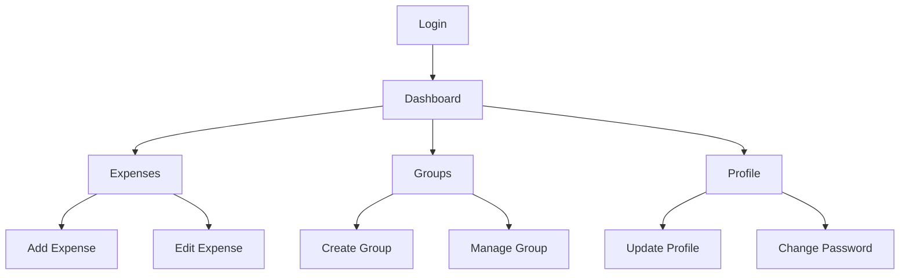

# 📄 Páginas - Frontend FinBoost+

## 📋 Visão Geral

O **FinBoost+** é organizado em páginas específicas que cobrem todo o fluxo de uso da aplicação, desde a autenticação até o gerenciamento financeiro avançado. Cada página é desenvolvida como um componente container que integra múltiplos componentes menores e gerencia o estado local necessário.

## 🗺️ Mapa de Navegação

```
🏠 Aplicação FinBoost+
├── 🔐 Autenticação
│   ├── /login - Página de Login
│   └── /register - Página de Cadastro
├── 📊 Área Logada
│   ├── /dashboard - Dashboard Principal
│   ├── /expenses - Gestão de Despesas
│   ├── /groups - Gestão de Grupos
│   └── /profile - Perfil do Usuário
└── 🚫 Páginas de Erro
    └── /404 - Página Não Encontrada
```

## 🔐 Páginas de Autenticação

### 🚪 Login (`/login`)

**Localização**: `src/pages/Login/index.jsx`

**Objetivo**: Autenticar usuários existentes no sistema.

#### Componentes Utilizados
- `LoginForm` - Formulário principal de login
- `Logo` - Marca da aplicação
- `Button` - Botões de ação
- `Input` - Campos de email e senha

#### Funcionalidades
- **Validação em Tempo Real**: Email e senha validados durante digitação
- **Estados de Loading**: Indicador visual durante autenticação
- **Mensagens de Erro**: Feedback claro para credenciais inválidas
- **Lembrar-me**: Opção de manter sessão ativa
- **Redirecionamento**: Automático para dashboard após login bem-sucedido

#### Layout e Design
```jsx
<div className="min-h-screen flex items-center justify-center bg-background">
  <div className="w-full max-w-md">
    <Logo size="lg" />
    <h1>Bem-vindo de volta!</h1>
    <LoginForm />
    <p>Não tem conta? <Link to="/register">Cadastre-se</Link></p>
  </div>
</div>
```

#### Fluxo de Autenticação
1. **Input de Credenciais**: Usuário insere email/senha
2. **Validação Client-side**: Verificação de formato
3. **Envio para API**: Requisição segura ao backend
4. **Tratamento de Resposta**: Token JWT ou erro
5. **Redirecionamento**: Para dashboard ou exibição de erro

#### Estados da Página
- **Idle**: Aguardando input do usuário
- **Loading**: Processando autenticação
- **Error**: Exibindo mensagem de erro
- **Success**: Redirecionando para dashboard

### 📝 Register (`/register`)

**Localização**: `src/pages/Register/index.jsx`

**Objetivo**: Permitir cadastro de novos usuários.

#### Campos do Formulário
- **Nome Completo**: Input de texto obrigatório
- **Email**: Input com validação de formato
- **Senha**: Campo password com requisitos de segurança
- **Confirmar Senha**: Validação de igualdade
- **Termos de Uso**: Checkbox obrigatório

#### Validações Implementadas
```javascript
const validations = {
  name: {
    required: true,
    minLength: 2,
    pattern: /^[a-zA-ZÀ-ÿ\s]+$/
  },
  email: {
    required: true,
    pattern: /^[^\s@]+@[^\s@]+\.[^\s@]+$/
  },
  password: {
    required: true,
    minLength: 8,
    hasUppercase: true,
    hasNumber: true,
    hasSpecialChar: true
  }
};
```

#### Fluxo de Cadastro
1. **Preenchimento**: Dados pessoais e credenciais
2. **Validação**: Regras de negócio client-side
3. **Verificação de Email**: Checagem se email já existe
4. **Criação de Conta**: Requisição para API
5. **Confirmação**: Email de verificação (se configurado)
6. **Login Automático**: Redirecionamento para dashboard

## 📊 Páginas da Área Logada

### 🏠 Dashboard (`/dashboard`)

**Localização**: `src/pages/Dashboard/index.jsx`

**Objetivo**: Visão geral financeira e navegação principal.

#### Seções Principais

##### 📋 SummaryCards
Grid com métricas financeiras principais:

```jsx
<div className="grid grid-cols-1 md:grid-cols-2 lg:grid-cols-4 gap-6">
  <SummaryCard 
    title="Saldo Total"
    value={totalBalance}
    icon={<FaWallet />}
    trend="positive"
  />
  <SummaryCard 
    title="Gastos do Mês"
    value={monthlyExpenses}
    icon={<FaArrowDown />}
    trend="negative"
  />
  <SummaryCard 
    title="Receitas do Mês"
    value={monthlyIncome}
    icon={<FaArrowUp />}
    trend="positive"
  />
  <SummaryCard 
    title="Economia"
    value={savings}
    icon={<FaPiggyBank />}
    trend={savings > 0 ? "positive" : "negative"}
  />
</div>
```

##### 📊 ChartSwitcher
Visualizações gráficas alternadas:
- **BalanceChart**: Evolução do saldo ao longo do tempo
- **ExpenseChart**: Distribuição de gastos por categoria

##### 📝 LatestExpenses
Lista das últimas transações:
- Últimas 5-10 despesas
- Informações resumidas (data, valor, categoria)
- Links para detalhes e edição

#### Hooks Utilizados
```javascript
const { user, isAuthenticated } = useAuth();
const { expenses, loading: expensesLoading } = useExpenses();
const { groups } = useGroups();
const { theme } = useTheme();
```

#### Estados de Loading
- **Skeleton Cards**: Placeholders durante carregamento
- **Chart Loading**: Spinner para gráficos
- **Progressive Loading**: Carrega seções independentemente

### 💰 Expenses (`/expenses`)

**Localização**: `src/pages/Expenses/index.jsx`

**Objetivo**: Gerenciamento completo de despesas e receitas.

#### Funcionalidades Principais

##### 📋 Lista de Despesas
- **Filtros**: Por categoria, data, grupo, valor
- **Ordenação**: Data, valor, categoria
- **Busca**: Texto livre na descrição
- **Paginação**: 20 itens por página

##### ➕ Adição de Despesas
- **Formulário Modal**: ExpenseForm em modal
- **Validação**: Campos obrigatórios e regras de negócio
- **Upload**: Comprovantes opcionais
- **Categorização**: Seleção de categoria predefinida

##### ✏️ Edição e Exclusão
- **Edição Inline**: Campos editáveis diretamente na lista
- **Modal de Edição**: Formulário completo para mudanças maiores
- **Confirmação de Exclusão**: Modal de confirmação

#### Estrutura de Dados
```javascript
const expense = {
  id: string,
  description: string,
  amount: number,
  category: string,
  date: Date,
  groupId: string,
  userId: string,
  receipt: File | null,
  tags: string[],
  createdAt: Date,
  updatedAt: Date
};
```

#### Filtros Disponíveis
```jsx
<div className="filters-section">
  <DateRangePicker />
  <CategoryFilter categories={categories} />
  <AmountRangeFilter />
  <GroupFilter groups={userGroups} />
  <SearchInput placeholder="Buscar despesas..." />
</div>
```

### 👥 Groups (`/groups`)

**Localização**: `src/pages/Groups/index.jsx`

**Objetivo**: Criação e gestão de grupos para despesas compartilhadas.

#### Funcionalidades

##### 🏗️ Criação de Grupos
- **GroupForm**: Formulário de criação
- **Convites**: Sistema de convite por email
- **Configurações**: Regras de divisão de gastos

##### 📊 Visualização de Grupos
- **Cards de Grupos**: Grid com grupos do usuário
- **Resumo Financeiro**: Saldo por grupo
- **Membros**: Lista de participantes

##### 💸 Gestão de Despesas do Grupo
- **Despesas Compartilhadas**: Gastos divididos automaticamente
- **Liquidação**: Sistema de acerto de contas
- **Relatórios**: Resumos por período

#### Estados do Grupo
```javascript
const groupStates = {
  ACTIVE: 'Ativo',
  PENDING: 'Pendente',
  ARCHIVED: 'Arquivado',
  DISSOLVED: 'Dissolvido'
};
```

#### Permissões
- **Admin**: Criador do grupo (todas as permissões)
- **Member**: Membro padrão (adicionar despesas, ver relatórios)
- **Viewer**: Apenas visualização

### 👤 Profile (`/profile`)

**Localização**: `src/pages/Profile/index.jsx`

**Objetivo**: Gestão de perfil e configurações do usuário.

#### Seções da Página

##### 📷 Informações Pessoais
```jsx
<ProfileSection title="Informações Pessoais">
  <AvatarUpload currentAvatar={user.avatar} />
  <Input name="name" value={user.name} />
  <Input name="email" value={user.email} />
  <Input name="phone" value={user.phone} />
</ProfileSection>
```

##### 🔒 Segurança
- **Alterar Senha**: Formulário com senha atual e nova
- **Autenticação 2FA**: Configuração de dois fatores
- **Sessões Ativas**: Lista de dispositivos logados

##### ⚙️ Preferências
- **Tema**: Seletor claro/escuro
- **Idioma**: Seleção de idioma (se aplicável)
- **Notificações**: Configurações de email/push
- **Moeda**: Moeda padrão para exibição

##### 📊 Dados e Privacidade
- **Exportar Dados**: Download de informações pessoais
- **Excluir Conta**: Processo de exclusão com confirmação
- **Histórico de Atividades**: Log de ações do usuário

## 🚫 Páginas de Erro

### 404 Not Found (`/404`)

**Localização**: `src/pages/Notfound/index.jsx`

**Objetivo**: Página amigável para rotas não encontradas.

#### Elementos
- **Ilustração 404**: SVG ou imagem temática
- **Mensagem Amigável**: Texto explicativo
- **Navegação**: Links para páginas principais
- **Busca**: Campo de busca (opcional)

```jsx
<div className="error-page">
  
  <h1>Oops! Página não encontrada</h1>
  <p>A página que você está procurando não existe ou foi movida.</p>
  <div className="actions">
    <Button onClick={() => navigate('/dashboard')}>
      Voltar ao Dashboard
    </Button>
    <Button variant="outline" onClick={() => navigate(-1)}>
      Página Anterior
    </Button>
  </div>
</div>
```

## 🔄 Fluxos de Navegação

### Fluxo Principal do Usuário


### Proteção de Rotas
- **Rotas Públicas**: `/login`, `/register`, `/404`
- **Rotas Protegidas**: Todas as outras requerem autenticação
- **Redirecionamento**: Usuários não autenticados → `/login`

## 📱 Responsividade das Páginas

### Breakpoints e Adaptações

#### Mobile (< 640px)
- **Navigation**: Menu hamburger
- **Cards**: Stack vertical
- **Forms**: Full-width inputs
- **Tables**: Scroll horizontal ou cards

#### Tablet (640px - 1024px)
- **Grid**: 2 colunas para cards
- **Sidebar**: Collapsible
- **Charts**: Tamanho médio

#### Desktop (> 1024px)
- **Layout**: Full sidebar + main content
- **Grid**: 3-4 colunas
- **Charts**: Tamanho completo
- **Tables**: Visualização completa

## ⚡ Otimizações de Performance

### Lazy Loading
```javascript
// Carregamento sob demanda das páginas
const Dashboard = lazy(() => import('./pages/Dashboard'));
const Expenses = lazy(() => import('./pages/Expenses'));
const Groups = lazy(() => import('./pages/Groups'));
```

### Memoização
- **React.memo**: Componentes que não mudam frequentemente
- **useMemo**: Cálculos complexos (totais, gráficos)
- **useCallback**: Funções de callback estáveis

### Code Splitting
- **Por Rota**: Cada página em bundle separado
- **Por Feature**: Funcionalidades opcionais separadas
- **Vendor Splitting**: Bibliotecas em chunks específicos

---

**🎯 Cada página do FinBoost+ é otimizada para proporcionar a melhor experiência do usuário, com foco em usabilidade, performance e acessibilidade em todos os dispositivos.**
