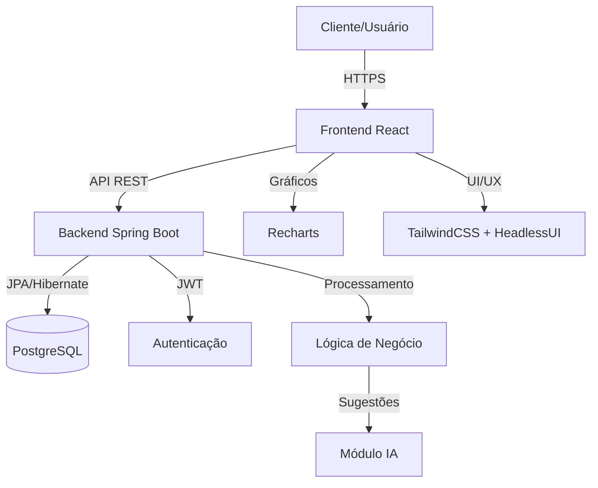

# FinBoost+ — Documentação

Bem-vindo à documentação do **FinBoost+**, um sistema web moderno para controle financeiro pessoal e compartilhado, desenvolvido como projeto final do curso **Desenvolvimento Full-Stack Jr – +Prati & Codifica**.

## Sobre o Projeto

O **FinBoost+** é uma aplicação fullstack que permite aos usuários gerenciar finanças e compartilhar despesas em grupo de forma intuitiva e eficiente.

### Principais Funcionalidades

- **Controle financeiro** com categorização de despesas e receitas
- **Gestão compartilhada** para divisão de gastos em grupos (família, amigos, viagens)
- **Visualização de dados** através de gráficos interativos e relatórios
- **Interface responsiva** com suporte a temas claro/escuro
- **Autenticação segura** com JWT e controle de sessões
- **Sugestões inteligentes** com apoio de inteligência artificial

### Stack Tecnológico

**Frontend:**
- React 19.1.0 com Vite 7.0.3
- TailwindCSS 4.1.11 para estilização
- HeadlessUI 2.2.4 para componentes acessíveis
- Recharts 3.1.0 para visualização de dados

**Backend:**
- Java Spring Boot com Spring Security
- PostgreSQL para persistência de dados
- Docker para containerização
- JWT para autenticação

## Estrutura da Documentação

Esta documentação está organizada para atender diferentes públicos e necessidades:

### Para Usuários
**[Guia do Usuário](user_guide/intro.md)** - Como instalar, configurar e utilizar a aplicação

### Para Avaliadores e Recrutadores
**[Sobre o Projeto](project/overview.md)** - Contexto, objetivos e decisões técnicas tomadas durante o desenvolvimento

### Para Desenvolvedores
**[Arquitetura e API](technical/architecture.md)** - Estrutura técnica detalhada e documentação da API

**[Frontend](frontend/structure.md)** e **[Backend](backend/structure.md)** - Padrões de código e estrutura dos projetos

### Transparência
**[Transparência de IA](ai_docs/ai_usage.md)** - Registro completo do uso de inteligência artificial no desenvolvimento

## Diagrama de Arquitetura



## Quick Start

### Pré-requisitos
- Node.js 18+
- Java 17+
- PostgreSQL 13+
- Git

### Executar o Projeto Localmente

**Frontend:**
```bash
cd frontend
npm install
npm run dev
```

**Backend:**
```bash
cd backend/finboostplus_teste
./mvnw spring-boot:run
```

A aplicação estará disponível em `http://localhost:3000` (frontend) e `http://localhost:8080` (backend).

## Características Técnicas

### Arquitetura
- **Separação clara** entre frontend e backend
- **API RESTful** seguindo padrões REST
- **Autenticação stateless** com JWT
- **Design responsivo** mobile-first

### Qualidade de Código
- **Padrões de desenvolvimento** documentados e seguidos
- **Testes automatizados** para frontend e backend
- **Documentação abrangente** de código e APIs
- **Versionamento semântico** e controle de branches

### Segurança
- **Autenticação JWT** com refresh tokens
- **Validação de dados** no frontend e backend
- **Proteção contra ataques** comuns (XSS, CSRF)
- **Configuração segura** de CORS e headers

## Sobre o Desenvolvimento

Este projeto foi desenvolvido com foco em:

- **Aplicação de conhecimentos** adquiridos durante o curso
- **Boas práticas** de desenvolvimento (Clean Code, SOLID)
- **Arquitetura escalável** e manutenível
- **Documentação técnica** completa e acessível
- **Transparência** no uso de ferramentas de IA

## Links Importantes

- **Repositório:** [GitHub - FinBoost+](https://github.com/Finboostplus/finboostplus-app)
- **Wiki de Desenvolvimento:** [GitHub Wiki](https://github.com/Finboostplus/finboostplus-app/wiki)
- **Documentação da API:** [Swagger/Scalar](technical/api_interactive.md)

## Suporte e Contato

- **Email:** finboostplus@gmail.com
- **Issues:** [GitHub Issues](https://github.com/Finboostplus/finboostplus-app/issues)

---

!!! note "Sobre esta documentação"
    Esta documentação é continuamente atualizada conforme o desenvolvimento do projeto. Para informações técnicas detalhadas sobre o processo de desenvolvimento, consulte também nossa [Wiki no GitHub](https://github.com/Finboostplus/finboostplus-app/wiki).

*Projeto desenvolvido como trabalho final de curso - 2025*