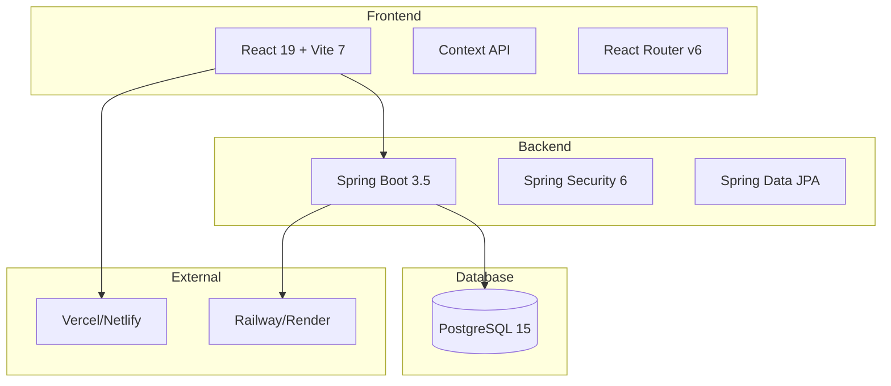

# 🏗️ Arquitetura do Sistema - FinBoost+

<div align="center">
  
  
  
  
</div>

Este documento apresenta a arquitetura técnica do **FinBoost+**, detalhando decisões de design, padrões utilizados e estrutura do sistema.

---

## 🎯 **Visão Geral da Arquitetura**

### **Arquitetura de Alto Nível**


### **Princípios Arquiteturais**
- **Separation of Concerns**: Camadas bem definidas
- **Clean Architecture**: Independência de frameworks
- **SOLID Principles**: Código maintível e extensível
- **RESTful API**: Comunicação padronizada
- **Responsive Design**: Mobile-first approach

---

## 🎨 **Frontend - React Architecture**

### **Stack Tecnológico**
```yaml
Core:
  - React: 19.x (Latest)
  - TypeScript: 5.x
  - Vite: 7.x (Build tool)

Styling:
  - TailwindCSS: 4.x
  - Headless UI: 2.x
  - CSS Modules: Scoped styles

State Management:
  - Context API: Global state
  - React Hooks: Local state
  - Custom Hooks: Business logic

Routing:
  - React Router: v6.x
  - Protected Routes: Authentication
  - Lazy Loading: Code splitting

Testing:
  - Vitest: Test framework
  - React Testing Library: Component testing
  - MSW: API mocking
```

### **Estrutura de Pastas**
```
src/
├── components/          # Componentes reutilizáveis
│   ├── ui/             # Atomic components
│   ├── forms/          # Formulários
│   ├── Layout/         # Layout components
│   └── [Feature]/      # Feature components
├── pages/              # Páginas/Rotas
├── hooks/              # Custom hooks
├── context/            # Context providers
├── services/           # API services
├── utils/              # Utility functions
├── types/              # TypeScript types
└── routes/             # Route configuration
```

### **Padrões de Componentes**
```jsx
// Atomic Design Pattern
// Atoms -> Molecules -> Organisms -> Templates -> Pages

// Component Structure
const Component = ({ prop1, prop2, ...props }) => {
  // Hooks
  const [state, setState] = useState()
  const customHook = useCustomHook()
  
  // Effects
  useEffect(() => {
    // Side effects
  }, [dependencies])
  
  // Handlers
  const handleAction = () => {
    // Action logic
  }
  
  // Render
  return (
    <div {...props}>
      {/* JSX */}
    </div>
  )
}
```

### **Gerenciamento de Estado**
```jsx
// Context API Pattern
const AppContext = createContext()

const AppProvider = ({ children }) => {
  const [state, setState] = useState(initialState)
  
  const actions = {
    updateState: (newState) => setState(newState),
    // More actions...
  }
  
  return (
    <AppContext.Provider value={{ state, ...actions }}>
      {children}
    </AppContext.Provider>
  )
}

// Custom Hook
const useApp = () => {
  const context = useContext(AppContext)
  if (!context) {
    throw new Error('useApp must be used within AppProvider')
  }
  return context
}
```

---

## ⚙️ **Backend - Spring Boot Architecture**

### **Stack Tecnológico**
```yaml
Core:
  - Java: 21 LTS
  - Spring Boot: 3.5.x
  - Spring Framework: 6.x

Data:
  - Spring Data JPA: 3.x
  - Hibernate: 6.x
  - PostgreSQL: 15.x
  - Flyway: Migration tool

Security:
  - Spring Security: 6.x
  - JWT: Authentication
  - BCrypt: Password hashing

Web:
  - Spring Web MVC: REST API
  - Jackson: JSON serialization
  - Validation: Bean validation

Testing:
  - JUnit: 5.x
  - Mockito: Mocking
  - TestContainers: Integration tests
```

### **Arquitetura em Camadas**
```
src/main/java/
├── controller/         # REST Controllers
├── service/           # Business Logic
├── repository/        # Data Access Layer
├── model/            # JPA Entities
├── dto/              # Data Transfer Objects
├── config/           # Configuration classes
├── security/         # Security configuration
├── exception/        # Exception handling
└── util/             # Utility classes
```

### **Padrão de Controlador**
```java
@RestController
@RequestMapping("/api/v1/groups")
@RequiredArgsConstructor
@Validated
public class GroupController {
    
    private final GroupService groupService;
    
    @GetMapping
    public ResponseEntity<PagedResponse<GroupDTO>> getGroups(
            @PageableDefault Pageable pageable,
            Authentication authentication) {
        
        String userEmail = authentication.getName();
        PagedResponse<GroupDTO> groups = groupService.getUserGroups(userEmail, pageable);
        
        return ResponseEntity.ok(groups);
    }
    
    @PostMapping
    public ResponseEntity<ApiResponse<GroupDTO>> createGroup(
            @Valid @RequestBody CreateGroupRequest request,
            Authentication authentication) {
        
        String userEmail = authentication.getName();
        GroupDTO group = groupService.createGroup(request, userEmail);
        
        return ResponseEntity.status(HttpStatus.CREATED)
                .body(ApiResponse.success("Grupo criado com sucesso", group));
    }
}
```

### **Padrão de Serviço**
```java
@Service
@RequiredArgsConstructor
@Transactional
public class GroupService {
    
    private final GroupRepository groupRepository;
    private final UserRepository userRepository;
    private final GroupMapper groupMapper;
    
    public PagedResponse<GroupDTO> getUserGroups(String userEmail, Pageable pageable) {
        User user = userRepository.findByEmail(userEmail)
                .orElseThrow(() -> new UserNotFoundException("Usuário não encontrado"));
        
        Page<Group> groups = groupRepository.findByMembersContaining(user, pageable);
        
        List<GroupDTO> groupDTOs = groups.getContent().stream()
                .map(groupMapper::toDTO)
                .collect(Collectors.toList());
        
        return PagedResponse.of(groupDTOs, groups);
    }
    
    @Transactional
    public GroupDTO createGroup(CreateGroupRequest request, String userEmail) {
        User creator = userRepository.findByEmail(userEmail)
                .orElseThrow(() -> new UserNotFoundException("Usuário não encontrado"));
        
        Group group = Group.builder()
                .name(request.getName())
                .description(request.getDescription())
                .inviteCode(generateInviteCode())
                .createdBy(creator)
                .build();
        
        group.addMember(creator);
        
        Group savedGroup = groupRepository.save(group);
        
        return groupMapper.toDTO(savedGroup);
    }
}
```

### **Configuração de Segurança**
```java
@Configuration
@EnableWebSecurity
@RequiredArgsConstructor
public class SecurityConfig {
    
    private final JwtAuthenticationEntryPoint jwtAuthenticationEntryPoint;
    private final JwtAuthenticationFilter jwtAuthenticationFilter;
    
    @Bean
    public SecurityFilterChain filterChain(HttpSecurity http) throws Exception {
        http.cors(Customizer.withDefaults())
            .csrf(csrf -> csrf.disable())
            .sessionManagement(session -> 
                session.sessionCreationPolicy(SessionCreationPolicy.STATELESS))
            .authorizeHttpRequests(auth -> auth
                .requestMatchers("/api/v1/auth/**").permitAll()
                .requestMatchers("/api/v1/health").permitAll()
                .anyRequest().authenticated())
            .exceptionHandling(ex -> 
                ex.authenticationEntryPoint(jwtAuthenticationEntryPoint))
            .addFilterBefore(jwtAuthenticationFilter, UsernamePasswordAuthenticationFilter.class);
        
        return http.build();
    }
}
```

---

## 🗄️ **Banco de Dados - PostgreSQL**

### **Modelo de Dados**
```sql
-- Principais entidades e relacionamentos

CREATE TABLE users (
    id BIGSERIAL PRIMARY KEY,
    name VARCHAR(100) NOT NULL,
    email VARCHAR(100) UNIQUE NOT NULL,
    password_hash VARCHAR(255) NOT NULL,
    avatar_url VARCHAR(500),
    created_at TIMESTAMP DEFAULT CURRENT_TIMESTAMP,
    updated_at TIMESTAMP DEFAULT CURRENT_TIMESTAMP
);

CREATE TABLE groups (
    id BIGSERIAL PRIMARY KEY,
    name VARCHAR(100) NOT NULL,
    description TEXT,
    invite_code VARCHAR(10) UNIQUE NOT NULL,
    created_by BIGINT REFERENCES users(id),
    created_at TIMESTAMP DEFAULT CURRENT_TIMESTAMP,
    updated_at TIMESTAMP DEFAULT CURRENT_TIMESTAMP
);

CREATE TABLE group_members (
    id BIGSERIAL PRIMARY KEY,
    group_id BIGINT REFERENCES groups(id) ON DELETE CASCADE,
    user_id BIGINT REFERENCES users(id) ON DELETE CASCADE,
    is_admin BOOLEAN DEFAULT FALSE,
    joined_at TIMESTAMP DEFAULT CURRENT_TIMESTAMP,
    UNIQUE(group_id, user_id)
);

CREATE TABLE expenses (
    id BIGSERIAL PRIMARY KEY,
    group_id BIGINT REFERENCES groups(id) ON DELETE CASCADE,
    description VARCHAR(200) NOT NULL,
    amount DECIMAL(10,2) NOT NULL,
    category VARCHAR(50) NOT NULL,
    date DATE NOT NULL,
    notes TEXT,
    created_by BIGINT REFERENCES users(id),
    created_at TIMESTAMP DEFAULT CURRENT_TIMESTAMP,
    updated_at TIMESTAMP DEFAULT CURRENT_TIMESTAMP
);

CREATE TABLE expense_splits (
    id BIGSERIAL PRIMARY KEY,
    expense_id BIGINT REFERENCES expenses(id) ON DELETE CASCADE,
    user_id BIGINT REFERENCES users(id),
    amount DECIMAL(10,2) NOT NULL,
    percentage DECIMAL(5,2) NOT NULL,
    UNIQUE(expense_id, user_id)
);
```

### **Índices e Performance**
```sql
-- Índices para performance
CREATE INDEX idx_groups_created_by ON groups(created_by);
CREATE INDEX idx_group_members_group_id ON group_members(group_id);
CREATE INDEX idx_group_members_user_id ON group_members(user_id);
CREATE INDEX idx_expenses_group_id ON expenses(group_id);
CREATE INDEX idx_expenses_created_by ON expenses(created_by);
CREATE INDEX idx_expenses_date ON expenses(date);
CREATE INDEX idx_expense_splits_expense_id ON expense_splits(expense_id);
CREATE INDEX idx_expense_splits_user_id ON expense_splits(user_id);
```

---

## 🔄 **Integração e APIs**

### **Padrão de Response**
```json
{
  "success": true,
  "message": "Operação realizada com sucesso",
  "data": {
    // Dados da resposta
  },
  "pagination": {
    "page": 0,
    "size": 20,
    "totalElements": 100,
    "totalPages": 5
  },
  "timestamp": "2024-01-16T10:30:00Z"
}
```

### **Tratamento de Erros**
```json
{
  "success": false,
  "error": {
    "code": "VALIDATION_ERROR",
    "message": "Dados inválidos",
    "details": [
      {
        "field": "email",
        "message": "Email é obrigatório"
      }
    ]
  },
  "timestamp": "2024-01-16T10:30:00Z",
  "path": "/api/v1/groups"
}
```

### **Versionamento de API**
- **URL Versioning**: `/api/v1/`, `/api/v2/`
- **Backward Compatibility**: Manter versões anteriores
- **Deprecation Policy**: 6 meses de notice

---

## 🚀 **Deploy e Infraestrutura**

### **Frontend (Vercel/Netlify)**
```yaml
Build:
  - Framework: Vite
  - Output: dist/
  - Commands: npm run build
  - Node: 18.x

Environment:
  - VITE_API_URL: Backend URL
  - VITE_APP_VERSION: Application version

Features:
  - CDN: Global distribution
  - SSL: Automatic HTTPS
  - Cache: Static assets
  - Preview: PR previews
```

### **Backend (Railway/Render)**
```yaml
Runtime:
  - Java: 21
  - Memory: 512MB
  - CPU: 0.5 vCPU

Database:
  - PostgreSQL: 15.x
  - Connection Pool: HikariCP
  - Migrations: Flyway

Environment:
  - SPRING_PROFILES_ACTIVE: production
  - DATABASE_URL: Connection string
  - JWT_SECRET: Secret key
```

### **CI/CD Pipeline**
```yaml
# GitHub Actions
name: Deploy

on:
  push:
    branches: [main]

jobs:
  test:
    runs-on: ubuntu-latest
    steps:
      - uses: actions/checkout@v3
      - name: Setup Node.js
        uses: actions/setup-node@v3
        with:
          node-version: '18'
      - name: Run tests
        run: npm test

  deploy:
    needs: test
    runs-on: ubuntu-latest
    steps:
      - name: Deploy to Vercel
        uses: amondnet/vercel-action@v20
```

---

## 📊 **Monitoramento e Observabilidade**

### **Métricas de Performance**
- **Frontend**: Core Web Vitals, Bundle size
- **Backend**: Response time, Throughput, Error rate
- **Database**: Query performance, Connection pool

### **Logging**
```java
@Slf4j
@Service
public class GroupService {
    
    public GroupDTO createGroup(CreateGroupRequest request, String userEmail) {
        log.info("Creating group: {} for user: {}", request.getName(), userEmail);
        
        try {
            // Business logic
            log.info("Group created successfully: {}", group.getId());
            return groupMapper.toDTO(group);
        } catch (Exception e) {
            log.error("Error creating group for user: {}", userEmail, e);
            throw e;
        }
    }
}
```

### **Health Checks**
```java
@RestController
public class HealthController {
    
    @Autowired
    private DataSource dataSource;
    
    @GetMapping("/api/v1/health")
    public ResponseEntity<Map<String, String>> health() {
        Map<String, String> status = new HashMap<>();
        status.put("status", "UP");
        status.put("database", checkDatabase());
        status.put("timestamp", Instant.now().toString());
        
        return ResponseEntity.ok(status);
    }
}
```

---

## 🔒 **Segurança**

### **Autenticação e Autorização**
- **JWT Tokens**: Stateless authentication
- **Password Hashing**: BCrypt with salt
- **Role-based Access**: Admin/Member permissions
- **Session Management**: Token expiration

### **Proteções Implementadas**
- **CORS**: Cross-origin requests
- **CSRF**: Cross-site request forgery
- **SQL Injection**: Prepared statements
- **XSS**: Input sanitization
- **Rate Limiting**: API throttling

---

## 📈 **Escalabilidade**

### **Estratégias de Crescimento**
- **Horizontal Scaling**: Multiple instances
- **Database Optimization**: Indexing, query tuning
- **Caching**: Redis for sessions/data
- **CDN**: Static asset distribution
- **Load Balancing**: Traffic distribution

### **Futuras Melhorias**
- **Microservices**: Service decomposition
- **Event Sourcing**: Audit trail
- **CQRS**: Command/Query separation
- **GraphQL**: Flexible API queries

---

<div align="center">
  <strong>🏗️ Arquitetura sólida e escalável</strong><br/>
  <em>Base técnica para crescimento sustentável</em>
</div>
