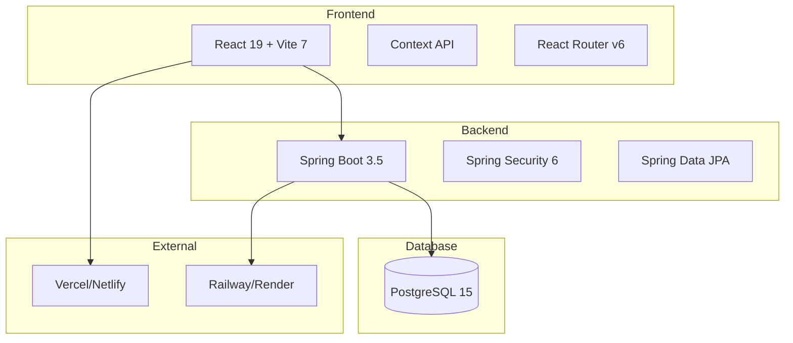

# Arquitetura do Sistema - FinBoost+

Este documento apresenta a arquitetura técnica do FinBoost+, detalhando decisões de design, padrões utilizados e estrutura do sistema.

---

## Visão Geral da Arquitetura

### Arquitetura de Alto Nível


```mermaid
graph TB
    subgraph "Frontend"
        UI[React 19 + Vite 7]
        State[Context API]
        Router[React Router v6]
    end
    subgraph "Backend"
        API[Spring Boot 3.5]
        Security[Spring Security 6]
        JPA[Spring Data JPA]
    end
    subgraph "Database"
        DB[(PostgreSQL 15)]
    end
    subgraph "External"
        CDN[Vercel/Netlify]
        Deploy[Railway/Render]
    end
    UI --> API
    API --> DB
    UI --> CDN
    API --> Deploy
```

### Princípios Arquiteturais
- Separação de responsabilidades (Separation of Concerns)
- Clean Architecture: independência de frameworks
- Princípios SOLID: código manutenível e extensível
- API RESTful: comunicação padronizada
- Design responsivo: abordagem mobile-first

---

## Frontend - Arquitetura React

### Stack Tecnológico
```yaml
Core:
  - React: 19.x
  - TypeScript: 5.x
  - Vite: 7.x
Styling:
  - TailwindCSS: 4.x
  - Headless UI: 2.x
  - CSS Modules
State Management:
  - Context API
  - React Hooks
  - Custom Hooks
Routing:
  - React Router: v6.x
  - Protected Routes
  - Lazy Loading
Testing:
  - Vitest
  - React Testing Library
  - MSW
```

### Estrutura de Pastas
```
src/
├── components/          # Componentes reutilizáveis
│   ├── ui/             # Componentes atômicos
│   ├── forms/          # Formulários
│   ├── Layout/         # Componentes de layout
│   └── [Feature]/      # Componentes de funcionalidades
├── pages/              # Páginas/Rotas
├── hooks/              # Custom hooks
├── context/            # Providers de contexto
├── services/           # Serviços de API
├── utils/              # Funções utilitárias
├── types/              # Tipos TypeScript
└── routes/             # Configuração de rotas
```

### Padrões de Componentes
```jsx
// Padrão Atomic Design: Atoms -> Molecules -> Organisms -> Templates -> Pages
const Component = ({ prop1, prop2, ...props }) => {
  // Hooks
  const [state, setState] = useState()
  const customHook = useCustomHook()
  // Effects
  useEffect(() => {
    // Side effects
  }, [dependencies])
  // Handlers
  const handleAction = () => {
    // Action logic
  }
  // Render
  return (
    <div {...props}>
      {/* JSX */}
    </div>
  )
}
```

### Gerenciamento de Estado
```jsx
// Context API Pattern
const AppContext = createContext()
const AppProvider = ({ children }) => {
  const [state, setState] = useState(initialState)
  const actions = {
    updateState: (newState) => setState(newState),
    // ...
  }
  return (
    <AppContext.Provider value={{ state, ...actions }}>
      {children}
    </AppContext.Provider>
  )
}
// Custom Hook
const useApp = () => {
  const context = useContext(AppContext)
  if (!context) {
    throw new Error('useApp must be used within AppProvider')
  }
  return context
}
```

---

## Backend - Arquitetura Spring Boot

### Stack Tecnológico
```yaml
Core:
  - Java: 21 LTS
  - Spring Boot: 3.5.x
  - Spring Framework: 6.x
Data:
  - Spring Data JPA: 3.x
  - Hibernate: 6.x
  - PostgreSQL: 15.x
  - Flyway
Security:
  - Spring Security: 6.x
  - JWT
  - BCrypt
Web:
  - Spring Web MVC
  - Jackson
  - Bean Validation
Testing:
  - JUnit: 5.x
  - Mockito
  - TestContainers
```

### Arquitetura em Camadas
```
src/main/java/
├── controller/         # REST Controllers
├── service/            # Lógica de negócio
├── repository/         # Acesso a dados
├── model/              # Entidades JPA
├── dto/                # Data Transfer Objects
├── config/             # Configurações
├── security/           # Configuração de segurança
├── exception/          # Tratamento de exceções
└── util/               # Utilitários
```

### Padrão de Controlador
```java
@RestController
@RequestMapping("/api/v1/groups")
@RequiredArgsConstructor
@Validated
public class GroupController {
    private final GroupService groupService;
    @GetMapping
    public ResponseEntity<PagedResponse<GroupDTO>> getGroups(
            @PageableDefault Pageable pageable,
            Authentication authentication) {
        String userEmail = authentication.getName();
        PagedResponse<GroupDTO> groups = groupService.getUserGroups(userEmail, pageable);
        return ResponseEntity.ok(groups);
    }
    @PostMapping
    public ResponseEntity<ApiResponse<GroupDTO>> createGroup(
            @Valid @RequestBody CreateGroupRequest request,
            Authentication authentication) {
        String userEmail = authentication.getName();
        GroupDTO group = groupService.createGroup(request, userEmail);
        return ResponseEntity.status(HttpStatus.CREATED)
                .body(ApiResponse.success("Grupo criado com sucesso", group));
    }
}
```

### Padrão de Serviço
```java
@Service
@RequiredArgsConstructor
@Transactional
public class GroupService {
    // ...implementação dos métodos de negócio...
}
```

---

## Integração e Infraestrutura

- **API RESTful**: Comunicação entre frontend e backend via endpoints REST
- **Autenticação JWT**: Segurança de acesso
- **Containerização**: Docker para padronização de ambiente
- **CI/CD**: GitHub Actions para integração e deploy contínuo
- **Monitoramento**: Spring Actuator e logs estruturados

---

## Considerações Finais

A arquitetura do FinBoost+ foi projetada para garantir escalabilidade, manutenibilidade e segurança, utilizando padrões modernos e tecnologias consolidadas no mercado. Todas as decisões arquiteturais visam facilitar a evolução do sistema e a colaboração entre equipes.
