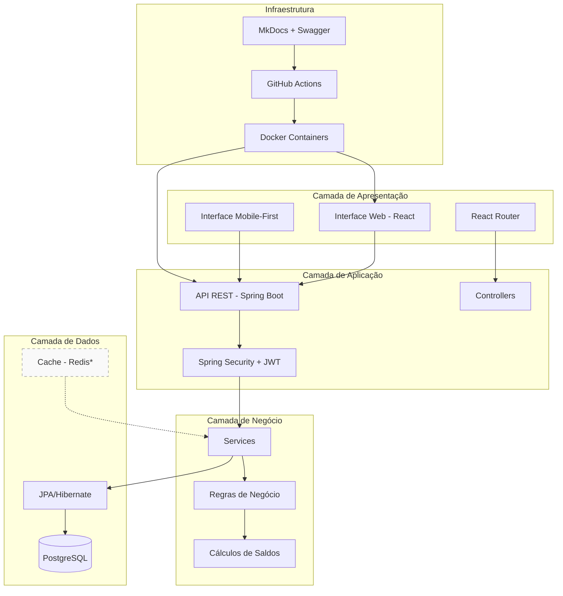
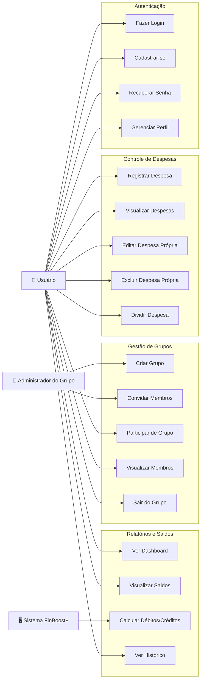
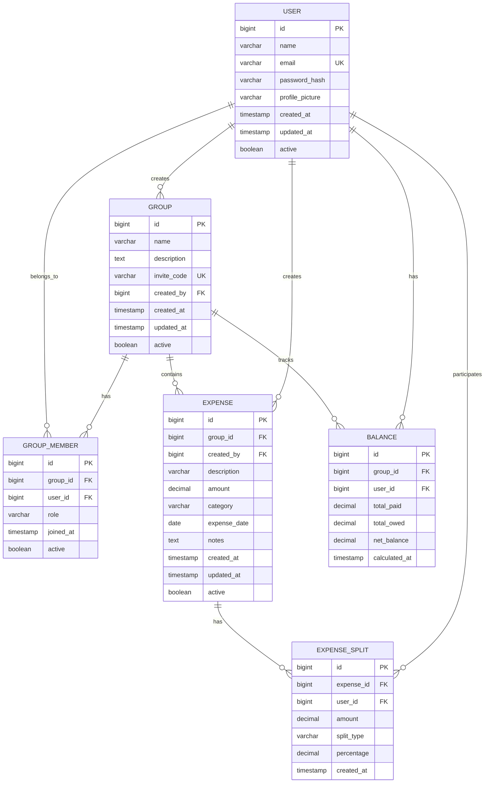
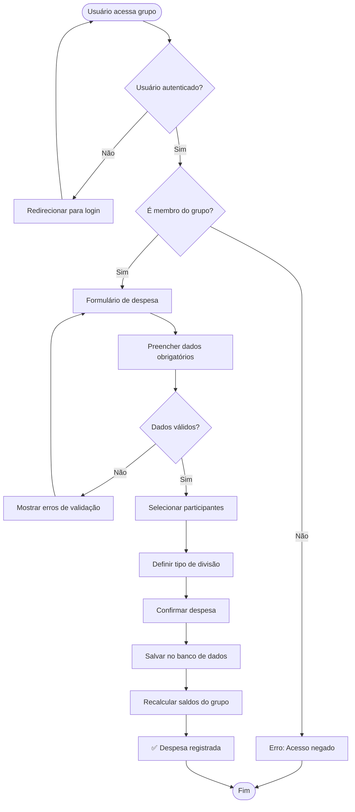
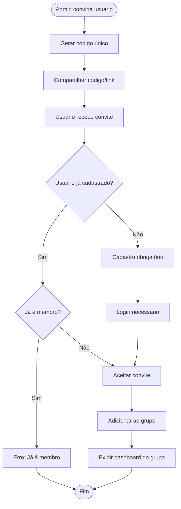
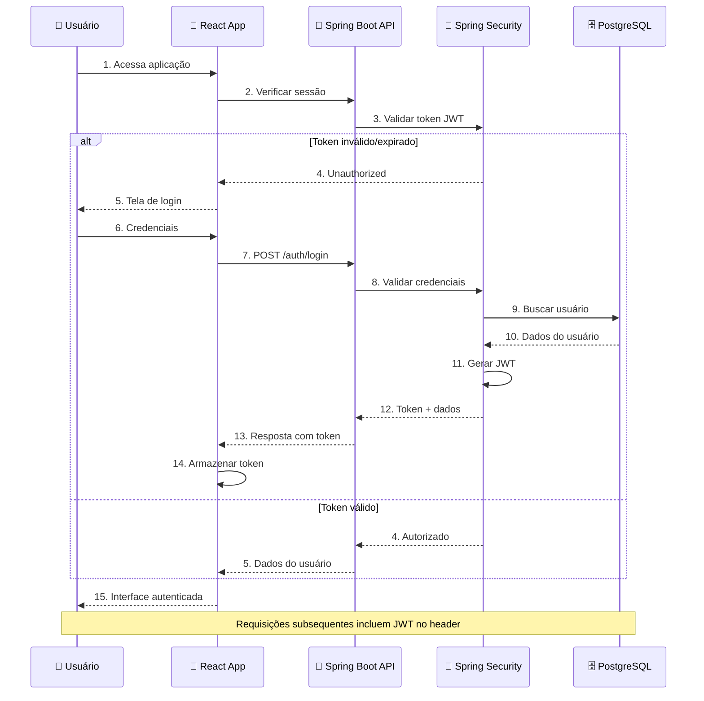

# 📊 Diagramas do Sistema - FinBoost+

Esta seção apresenta os diagramas oficiais que documentam a arquitetura e funcionamento do sistema FinBoost+, baseados nos documentos originais do projeto.

---

## 🏗️ **Diagrama de Arquitetura do Sistema**



*Cache Redis previsto para versões futuras

---

## 👤 **Diagrama de Casos de Uso**

> **📋 Nota:** Este diagrama está baseado no arquivo oficial `Diagrama de Casos de Uso.png` localizado em `project_docs/diagramas/`



---

## 🗄️ **Diagrama Entidade-Relacionamento (ER)**

> **📋 Nota:** Este diagrama está baseado no arquivo oficial `diagrama_ER.png` localizado em `project_docs/diagramas/`



---

## 📱 **Diagrama de Classes - Estrutura Principal**

> **📋 Nota:** Este diagrama está baseado no arquivo oficial `diagrama_classes.png` localizado em `project_docs/diagramas/`

```mermaid
classDiagram
    class User {
        +Long id
        +String name
        +String email
        +String passwordHash
        +String profilePicture
        +LocalDateTime createdAt
        +LocalDateTime updatedAt
        +Boolean active
        
        +createGroup()
        +joinGroup()
        +createExpense()
        +updateProfile()
    }
    
    class Group {
        +Long id
        +String name
        +String description
        +String inviteCode
        +Long createdBy
        +LocalDateTime createdAt
        +LocalDateTime updatedAt
        +Boolean active
        
        +addMember()
        +removeMember()
        +generateInviteCode()
        +calculateGroupBalance()
    }
    
    class GroupMember {
        +Long id
        +Long groupId
        +Long userId
        +String role
        +LocalDateTime joinedAt
        +Boolean active
        
        +changeRole()
        +leave()
    }
    
    class Expense {
        +Long id
        +Long groupId
        +Long createdBy
        +String description
        +BigDecimal amount
        +String category
        +LocalDate expenseDate
        +String notes
        +LocalDateTime createdAt
        +LocalDateTime updatedAt
        +Boolean active
        
        +splitExpense()
        +updateSplits()
        +calculateIndividualAmounts()
    }
    
    class ExpenseSplit {
        +Long id
        +Long expenseId
        +Long userId
        +BigDecimal amount
        +String splitType
        +BigDecimal percentage
        +LocalDateTime createdAt
        
        +calculateAmount()
    }
    
    class Balance {
        +Long id
        +Long groupId
        +Long userId
        +BigDecimal totalPaid
        +BigDecimal totalOwed
        +BigDecimal netBalance
        +LocalDateTime calculatedAt
        
        +recalculate()
        +getDebtsAndCredits()
    }
    
    User ||--o{ Group : creates
    User ||--o{ GroupMember : participates
    Group ||--o{ GroupMember : contains
    Group ||--o{ Expense : has
    User ||--o{ Expense : creates
    Expense ||--o{ ExpenseSplit : divided_into
    User ||--o{ ExpenseSplit : owes
    Group ||--o{ Balance : tracks
    User ||--o{ Balance : has
```

---

## 🔄 **Fluxograma: Processo de Registro de Despesa**



---

## 🔄 **Fluxograma: Processo de Convite para Grupo**



---

## 🎯 **Diagrama de Componentes - Frontend React**

```mermaid
graph TB
    subgraph "App Principal"
        App[App.jsx]
        Router[React Router]
        AuthContext[AuthContext]
        ThemeContext[ThemeContext]
    end
    
    subgraph "Páginas"
        Login[Login]
        Dashboard[Dashboard]
        Groups[Groups]
        Profile[Profile]
    end
    
    subgraph "Componentes Principais"
        Header[Header]
        ExpenseForm[ExpenseForm]
        ExpenseList[ExpenseList]
        GroupCard[GroupCard]
        BalanceCard[BalanceCard]
    end
    
    subgraph "Componentes UI"
        Button[Button]
        Input[Input]
        Modal[Modal]
        Loading[Loading]
    end
    
    subgraph "Hooks Customizados"
        useAuth[useAuth]
        useGroups[useGroups]
        useExpenses[useExpenses]
    end
    
    subgraph "Serviços"
        AuthService[AuthService]
        APIService[APIService]
        LocalStorage[LocalStorage]
    end
    
    App --> Router
    App --> AuthContext
    App --> ThemeContext
    Router --> Páginas
    
    Páginas --> "Componentes Principais"
    "Componentes Principais" --> "Componentes UI"
    "Componentes Principais" --> "Hooks Customizados"
    "Hooks Customizados" --> Serviços
```

---

## � **Fluxo de Autenticação e Segurança**



---

## 📊 **Referências dos Diagramas Oficiais**

Os diagramas apresentados nesta documentação são baseados nos seguintes arquivos oficiais do projeto:

- **📁 `project_docs/diagramas/Diagrama de Casos de Uso.png`** - Casos de uso detalhados do sistema
- **📁 `project_docs/diagramas/diagrama_ER.png`** - Modelo de dados e relacionamentos
- **📁 `project_docs/diagramas/diagrama_classes.png`** - Estrutura de classes do domínio

### **Observações Importantes:**

1. **Escopo do MVP:** Os diagramas refletem apenas as funcionalidades implementadas no MVP
2. **Versões Futuras:** Funcionalidades como cache Redis, notificações e IA estão marcadas como futuras
3. **Simplificação:** Alguns detalhes de implementação foram simplificados para clareza
4. **Atualização:** Esta documentação será atualizada conforme a evolução do projeto

---

<div align="center">
  <strong>📊 Diagramas baseados na documentação oficial</strong><br/>
  <em>Representação visual da arquitetura implementada</em>
</div>
