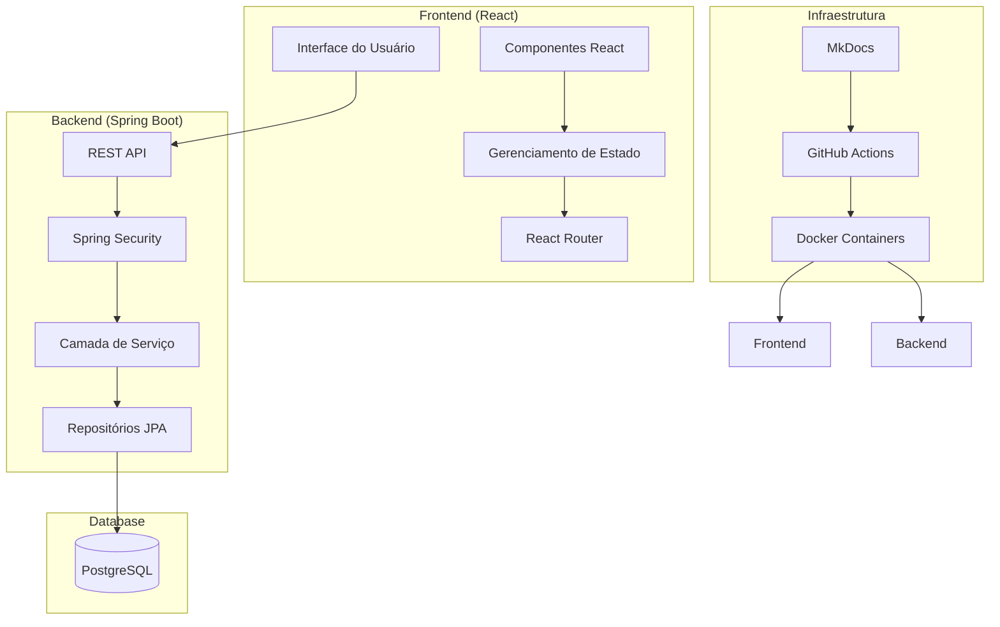
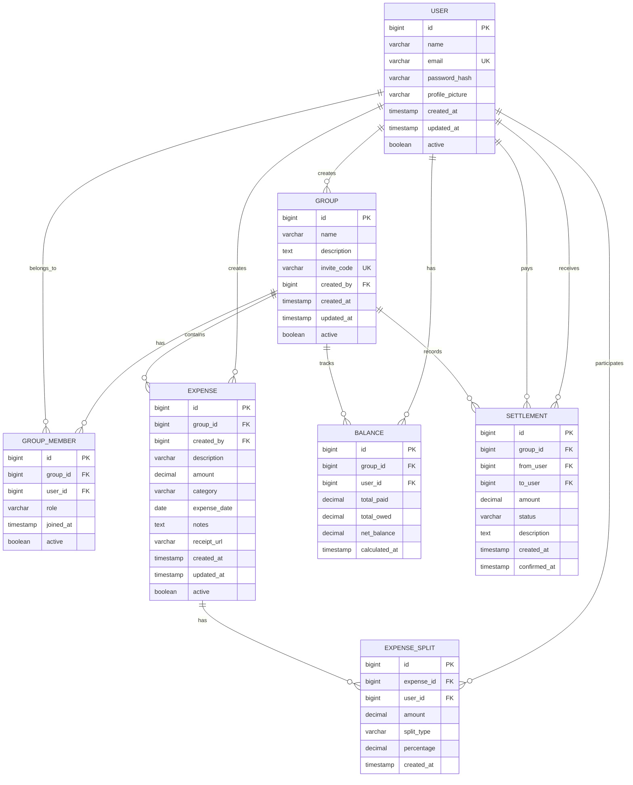
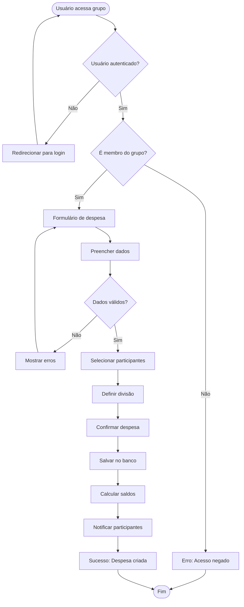
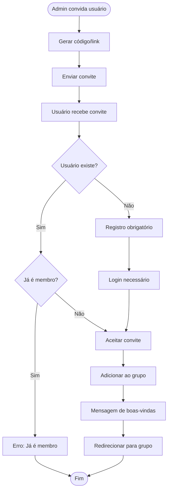
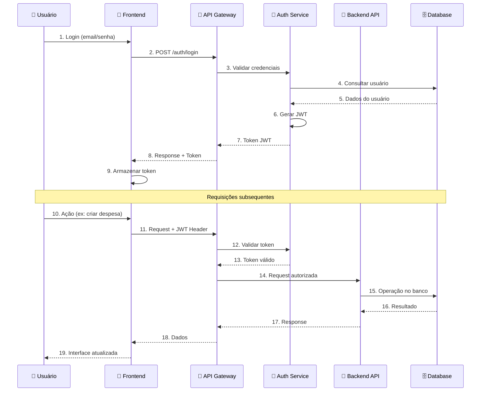
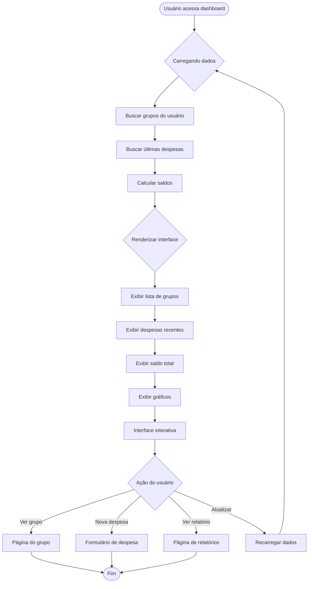
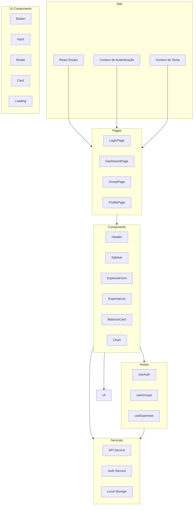
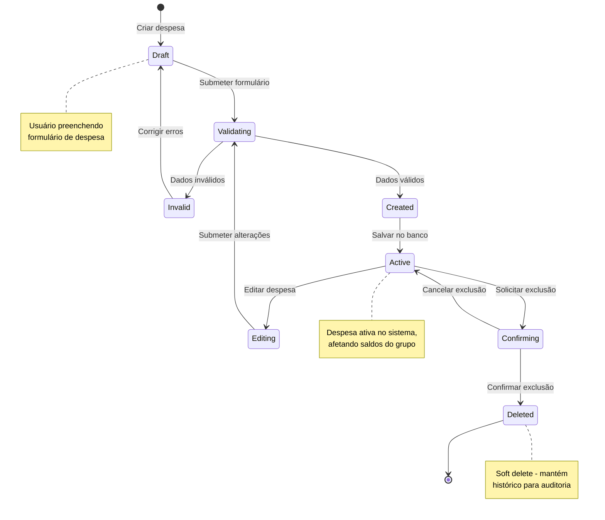
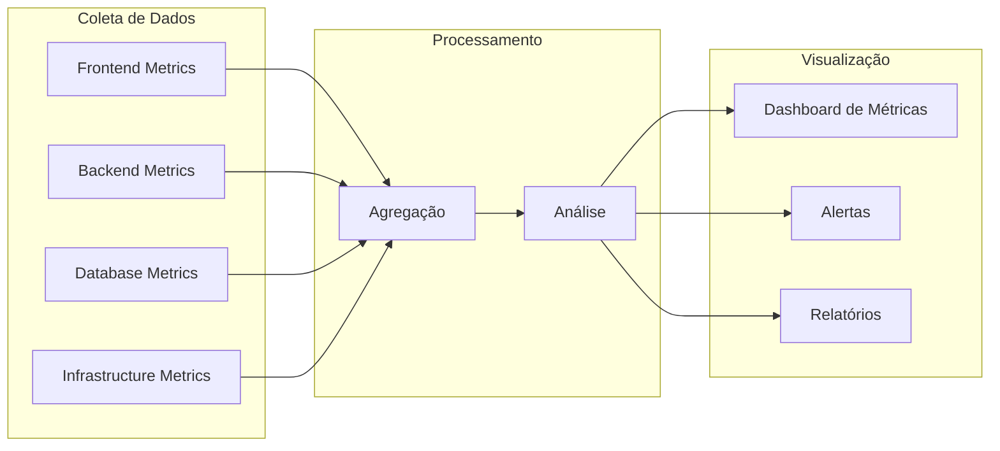

# 📊 Diagramas do Sistema - FinBoost+

Esta seção apresenta os diagramas técnicos e de processo que documentam a arquitetura e funcionamento do sistema FinBoost+.

---

## 🏗️ **Diagrama de Arquitetura**

---

## 👤 **Diagrama de Casos de Uso**

```mermaid
graph TD
    User[👤 Usuário]
    Admin[👤 Administrador]
    System[🖥️ Sistema FinBoost+]
    
    subgraph "Autenticação"
        UC1[Fazer Login]
        UC2[Cadastrar-se]
        UC3[Recuperar Senha]
        UC4[Gerenciar Perfil]
    end
    
    subgraph "Gestão de Grupos"
        UC5[Criar Grupo]
        UC6[Convidar Membros]
        UC7[Listar Grupos]
        UC8[Configurar Grupo]
        UC9[Sair do Grupo]
    end
    
    subgraph "Controle de Despesas"
        UC10[Registrar Despesa]
        UC11[Visualizar Despesas]
        UC12[Editar Despesa]
        UC13[Excluir Despesa]
        UC14[Calcular Saldos]
    end
    
    subgraph "Relatórios"
        UC15[Gerar Dashboard]
        UC16[Visualizar Saldos]
        UC17[Relatório por Período]
        UC18[Gráficos de Gastos]
    end
    
    User --> UC1
    User --> UC2
    User --> UC3
    User --> UC4
    User --> UC5
    User --> UC7
    User --> UC9
    User --> UC10
    User --> UC11
    User --> UC12
    User --> UC13
    User --> UC15
    User --> UC16
    User --> UC17
    User --> UC18
    
    Admin --> UC6
    Admin --> UC8
    
    System --> UC14
```

---

## 🗄️ **Diagrama Entidade-Relacionamento (ER)**

---

## 🔄 **Fluxograma de Processos Principais**

### **Processo: Registro de Nova Despesa**

### **Processo: Convite para Grupo**

---

## 🔐 **Diagrama de Segurança**

---

## 🏃‍♂️ **Diagrama de Atividades - Dashboard**

---

## 📱 **Diagrama de Componentes - Frontend**

---

## 🔄 **Diagrama de Estados - Despesa**

---

## 📊 **Métricas e Monitoramento**

### **Métricas Chave**
- **Performance:** Response time, FCP, LCP
- **Uso:** DAU, MAU, Session duration
- **Business:** Grupos criados, Despesas registradas
- **Técnicas:** Error rate, Uptime, Memory usage

---

  <strong>📊 Diagramas técnicos e de processo</strong> 
  <em>Documentação visual da arquitetura do sistema</em>

