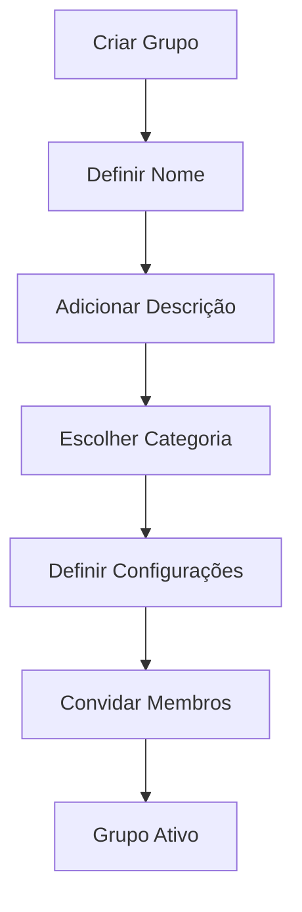
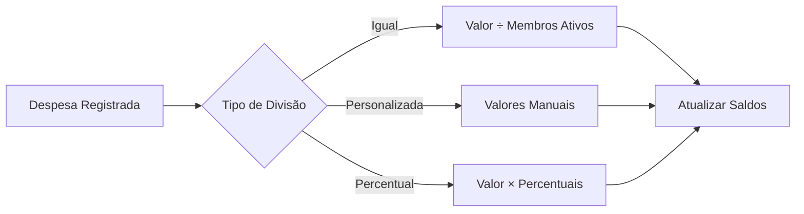
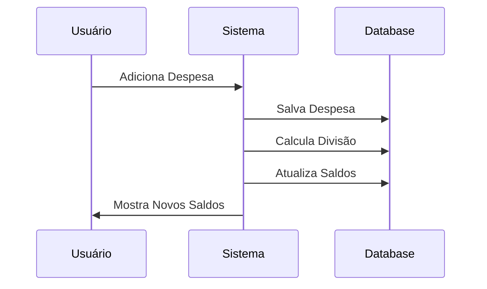
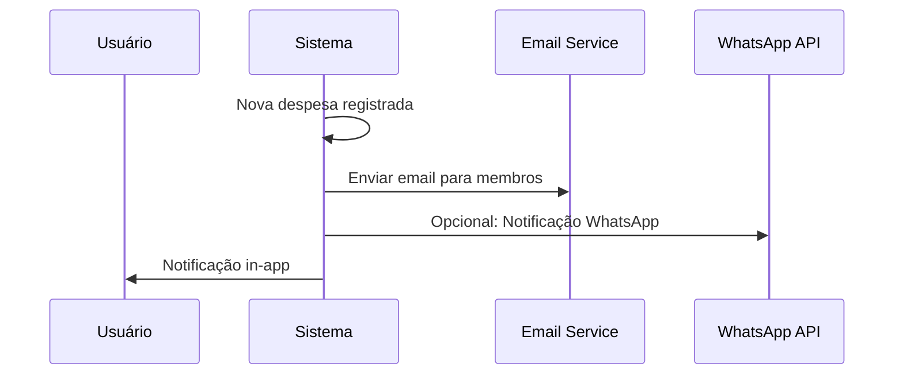

# Funcionalidades Atuais

Este documento detalha todas as funcionalidades implementadas e disponíveis na versão atual do FinBoost+. Cada funcionalidade é apresentada com sua descrição, casos de uso e aspectos técnicos relevantes.

## Sistema de Autenticação e Autorização

### Autenticação Segura

**Cadastro de Usuários**

- Validação de email único e formato válido
- Senha com critérios de segurança (mínimo 6 caracteres)
- Confirmação de senha obrigatória
- Hash seguro das senhas (BCrypt)

**Login e Sessão**

- Autenticação via JWT (JSON Web Tokens)
- Refresh token para renovação automática de sessão
- Logout seguro com invalidação de tokens
- Sessão persistente entre navegação

**Recuperação de Conta**

- Reset de senha via email
- Tokens temporários com expiração
- Validação de identidade antes da alteração

### Gerenciamento de Perfil

**Informações Básicas**

- Nome completo e email
- Histórico de atividades
- Preferências

## Gerenciamento de Grupos Financeiros

### Criação e Configuração

**Configurações de Grupo**

- Nome e descrição personalizáveis
- Categorias predefinidas (Casa, Viagem, Trabalho, etc.)
- Definição de administradores

### Gerenciamento de Membros

**Convites e Adição**

- Convite para novo membro
- Aprovação automática ou manual de novos membros
- Diferentes níveis de permissão (Admin, Membro)

## Sistema de Despesas

### Registro de Despesas

**Tipos de Despesa**

- **Individual**: Afeta apenas o usuário que registra
- **Compartilhada Igual**: Dividida igualmente entre todos os membros ativos
- **Compartilhada Personalizada**: Divisão manual com valores específicos

**Informações da Despesa**

- Título e descrição detalhada
- Valor monetário com validação
- Data da despesa (padrão: data atual)
- Categoria (Alimentação, Transporte, Entretenimento, etc.)

### Cálculos Financeiros

**Engine de Divisão**

### Categorização

**Categorias Padrão**

- Alimentação e Restaurantes
- Transporte e Combustível
- Entretenimento e Lazer
- Casa e Utilities
- Compras e Shopping
- Saúde e Medicamentos
- Educação e Livros
- Outros

## Dashboard e Visualizações

### Painel Principal

**Visão Geral Financeira**

- Saldo atual por grupo
- Total de despesas do mês
- Débitos e créditos pendentes
- Atividades recentes

**Cards Informativos**

- Resumo rápido por grupo ativo
- Status de pagamentos pendentes

### Relatórios e Gráficos

**Gráficos Interativos (Recharts)**

- Distribuição de gastos por categoria (Pizza)
- Evolução temporal dos gastos (Linha)

**Filtros e Períodos**

- Filtro por data (último mês, trimestre, ano)
- Filtro por categoria específica
- Filtro por membro do grupo
- Busca textual em descrições

### Histórico de Transações

**Lista Detalhada**

- Todas as despesas em ordem cronológica
- Informações completas de cada transação
- Status de divisão e pagamentos

**Funcionalidades de Lista**

- Paginação para performance
- Ordenação por diferentes campos
- Filtros múltiplos simultâneos
- Exportação básica (futuro)

## Cálculo e Gestão de Saldos

### Engine de Saldos

**Cálculo em Tempo Real**

**Algoritmos de Saldo**

- Cálculo individual por usuário em cada grupo
- Soma de débitos (despesas que deve pagar)
- Soma de créditos (despesas que outros devem)
- Saldo líquido (créditos - débitos)

### Transparência Financeira

**Detalhamento de Saldos**

- Origem de cada débito e crédito
- Histórico de como o saldo foi formado
- Drill-down até a despesa específica
- Validação de consistência matemática

**Resumos por Relacionamento**

- "João deve R$ 50,00 para Maria"
- "Ana deve receber R$ 30,00 de Pedro"
- Simplificação de débitos múltiplos
- Sugestões de acerto de contas

## Interface e Experiência do Usuário

### Design Responsivo

**Layout Adaptativo**

- Mobile-first design
- Breakpoints otimizados para tablet e desktop
- Navegação intuitiva em todos os dispositivos
- Touch-friendly para dispositivos móveis

### Temas e Personalização

**Sistema de Temas**

- Tema claro (padrão)
- Tema escuro
- Preferência salva no perfil do usuário
- Transição suave entre temas

## Funcionalidades de Busca e Filtros

### Sistema de Busca

**Busca Inteligente**

- Busca em títulos e descrições de despesas
- Filtro por autor da despesa
- Filtro por período específico
- Combinação múltipla de filtros

**Filtros Avançados**

- Por categoria de despesa
- Por valor mínimo/máximo
- Por tipo de divisão
- Por status de pagamento

## Segurança e Validações

### Validações de Dados

**Frontend (Imediata)**

- Validação de campos obrigatórios
- Formato de email e valores monetários
- Limites de caracteres em textos
- Confirmação de ações destrutivas

**Backend (Definitiva)**

- Revalidação de todos os dados recebidos
- Sanitização contra ataques XSS
- Verificação de autorização por recurso
- Logs de segurança para auditoria

### Proteções Implementadas

**Autenticação e Autorização**

- JWT com expiração configurável
- Verificação de permissões por endpoint
- Rate limiting para APIs críticas
- Logout automático por inatividade

**Integridade de Dados**

- Validações de consistência matemática
- Rollback automático em erros
- Backup de transações críticas
- Monitoramento de integridade

## Performance e Otimizações

### Otimizações Frontend

**Carregamento Eficiente**

- Lazy loading de componentes grandes
- Paginação de listas extensas
- Cache local de dados frequentes
- Otimização de imagens anexadas

### Otimizações Backend

**Queries Otimizadas**

- Índices estratégicos no banco
- Consultas com joins eficientes
- Paginação no servidor
- Cache de consultas frequentes

!!! note "Status de Desenvolvimento"
    Todas as funcionalidades listadas foram implementadas e testadas. O sistema está em constante evolução, com melhorias baseadas nos testes realizados.

## Roadmap de Desenvolvimento

### Fase 1 - Melhorias Imediatas (Próximos meses)

**Prioridade: Alta**

#### Aprimoramentos de Usabilidade

**Notificações Avançadas**

- Sistema de notificações por email
- Alertas personalizáveis por usuário
- Notificações push para PWA
- Resumos periódicos de atividades

**Melhorias na Interface**

- Wizard de onboarding para novos usuários
- Tutoriais interativos para funcionalidades principais
- Atalhos de teclado para ações frequentes
- Modo offline básico com sincronização

#### Funcionalidades Financeiras

**Gestão de Pagamentos**

- Registro de quitação de dívidas entre membros
- Histórico de pagamentos realizados
- Lembretes automáticos de débitos pendentes
- Validação de acerto de contas

**Relatórios Expandidos**

- Exportação para PDF e Excel
- Relatórios personalizáveis por período
- Análises de tendências de gastos
- Comparativos entre grupos diferentes

### Fase 2 - Expansão de Recursos 

**Prioridade: Média-Alta**

#### Inteligência Artificial

**Sugestões Inteligentes**

- Análise de padrões de gastos
- Alertas de gastos atípicos
- Sugestões de categorização automática
- Previsões de gastos mensais

**Reconhecimento de Dados**

- OCR para extração de dados de recibos
- Reconhecimento de voz para entrada rápida
- Classificação automática de despesas
- Detecção de duplicatas

## Critérios de Priorização

### Impacto no Usuário

**Alto Impacto**

- Funcionalidades que resolvem dores principais dos usuários
- Melhorias que aumentam significativamente a usabilidade
- Recursos que reduzem tempo de execução de tarefas

**Médio Impacto**

- Funcionalidades que agregam conveniência
- Melhorias estéticas e de experiência
- Recursos que ampliam casos de uso

**Baixo Impacto**

- Funcionalidades "nice-to-have"
- Recursos utilizados por poucos usuários
- Melhorias puramente estéticas

Para detalhes técnicos de implementação, veja a seção [Arquitetura e API](../technical/architecture.md).