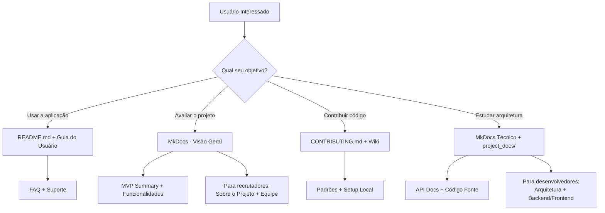

# Documentação Completa

Esta página serve como índice centralizado para toda a documentação técnica e de projeto do **FinBoost+**. A documentação está distribuída em diferentes locais para atender às necessidades específicas de cada público e tipo de informação.

## Estrutura da Documentação

### Documentação no MkDocs (Este Site)

Esta documentação técnica está organizada para usuários, desenvolvedores e avaliadores do projeto.

**Para Usuários Finais**
- [Guia do Usuário](../user_guide/intro.md) - Como usar a aplicação
- [FAQ](../user_guide/faq.md) - Perguntas frequentes

**Para Desenvolvedores e Avaliadores**
- [Arquitetura e API](../technical/architecture.md) - Visão técnica do sistema
- [Frontend](../frontend/structure.md) - Estrutura e padrões do frontend
- [Backend](../backend/structure.md) - Estrutura e padrões do backend
- [Transparência de IA](../ai_docs/ai_usage.md) - Registro do uso de IA no projeto

### Documentação no GitHub

#### Arquivos Principais do Repositório

**README.md Principal**
- Visão geral do projeto para visitantes do GitHub
- Quick start e instruções básicas
- Links para documentações mais detalhadas
- **Acesso**: [GitHub - README](https://github.com/Finboostplus/finboostplus-app/blob/main/README.md)

**CONTRIBUTING.md**
- Guia detalhado para contribuidores
- Padrões de código e commit
- Processo de pull requests
- **Acesso**: [GitHub - Contributing](https://github.com/Finboostplus/finboostplus-app/blob/main/CONTRIBUTING.md)

**LICENSE**
- Licença do projeto (MPL-2.0)
- **Acesso**: [GitHub - License](https://github.com/Finboostplus/finboostplus-app/blob/main/LICENSE)

#### Diretório project_docs/

Contém documentos extensos de planejamento e especificação do projeto:

**Documento MVP Completo**
- Especificação detalhada do Produto Mínimo Viável
- Mais de 900 linhas com requisitos técnicos e funcionais
- Diagramas de arquitetura e banco de dados
- **Acesso**: [GitHub - MVP](https://github.com/Finboostplus/finboostplus-app/blob/main/project_docs/mvp.md)

**Personas Detalhadas**
- Perfis completos dos usuários-alvo
- Cenários de uso e necessidades específicas
- Jornadas do usuário mapeadas
- **Acesso**: [GitHub - Personas](https://github.com/Finboostplus/finboostplus-app/blob/main/project_docs/personas.md)

**Histórias de Usuário**
- Especificação detalhada de todos os recursos
- Critérios de aceitação por funcionalidade
- Priorização e estimativas
- **Acesso**: [GitHub - User Stories](https://github.com/Finboostplus/finboostplus-app/blob/main/project_docs/user_stories.md)

**Documento de Requisitos**
- Requisitos funcionais e não funcionais
- Restrições técnicas e de negócio
- Matriz de rastreabilidade
- **Acesso**: [GitHub - Requisitos](https://github.com/Finboostplus/finboostplus-app/blob/main/project_docs/requirements.md)

**Contrato de API**
- Especificação completa de todos os endpoints
- Modelos de dados e schemas
- Códigos de resposta e tratamento de erros
- **Acesso**: [GitHub - API Contract](https://github.com/Finboostplus/finboostplus-app/blob/main/project_docs/api_contract.md)

### GitHub Wiki

A Wiki contém documentação técnica voltada para desenvolvedores durante o processo de desenvolvimento:

**Processo de Desenvolvimento**
- [Estrutura do Repositório](https://github.com/Finboostplus/finboostplus-app/wiki/Estrutura-do-Repositório)
- [Como Rodar o Projeto](https://github.com/Finboostplus/finboostplus-app/wiki/Como-Rodar-o-Projeto)
- [Boas Práticas de Desenvolvimento](https://github.com/Finboostplus/finboostplus-app/wiki/Boas-Praticas-de-Desenvolvimento)

**Padrões Técnicos**
- [Padrão de Commits](https://github.com/Finboostplus/finboostplus-app/wiki/Padrão-de-Commits)
- [GitFlow e Branching](https://github.com/Finboostplus/finboostplus-app/wiki/GitFlow-e-Branching)
- [Code Review Guidelines](https://github.com/Finboostplus/finboostplus-app/wiki/Code-Review-Guidelines)

**Deploy e Infraestrutura**
- [Configuração de Ambiente](https://github.com/Finboostplus/finboostplus-app/wiki/Configuração-de-Ambiente)
- [Deploy Local com Docker](https://github.com/Finboostplus/finboostplus-app/wiki/Deploy-Local-com-Docker)
- [Testes Automatizados](https://github.com/Finboostplus/finboostplus-app/wiki/Testes-Automatizados)

**Planejamento**
- [Roadmap Detalhado](https://github.com/Finboostplus/finboostplus-app/wiki/Roadmap)
- [Retrospectivas de Sprint](https://github.com/Finboostplus/finboostplus-app/wiki/Retrospectivas)
- [Decisões Arquiteturais](https://github.com/Finboostplus/finboostplus-app/wiki/Decisões-Arquiteturais)

**Acesso à Wiki**: [GitHub Wiki](https://github.com/Finboostplus/finboostplus-app/wiki)

### Documentação da API (Swagger/Scalar)

**Documentação Interativa**
- Interface web para explorar e testar todas as APIs
- Schemas de dados automaticamente gerados
- Exemplos de requisições e respostas
- **Acesso**: Disponível quando a aplicação está rodando em `/swagger-ui.html`

**Para desenvolvedores**: Consulte [API - Guia Rápido](../technical/api_documentation.md) para instruções de acesso.

### Notion - Hub de Documentação (Interno)

O Notion serve como hub centralizado para documentação de processos, planejamento e acompanhamento do projeto (acesso restrito à equipe):

**Planejamento e Gestão**
- Backlog detalhado com priorização
- Sprint planning e retrospectives
- Acompanhamento de métricas do projeto
- Documentação de reuniões e decisões

**Conhecimento Compartilhado**
- Tutoriais e guias técnicos
- Troubleshooting comum
- Links úteis e recursos de aprendizado
- Templates e checklists

**Gestão de Equipe**
- Divisão de tarefas e responsabilidades
- Timeline de entregas

## Mapa de Navegação da Documentação

