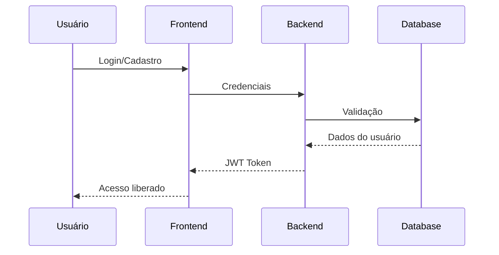
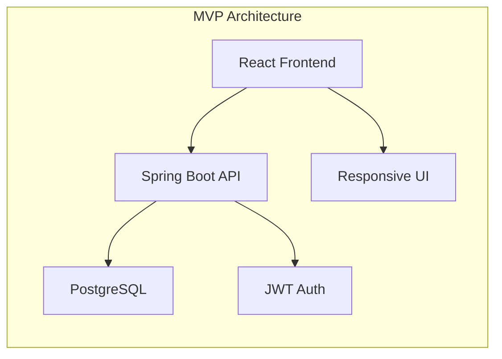

# MVP - Produto Mínimo Viável

Este documento apresenta um resumo das definições e escopo do Produto Mínimo Viável (MVP) do FinBoost+. O MVP representa a primeira versão funcional da aplicação, focada nas funcionalidades essenciais para validação do conceito.

!!! info "Documento Completo"
    Este é um resumo executivo do MVP. Para acesso ao documento completo com especificações detalhadas e requisitos técnicos, consulte: [MVP Completo no GitHub](https://github.com/Finboostplus/finboostplus-app/blob/main/project_docs/documentos/mvp.md)

## Definição do MVP

O MVP do FinBoost+ foi definido com foco na entrega de valor imediato aos usuários, priorizando funcionalidades que resolvem os problemas centrais identificados: controle financeiro e divisão transparente de despesas em grupo.

### Critérios de Sucesso

**Funcional**
- Usuários conseguem registrar e dividir despesas
- Cálculos de saldos são precisos e transparentes
- Interface é intuitiva para usuários não técnicos

**Técnico**
- Sistema é estável e responsivo
- APIs são seguras e bem documentadas
- Código segue padrões estabelecidos

## Funcionalidades Incluídas

### Core - Funcionalidades Essenciais

**Sistema de Autenticação**

- Cadastro de novos usuários com validação
- Login seguro com JWT
- Perfil básico do usuário

**Gerenciamento de Grupos**
- Criação e edição de grupos financeiros
- Convite e remoção de membros
- Configurações de grupo (nome, descrição, categoria)
- Histórico de atividades do grupo

**Controle de Despesas**
- Registro de despesas individuais e compartilhadas
- Categorização de novas despesas
- Divisão flexível entre membros (igual ou personalizada)

**Dashboard e Relatórios**
- Visão geral de saldos por grupo
- Histórico de transações
- Gráficos básicos de gastos por categoria
- Resumo mensal de atividades

### Secundárias - Funcionalidades de Suporte

**Interface e Usabilidade**
- Design responsivo para mobile e desktop
- Tema claro/escuro
- Buscas e filtros básicos

## Funcionalidades Excluídas do MVP

Para manter o foco e viabilizar a entrega no prazo estabelecido, algumas funcionalidades foram deliberadamente deixadas para versões futuras:

### Integrações Externas
- Conexão com bancos e cartões
- APIs de pagamento (PIX, cartão)
- Sincronização com planilhas
- Integração com outros apps financeiros

### Recursos Avançados
- Inteligência artificial para sugestões
- Reconhecimento automático de recibos
- Análises preditivas de gastos
- Relatórios avançados e exportação

### Funcionalidades Sociais
- Chat integrado entre membros dos grupos
- Sistema de pontuação/gamificação
- Comunidade de usuários

!!! warning "Escopo Controlado"
    A exclusão dessas funcionalidades não significa que elas não são importantes, mas sim uma decisão estratégica para garantir que o MVP seja entregue com qualidade dentro do cronograma disponível.

## Arquitetura Simplificada

### Decisões Técnicas para o MVP

**Frontend**
- React com hooks para gerenciamento de estado
- TailwindCSS para estilização rápida
- Recharts para gráficos básicos

**Backend**
- Spring Boot com arquitetura em camadas
- JPA/Hibernate para persistência
- Spring Security para autenticação
- Validação robusta de dados

**Infraestrutura**
- PostgreSQL como banco principal
- Docker para desenvolvimento local
- Deploy manual para demonstração

## Métricas de Sucesso

### Técnicas
- **Performance**: Tempo de resposta < 2 segundos
- **Segurança**: Zero vulnerabilidades críticas
- **Cobertura de Testes**: Mínimo 70% backend, 70% frontend

### Usabilidade
- **Onboarding**: Usuário consegue criar primeiro grupo em < 5 minutos
- **Divisão de Despesa**: Processo completo em < 5 cliques
- **Navegação**: Interface intuitiva sem necessidade de tutorial

### Negócio
- **Adoção**: Demonstração funcional para avaliadores
- **Documentação**: 100% das funcionalidades documentadas

## Validação e Testes

### Cenários de Teste Principais

**Fluxo de Usuário Completo**
1. Usuário se cadastra na plataforma
2. Cria seu primeiro grupo financeiro
3. Adiciona outros membros
4. Registra primeira despesa compartilhada
5. Visualiza saldo calculado automaticamente

**Casos de Borda**
- Divisões com valores decimais complexos
- Grupos com muitos membros (10+)
- Despesas com valores muito altos/baixos
- Comportamento com conexão instável

## Conclusão

O MVP do FinBoost+ atende aos objetivos estabelecidos, fornecendo uma base sólida para futuras expansões. A arquitetura implementada permite escalabilidade, e o feedback inicial dos usuários valida a proposta de valor do produto.

Para detalhes técnicos da implementação atual, veja [Funcionalidades](features.md).