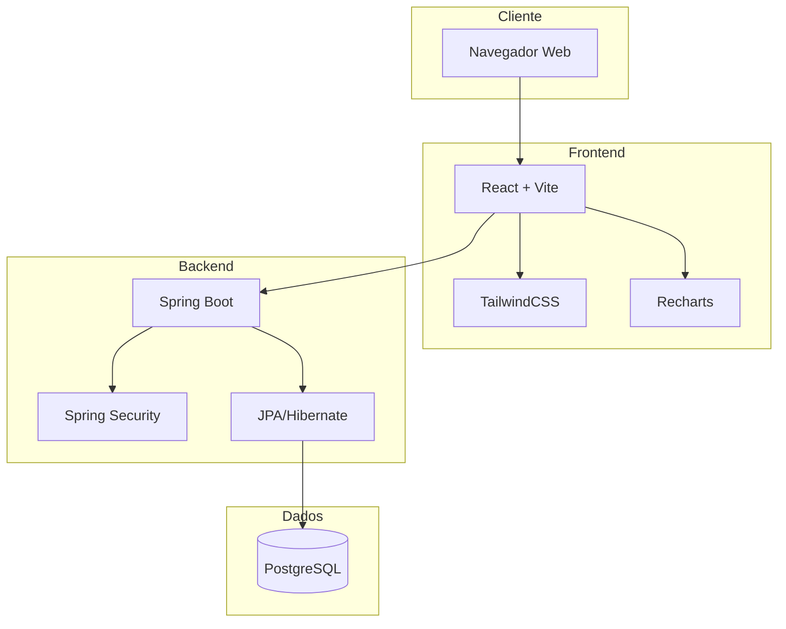

# Visão Geral do Projeto

O **FinBoost+** é uma aplicação web fullstack desenvolvida para solucionar problemas comuns no controle financeiro. O projeto nasceu da necessidade de uma ferramenta que combine simplicidade de uso com funcionalidades robustas para gestão de despesas em grupo.

## Contexto e Motivação

### Problema Identificado

O gerenciamento de finanças compartilhadas é um desafio constante em diversos cenários: divisão de contas entre amigos, controle de gastos familiares, gestão de despesas em viagens ou repúblicas estudantis. As soluções existentes frequentemente são complexas demais para uso casual ou limitadas demais para necessidades reais.

### Nossa Solução

O FinBoost+ oferece uma abordagem equilibrada, combinando funcionalidades essenciais de controle financeiro com uma interface intuitiva e recursos colaborativos eficientes.

## Objetivos do Projeto

### Objetivo Principal
Criar uma plataforma web que simplifique o controle financeiro compartilhado, oferecendo transparência nas divisões de despesas e facilidade de uso para todos os perfis de usuários.

### Objetivos Específicos

**Para Usuários Finais:**

- Reduzir conflitos relacionados a divisão de gastos
- Proporcionar visibilidade clara sobre saldos e débitos
- Facilitar o acompanhamento de gastos em grupo
- Oferecer insights através de relatórios e gráficos

**Para o Desenvolvimento Técnico:**

- Aplicar conhecimentos adquiridos no curso de Desenvolvimento Full-Stack
- Demonstrar competências em arquitetura de software moderna
- Implementar boas práticas de desenvolvimento e documentação
- Criar um projeto que sirva como portfólio profissional

## Arquitetura da Solução

### Decisões Arquiteturais

**Separação Frontend/Backend**

- Permite desenvolvimento paralelo das equipes
- Facilita escalabilidade e manutenção
- Possibilita futuras integrações (app mobile)

**Stack Tecnológico Moderna**

- React 19 com Vite para desenvolvimento ágil e performance
- Spring Boot 3.5+ para APIs robustas e seguras
- PostgreSQL para confiabilidade de dados
- JWT para autenticação stateless

**Padrões de Desenvolvimento**

- API RESTful seguindo padrões de mercado
- Design responsivo mobile-first
- Validação de dados em múltiplas camadas
- Arquitetura em camadas no backend

## Metodologia de Desenvolvimento

### Organização da Equipe

O projeto foi desenvolvido por uma equipe multidisciplinar dividida em frentes especializadas:

- **Gestão de Projeto**: Coordenação, planejamento e integração
- **Backend**: API, banco de dados e segurança
- **Frontend**: Interface, experiência do usuário e integrações

### Processo de Desenvolvimento

**Planejamento Inicial**

1. Definição de requisitos e MVP
2. Criação de personas e histórias de usuário
3. Design da arquitetura e banco de dados
4. Estabelecimento de padrões de código

**Desenvolvimento Iterativo**

1. Sprints focadas em funcionalidades completas
2. Integração contínua entre frontend e backend
3. Testes regulares e validação
4. Documentação paralela ao desenvolvimento

### Ferramentas e Práticas

**Controle de Versão**

- Git com metodologia GitFlow
- Pull Requests obrigatórios
- Code review entre pares

**Documentação**

- Documentação técnica detalhada (MkDocs)
- Wiki para documentação interna (GitHub Wiki)
- Documentação de API interativa (Swagger)
- Registro de decisões arquiteturais

**Qualidade de Código**

- Padrões de commit semântico
- Testes automatizados frontend e backend
- Análise de cobertura de código
- Revisões regulares de código

## Diferenciais da Solução

### Técnicos

**Arquitetura Escalável**

- Separação clara de responsabilidades
- APIs bem documentadas e versionadas
- Banco de dados otimizado

**Segurança**

- Autenticação JWT com refresh tokens
- Validação rigorosa de dados
- Proteção contra ataques comuns (XSS, CSRF)
- Controle de acesso baseado em roles

**Performance**

- Otimizações de consultas no banco
- Lazy loading de componentes
- Cache inteligente de requisições
- Interface responsiva e fluida

### Experiência do Usuário

**Interface Intuitiva**

- Design clean e moderno
- Navegação simplificada
- Feedback visual claro
- Suporte a temas (claro/escuro)

**Funcionalidades Práticas**

- Divisão de despesas
- Cálculo transparente de saldos
- Panéis visuais interativos

## Impacto Esperado

### Para Usuários

- Redução de tempo gasto em cálculos manuais
- Maior transparência em gastos compartilhados
- Melhor organização financeira 
- Redução de conflitos por questões financeiras

### Para a Equipe de Desenvolvimento

- Aplicação prática de conhecimentos técnicos
- Experiência em projeto colaborativo real
- Portfólio profissional robusto
- Preparação para mercado de trabalho

!!! note "Projeto Acadêmico"
    O FinBoost+ foi desenvolvido como projeto final do curso **Desenvolvimento Full-Stack Jr** oferecido pela **+Prati & Codifica**. Embora seja um projeto acadêmico, foi construído seguindo padrões profissionais de mercado e pode ser utilizado em cenários reais.

## Próximos Passos

Para informações sobre a implementação, veja [Funcionalidades](features.md).