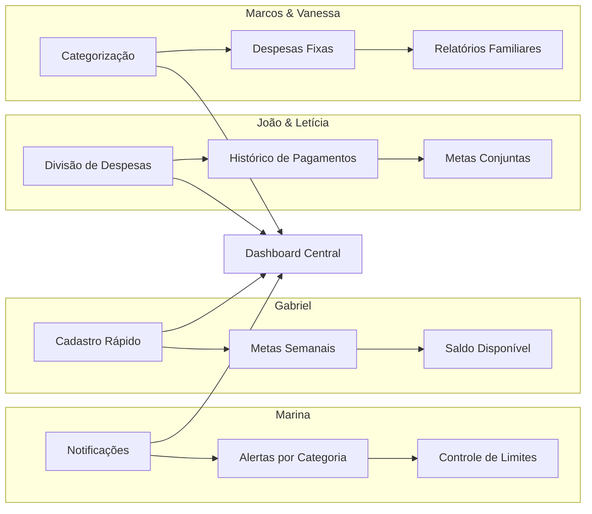

# Personas Principais

As personas são representações fictícias dos usuários reais baseadas em pesquisa e análise de necessidades. 
Para o **FinBoost+**, definimos 4 personas principais que orientam o desenvolvimento das funcionalidades do MVP, 
cobrindo diferentes contextos de uso do controle financeiro compartilhado.

## Por que Personas?

As personas nos ajudam a:
- **Focar nas necessidades reais** dos usuários durante o desenvolvimento
- **Priorizar funcionalidades** que resolvem problemas genuínos
- **Criar uma experiência consistente** em todos os fluxos da aplicação
- **Validar decisões de design** com base em cenários concretos

## Personas do MVP

### Marina - A Gastadora Impulsiva

**26 anos | Social Media Freelancer | Belo Horizonte-MG**

**Contexto:** Trabalha com clientes diversos, tem renda instável e não consegue controlar seus gastos impulsivos, 
especialmente compras online.

**Objetivo Financeiro:** Gastar menos do que ganha, diminuir dívidas no cartão e evitar compras por impulso.

**Principais Dores:**
- Não sabe quanto pode gastar no momento
- Esquece de registrar gastos regulares
- Vive no limite do cartão de crédito
- Falta de controle sobre categorias de gasto

**Como o FinBoost+ Ajuda:**
- Notificações em tempo real sobre gastos
- Alertas quando se aproxima de limites por categoria
- Relatórios visuais simples e informativos
- Classificação automática de gastos

> *"Quando vi, já tinha estourado o cartão de novo."*

---

### Gabriel - O Estudante Consciente

**22 anos | Estagiário e Estudante de Engenharia | Recife-PE**

**Contexto:** Rotina apertada entre estágio e faculdade, quer fazer o dinheiro durar e já faz algum controle em caderno.

**Objetivo Financeiro:** Ter uma reserva de emergência e controlar gastos com transporte e alimentação.

**Principais Dores:**
- Falta de tempo para registrar tudo detalhadamente
- Dificuldade em manter disciplina de controle
- Precisa de informações rápidas para tomar decisões
- Quer saber se ainda pode gastar no mês

**Como o FinBoost+ Ajuda:**
- Cadastro rápido de gastos do dia a dia
- Alertas semanais de controle
- Visualização clara de quanto ainda pode gastar
- Metas semanais simples de configurar

> *"Preciso de algo rápido pra saber se ainda dá pra pedir delivery."*

---

### João e Letícia - O Casal Organizado

**30 e 28 anos | Designer e Enfermeira | São Paulo-SP**

**Contexto:** Moram juntos, dividem contas como aluguel, mercado e luz. Querem juntar dinheiro para uma viagem 
internacional.

**Objetivo Financeiro:** Evitar brigas por dinheiro e poupar mensalmente de forma justa entre os dois.

**Principais Dores:**
- Desorganização na divisão de despesas domésticas
- Esquecimento de quem pagou cada conta
- Dificuldade em acompanhar contribuição de cada um
- Falta de clareza sobre economia conjunta

**Como o FinBoost+ Ajuda:**
- Divisão automática de despesas compartilhadas
- Visualização clara de quem pagou o quê
- Metas mensais conjuntas de economia
- Relatórios de contribuição de cada pessoa

> *"Eu paguei o mercado mês passado, agora é sua vez!"*

---

### Marcos e Vanessa - Família com Filha

**35 e 33 anos | Professor e Confeiteira | Campinas-SP**

**Contexto:** Têm uma filha pequena e precisam organizar o orçamento doméstico com renda variável da confeitaria.

**Objetivo Financeiro:** Ter controle das despesas domésticas e economizar para emergências familiares.

**Principais Dores:**
- Falta de controle sobre despesas fixas da casa
- Dificuldade em acompanhar todos os pagamentos
- Renda variável complica planejamento
- Necessidade de reserva para imprevistos com a filha

**Como o FinBoost+ Ajuda:**
- Categorização de despesas por tipo (casa, filha, pessoal)
- Divisão justa das contas do lar
- Visualização dos saldos familiares
- Metas de poupança para emergências

> *"Precisamos saber para onde está indo nosso dinheiro todo mês."*

## Mapeamento de Funcionalidades

Cada persona influencia diretamente as funcionalidades que priorizamos no desenvolvimento:

## Validação das Personas

### Critérios de Representatividade

**Diversidade de Contextos:**
- Individual (Marina, Gabriel)
- Casal (João e Letícia)
- Família (Marcos e Vanessa)

**Variação de Perfis:**
- Diferentes idades (22-35 anos)
- Diferentes profissões e rendas
- Diferentes níveis de organização financeira
- Diferentes localizações no Brasil

**Problemas Financeiros Cobertos:**
- Gastos impulsivos e falta de controle
- Tempo limitado para organização
- Divisão justa de despesas compartilhadas
- Planejamento familiar com renda variável

### User Stories Derivadas

Cada persona gerou **3-4 user stories específicas** que cobrem:

- **Cadastro e controle** de despesas pessoais
- **Divisão transparente** de gastos compartilhados
- **Metas e alertas** personalizados por contexto
- **Relatórios e visualizações** adequados ao perfil

## Personas Futuras

Além das 4 personas principais do MVP, identificamos **4 personas adicionais** que orientarão funcionalidades de 
versões futuras:

- **Carlos** - Profissional Autônomo (separação contas pessoal/profissional)
- **Rafael** - Planejador Financeiro (relatórios avançados e integrações)
- **Casa Conectada** - República de Amigos (divisão complexa entre múltiplos usuários)
- **Organização de Eventos** - Grupos Ocasionais (eventos específicos e temporários)

## Impacto no Desenvolvimento

### Decisões de UX/UI

**Interface Simples e Rápida** (Gabriel)
- Formulários com poucos campos obrigatórios
- Ações rápidas na tela principal
- Navegação intuitiva

**Clareza nas Divisões** (João & Letícia, Marcos & Vanessa)
- Visualização clara de "quem deve quanto"
- Histórico de pagamentos acessível
- Cálculos transparentes e auditáveis

**Controle e Alertas** (Marina)
- Notificações não-invasivas
- Cores e indicadores visuais claros
- Configurações de limite personalizáveis

### Priorização de Features

1. **Funcionalidades Essenciais** (todas as personas)
   - Cadastro de despesas
   - Divisão de gastos
   - Dashboard com resumos

2. **Funcionalidades Importantes** (2-3 personas)
   - Sistema de notificações
   - Metas e orçamentos
   - Relatórios por categoria

3. **Funcionalidades Desejáveis** (1-2 personas)
   - Exportação de dados
   - Integrações bancárias (futuro)

!!! tip "Metodologia" 
    As personas foram criadas utilizando **LLMs (DeepSeek, ChatGPT e Gemini)** através de prompts que simularam casos de pessoas reais com necessidades específicas de controle financeiro. A equipe avaliou e selecionou as melhores respostas geradas, refinando-as para criar perfis consistentes e realistas. Com base nessas personas validadas,foram derivadas **user stories específicas** e **cenários de uso detalhados** que orientam o desenvolvimento do produto.

## Documentação Completa

Para acessar a especificação completa das personas, incluindo jornadas detalhadas, motivações e cenários de uso 
ampliados:

**[Personas Detalhadas - GitHub](https://github.com/Finboostplus/finboostplus-app/blob/main/project_docs/documentos/personas.md)**

**[User Stories Completas - GitHub](https://github.com/Finboostplus/finboostplus-app/blob/main/project_docs/documentos/user_stories.md)**

---

*As personas são revisadas e validadas continuamente durante o desenvolvimento, garantindo que as funcionalidades 
implementadas atendam às necessidades reais dos usuários.*