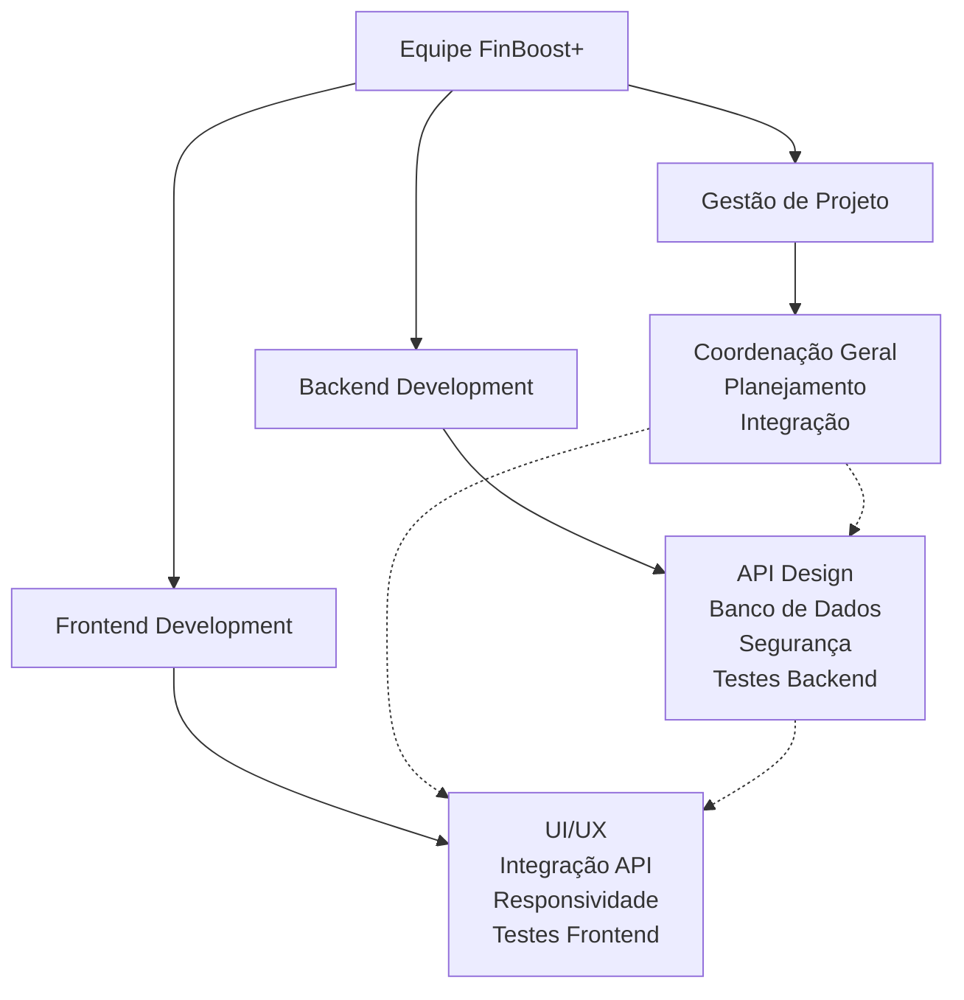
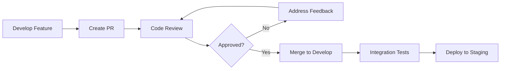

# Equipe do Projeto

O **FinBoost+** foi desenvolvido por uma equipe multidisciplinar de estudantes do curso **Desenvolvimento Full-Stack Jr** da **+Prati & Codifica**. Este documento apresenta a estrutura organizacional da equipe e as contribuições para o projeto.

## Estrutura Organizacional

### Metodologia de Trabalho

A equipe adotou uma abordagem híbrida combinando elementos de metodologias ágeis com práticas acadêmicas, organizando-se em times especializadas mas com colaboração constante entre todas as frentes.

### Distribuição de Responsabilidades

**Gestão e Coordenação**
- Planejamento de sprints e cronograma
- Coordenação entre equipes frontend e backend
- Gestão de requisitos e escopo
- Facilitação de reuniões e cerimônias ágeis
- Documentação e deploy do projeto

**Desenvolvimento Backend**
- Arquitetura da API REST
- Modelagem e implementação do banco de dados
- Sistema de autenticação e autorização
- Lógica de negócio e algoritmos financeiros
- Testes automatizados e documentação da API

**Desenvolvimento Frontend**
- Design e implementação da interface do usuário
- Experiência do usuário (UX) e usabilidade
- Integração com APIs backend
- Responsividade e otimização para diferentes dispositivos
- Testes de componentes e end-to-end

## Composição da Equipe

### Gestão de Projeto

- **Alan**

### Equipe Backend

- **Bruno**
- **Cristiano**
- **João**

### Equipe Frontend

- **Cleiton**
- **Hugo**

## Metodologia de Desenvolvimento

### Processos Adotados

**Scrum Adaptado**
- Sprints de 2 semanas com objetivos claros

**GitFlow**
- Branch `main` para código de produção
- Branch `develop` para integração contínua
- Feature branches para desenvolvimento de funcionalidades
- Pull requests obrigatórios com code review

### Ferramentas de Colaboração

**Desenvolvimento**
- **GitHub**: Controle de versão e colaboração de código
- **VS Code**: IDE usada no desenvolvimento do frontend
- **IntelliJ**: IDE usada no desenvolvimento do backend
- **Docker**: Ambientes de desenvolvimento consistentes
- **Postman** e **Scalar**: Testes e documentação de APIs

**Gestão e Comunicação**
- **Discord**: Comunicação e reuniões
- **Notion**: Documentação, planejamento e knowledge base
- **GitHub Wiki**: Documentação técnica para os times
- **MkDocs**: Documentação pública e técnica

**Design e Prototipagem**
- **Draw.io**: Diagramas técnicos e arquiteturais

## Processo de Code Review

### Critérios de Avaliação

**Qualidade Técnica**
- Aderência aos padrões de código estabelecidos
- Performance e otimização
- Segurança e validações adequadas
- Cobertura de testes apropriada

**Funcionalidade**
- Atendimento aos requisitos especificados
- Integração adequada com componentes existentes
- Tratamento de casos de erro e edge cases
- Usabilidade e experiência do usuário

### Fluxo de Aprovação

## Aprendizados e Crescimento

### Competências Desenvolvidas

**Técnicas**
- Desenvolvimento fullstack com tecnologias modernas
- Arquitetura de software e design patterns
- Testes automatizados e DevOps básico
- Colaboração em projetos de código aberto

**Interpessoais**
- Trabalho em equipe multidisciplinar
- Comunicação técnica efetiva
- Resolução de conflitos e tomada de decisões em grupo
- Mentoria e compartilhamento de conhecimento

### Desafios Superados

**Técnicos**
- Integração complexa entre frontend e backend
- Sincronização de desenvolvimento paralelo
- Debugging de problemas de integração
- Otimização de performance em consultas complexas

**Organizacionais**
- Coordenação de equipe grande (10+ pessoas)
- Conciliação de diferentes níveis de experiência
- Gestão de tempo e prioridades acadêmicas
- Comunicação efetiva em ambiente remoto

!!! note "Equipe em Formação"
    É importante destacar que todos os membros da equipe estão em processo de formação como desenvolvedores full-stack. As contribuições refletem o crescimento e aprendizado ao longo do projeto, com apoio mútuo e compartilhamento constante de conhecimento.

## Agradecimentos

**+Prati & Codifica**
- Ensino de programação
- Mentoria par soft skills
- Oportunidade de desenvolvimento de projeto real

---

**O FinBoost+ é resultado do esforço coletivo de uma equipe dedicada, representando não apenas um projeto acadêmico, mas uma jornada de crescimento profissional e pessoal de todos os envolvidos.**

Para mais informações sobre o contexto do projeto, consulte [Visão Geral](overview.md).

Para detalhes sobre as funcionalidades desenvolvidas, veja [Funcionalidades](features.md).