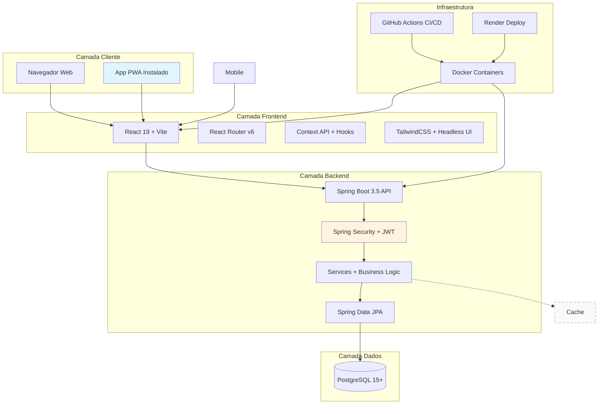
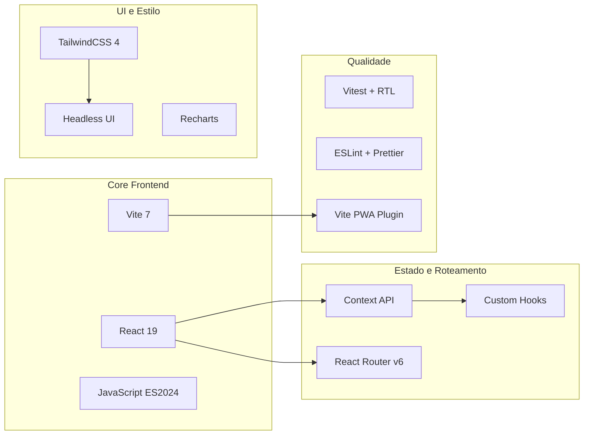
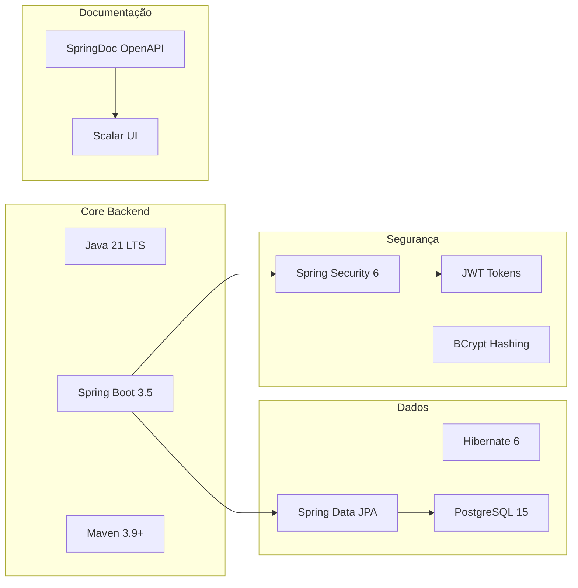
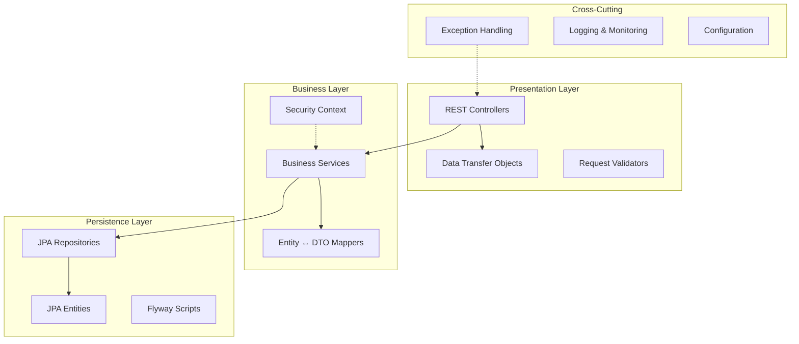
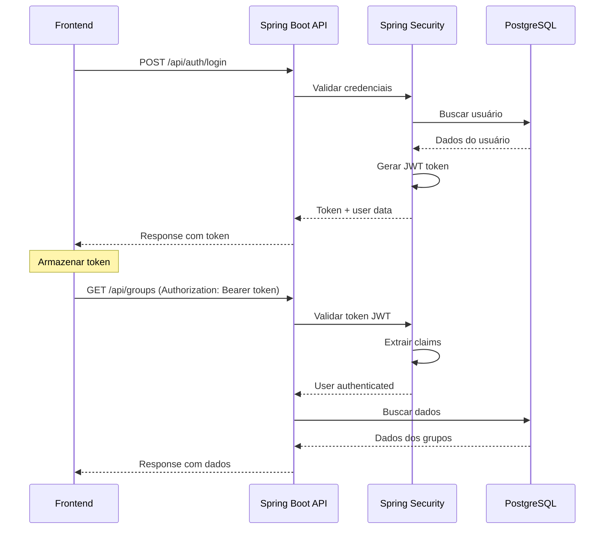
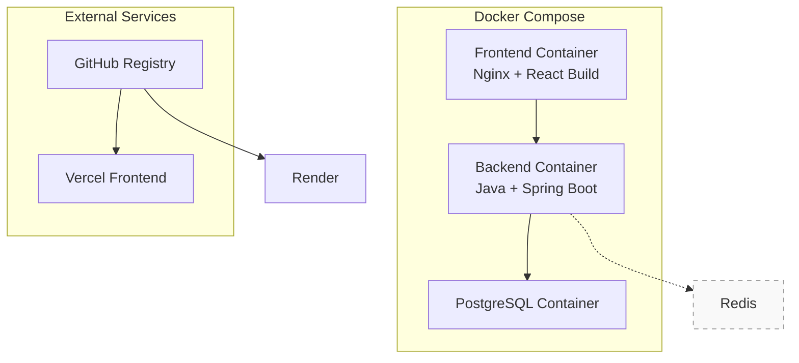

# Visão da Arquitetura

O **FinBoost+** foi projetado seguindo uma arquitetura moderna e escalável, com separação clara entre frontend e backend, facilitando manutenção, testes e futuras expansões do sistema.

## Arquitetura Geral do Sistema

### Visão de Alto Nível



*Cache Redis planejado para versões futuras

### Princípios Arquiteturais

**Separação de Responsabilidades**
- Frontend focado em UX e apresentação
- Backend concentrado em lógica de negócio e dados
- Banco de dados otimizado para performance e consistência

**Escalabilidade e Manutenibilidade**
- Arquitetura em camadas bem definidas
- Componentes desacoplados e testáveis
- APIs RESTful padronizadas

**Segurança por Design**
- Autenticação JWT com refresh tokens
- Validação rigorosa em múltiplas camadas
- Controle de acesso baseado em contexto de grupo

## Arquitetura Frontend - React

### Stack Tecnológico



### Estrutura de Arquivos

```
frontend/
├── src/
│   ├── components/          # Componentes reutilizáveis
│   │   ├── ui/             # Componentes atômicos (Button, Input)
│   │   ├── layout/         # Layout e navegação
│   │   ├── forms/          # Formulários complexos
│   │   └── features/       # Componentes de funcionalidades
│   ├── pages/              # Páginas principais (rotas)
│   ├── hooks/              # Custom hooks reutilizáveis
│   ├── context/            # Providers globais
│   │   ├── AuthContext.jsx # Autenticação
│   │   ├── GroupContext.jsx# Estado de grupos
│   │   └── ThemeContext.jsx# Tema e preferências
│   ├── services/           # Integração com APIs
│   ├── routes/             # Configuração de rotas
│   └── utils/              # Funções utilitárias
└── public/                 # Assets estáticos + PWA
```

### Padrões de Componentes

**Atomic Design + Feature-First**
- **Atoms**: Componentes básicos (Button, Input, Icon)
- **Molecules**: Combinações simples (SearchBox, FormField)
- **Organisms**: Componentes complexos (ExpenseList, Dashboard)
- **Features**: Agrupamento por funcionalidade (Auth, Groups, Expenses)

### Gerenciamento de Estado

Utilizamos **Context API + Custom Hooks** para gerenciamento de estado global:

```jsx
// Exemplo de Custom Hook
export const useAuth = () => {
  const context = useContext(AuthContext)
  if (!context) {
    throw new Error('useAuth must be used within AuthProvider')
  }
  return context
}
```

**Principais Contexts:**
- `AuthContext` - Autenticação e dados do usuário
- `GroupContext` - Estado de grupos ativos
- `ThemeContext` - Preferências de tema e UI

## Arquitetura Backend - Spring Boot

### Stack Tecnológico



### Arquitetura em Camadas



### Estrutura de Arquivos

```
backend/
├── src/main/java/com/finboostplus/
│   ├── controller/         # REST Controllers
│   ├── service/            # Business Logic
│   ├── model/              # JPA Entities
│   ├── repository/         # Data Access
│   ├── dto/                # Data Transfer Objects
│   │   ├── request/        # Request DTOs
│   │   └── response/       # Response DTOs
│   ├── config/             # Configuration Classes
│   ├── security/           # Security Components
│   └── exception/          # Exception Handling
└── src/main/resources/
    ├── application.yml     # Main Configuration
    └── db/migration/       # Database Scripts
```

### Padrão de Implementação

**Controller → Service → Repository**
```java
@RestController
@RequestMapping("/api/groups")
@RequiredArgsConstructor
public class GroupController {
    private final GroupService groupService;
    
    @GetMapping
    public ResponseEntity<PagedResponse<GroupDTO>> getUserGroups(
            @PageableDefault Pageable pageable,
            Authentication authentication) {
        return ResponseEntity.ok(groupService.getUserGroups(authentication.getName(), pageable));
    }
}
```

## Banco de Dados - Modelo Relacional

### Principais Relacionamentos

**Grupos e Membros**
- Um usuário pode ser dono de múltiplos grupos
- Um usuário pode participar de múltiplos grupos
- Cada grupo tem um dono e múltiplos membros

**Despesas e Divisões**
- Cada despesa pertence a um grupo
- Despesas são divididas entre membros selecionados
- Cálculo automático de valores individuais

## Segurança e Autenticação

### Fluxo de Autenticação JWT



### Níveis de Proteção

**Rotas Públicas**
- Registro, login e recuperação de senha

**Rotas Protegidas (JWT Required)**
- Todas as operações de grupos e despesas
- Dashboard e relatórios

**Controle de Acesso por Contexto**
- Apenas membros do grupo podem ver dados do grupo
- Apenas dono do grupo pode gerenciar membros
- Usuários podem editar apenas suas próprias despesas

## Integração e Comunicação

### API RESTful

**Padrões de Endpoint**
```
GET    /api/groups              # Listar grupos
POST   /api/groups              # Criar grupo
GET    /api/groups/{id}         # Detalhes do grupo
PUT    /api/groups/{id}         # Atualizar grupo
DELETE /api/groups/{id}         # Deletar grupo

GET    /api/groups/{id}/expenses # Despesas do grupo
POST   /api/groups/{id}/expenses # Criar despesa
```

**Formato de Resposta Padrão**
```json
{
  "success": true,
  "message": "Operação realizada com sucesso",
  "data": { /* dados da resposta */ },
  "timestamp": "2024-01-01T10:00:00Z"
}
```

## Deployment e Infraestrutura

### Containerização com Docker



### Estratégia de Deploy

**Desenvolvimento**
- Docker Compose para ambiente local completo
- Hot reload habilitado em frontend e backend

**Produção**
- Frontend: Vercel 
- Backend: Render 
- Banco: PostgreSQL managed service
- CI/CD: GitHub Actions

## Monitoramento e Performance

### Otimizações Implementadas

**Frontend**
- Code splitting por rota
- Lazy loading de componentes
- Service Worker para cache de assets
- Otimização de bundle com Vite

**Backend**
- Connection pooling do PostgreSQL
- Queries JPA otimizadas
- Paginação em listagens
- Spring Boot Actuator para métricas

**Banco de Dados**
- Índices em colunas de busca frequente
- Constraints para integridade referencial

## Planos de Expansão

### Funcionalidades Futuras
- Notificações push em tempo real
- Relatórios avançados e exportação
- App mobile nativo (React Native)

---

!!! info "Documentação Viva"
    Esta arquitetura evolui junto com o projeto. Para detalhes de implementação específicos, consulte:

- [**Backend README**](https://github.com/Finboostplus/finboostplus-app/blob/main/backend/README.md) - Setup e execução
- [**Frontend README**](https://github.com/Finboostplus/finboostplus-app/blob/main/frontend/README.md) - Desenvolvimento local
- [**API Interativa**](api_interactive.md) - Documentação Scalar/Swagger
- [**GitHub Wiki**](https://github.com/Finboostplus/finboostplus-app/wiki) - Guias técnicos detalhados
