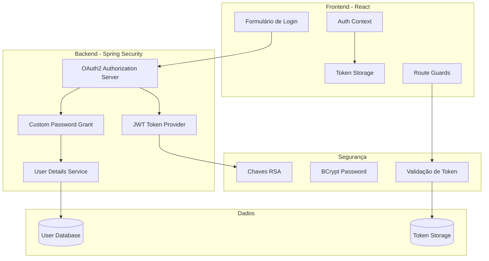
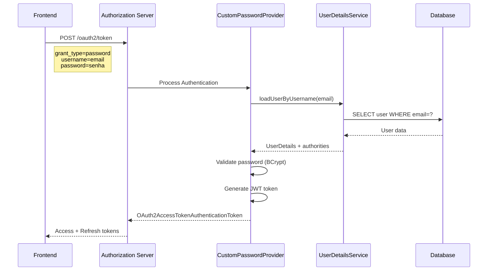
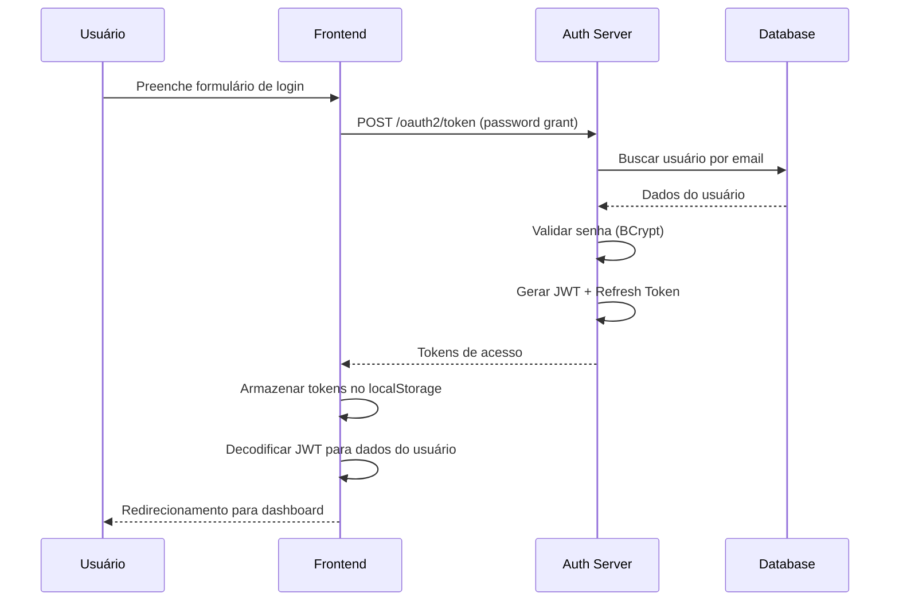
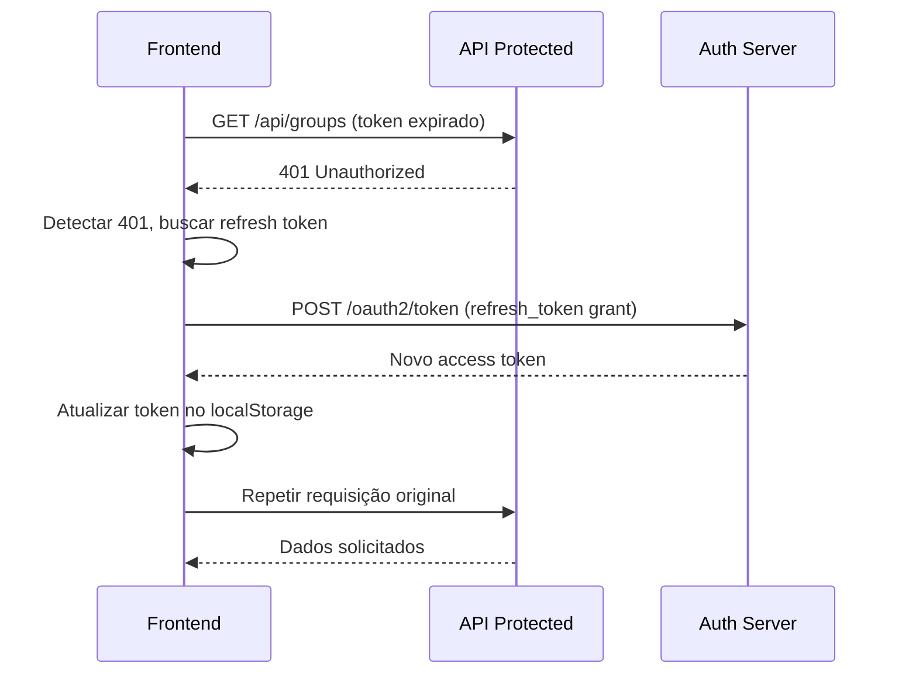
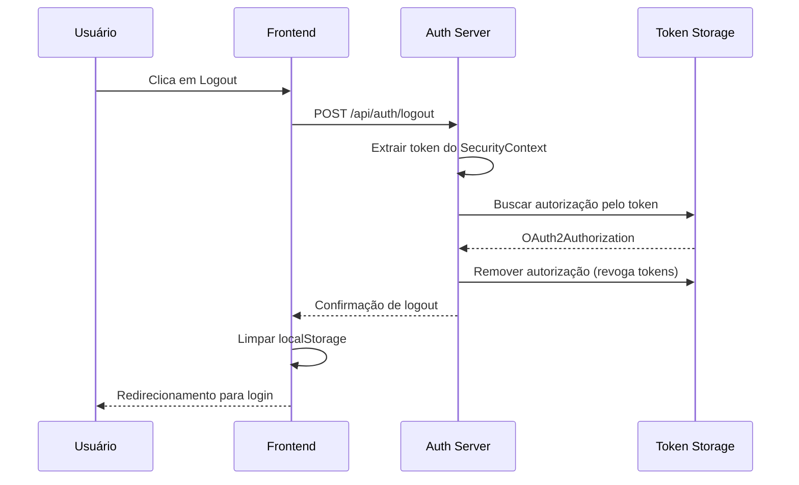

# Autenticação

O **FinBoost+** implementa um sistema de autenticação robusto baseado em **OAuth2 Authorization Server** com **JWT tokens** e **Spring Security**, fornecendo segurança de nível empresarial para todas as operações da aplicação.

## Visão Geral do Sistema

### Stack de Segurança



### Características Principais

**OAuth2 Authorization Server**
- Servidor de autorização completo com Spring Security
- Suporte a múltiplos grant types (password + refresh token)
- Tokens JWT auto-contidos com assinatura RSA

**Segurança Robusta**
- Senhas criptografadas com BCrypt
- Chaves RSA geradas dinamicamente
- Tokens com expiração configurável

**Performance Otimizada**
- Tokens JWT stateless (sem consulta ao banco)
- Claims customizadas para reduzir chamadas à API
- Refresh tokens para renovação automática

## Configuração do Authorization Server

### Componentes Principais

O sistema utiliza configurações injetáveis através de properties para máxima flexibilidade:

- **Client Registration**: Configuração do cliente OAuth2 com scopes `read` e `write`
- **Token Settings**: Access tokens JWT com duração configurável (padrão 24h)
- **Refresh Tokens**: Tokens de renovação com duração estendida (padrão 30 dias)
- **RSA Key Generation**: Chaves RSA 2048 bits geradas dinamicamente
```

### Token Settings

Tokens configurados para máxima segurança e usabilidade:

```java
@Bean
public TokenSettings tokenSettings() {
    return TokenSettings.builder()
            .accessTokenFormat(OAuth2TokenFormat.SELF_CONTAINED)
            .accessTokenTimeToLive(Duration.ofSeconds(jwtDurationSeconds))
            .refreshTokenTimeToLive(Duration.ofDays(refreshTokenDurationDays))
            .reuseRefreshTokens(true)
            .build();
}
```

## Custom Password Grant

### Fluxo de Autenticação

O sistema implementa um grant type customizado que processa autenticação via username/password:



### Implementação

O `CustomPasswordAuthenticationProvider` processa a autenticação completa:

1. **Validação do Cliente OAuth2**: Verifica client_id e client_secret
2. **Carregamento do Usuário**: Busca dados no banco via UserDetailsService
3. **Validação da Senha**: Compara hash BCrypt
4. **Geração de Tokens**: Cria JWT access token e refresh token

## Estrutura dos Tokens JWT

### Claims Personalizadas

Os tokens JWT incluem informações essenciais do usuário para reduzir consultas à API:

```json
{
  "sub": "usuario@email.com",
  "username": "usuario@email.com",
  "authorities": ["ROLE_USER"],
  "iss": "http://localhost:8080",
  "exp": 1706745600,
  "iat": 1706659200,
  "jti": "550e8400-e29b-41d4-a716-446655440000"
}
```

**Claims Principais:**
- `sub`: Email do usuário (identificador único)
- `username`: Nome para exibição na interface
- `authorities`: Roles e permissões do usuário
- `exp`: Timestamp de expiração do token

### Geração de Chaves RSA

Chaves RSA são geradas dinamicamente para assinatura dos tokens:

```java
private static RSAKey generateRsa() {
    KeyPair keyPair = generateRsaKey();
    RSAPublicKey publicKey = (RSAPublicKey) keyPair.getPublic();
    RSAPrivateKey privateKey = (RSAPrivateKey) keyPair.getPrivate();
    
    return new RSAKey.Builder(publicKey)
            .privateKey(privateKey)
            .keyID(UUID.randomUUID().toString())
            .build();
}
```

- **Algoritmo**: RSA 2048 bits para máxima segurança
- **Geração**: Nova chave a cada inicialização da aplicação
- **Key ID**: Identificador único para rotação de chaves

## Revogação de Tokens

### Casos de Uso

O sistema suporta revogação segura de tokens através da classe `TokenRevocationUtil`:

**Logout Seguro**: Remove tokens ativos do usuário
```java
@PostMapping("/api/auth/logout")
public ResponseEntity<ApiResponse> logout() {
    TokenRevocationUtil.revokeCurrentUserTokens(authorizationService);
    return ResponseEntity.ok(ApiResponse.success("Logout realizado com sucesso"));
}
```

**Alteração de Senha**: Revoga todos os tokens por segurança
```java
@PostMapping("/api/auth/change-password") 
public ResponseEntity<ApiResponse> changePassword(@RequestBody ChangePasswordRequest request) {
    userService.changePassword(request);
    TokenRevocationUtil.revokeCurrentUserTokens(authorizationService);
    return ResponseEntity.ok(ApiResponse.success("Senha alterada. Faça login novamente."));
}
```

### Funcionamento

A revogação busca o token atual no SecurityContext e remove a autorização completa (access + refresh tokens) do storage interno do OAuth2.

## Fluxos de Autenticação

### Login Completo



### Refresh Token Automático



### Logout com Revogação


    participant Auth as Auth Server
    
    F->>A: GET /api/groups (token expirado)
    A-->>F: 401 Unauthorized
    F->>F: Detectar 401, buscar refresh token
    F->>Auth: POST /oauth2/token (refresh_token grant)
    Auth-->>F: Novo access token
    F->>F: Atualizar token no localStorage
    F->>A: Repetir requisição original
    A-->>F: Dados solicitados
```

### Logout com Revogação


## Segurança e Monitoramento

### Proteções Implementadas

**Validação de Entrada**
- Sanitização de dados de entrada
- Validação de formato de email
- Rate limiting para tentativas de login

**Headers de Segurança**
- CORS configurado apropriadamente
- Headers HSTS para HTTPS obrigatório
- Content-Type validation

## Troubleshooting

### Problemas Comuns

**Token JWT Inválido**
```
Erro: "JWT signature does not match locally computed signature"
Causa: Chaves RSA não sincronizadas
Solução: Verificar geração de chaves no startup
```

**Client Authentication Failed**
```
Erro: "Client authentication failed"  
Causa: Client ID/Secret incorretos
Solução: Verificar variáveis de ambiente
```

**Refresh Token Expirado**
```
Erro: "Refresh token is expired"
Causa: Token expirou (30 dias padrão)
Solução: Usuário deve fazer login novamente
```

### Endpoints de Diagnóstico

```bash
# Verificar configuração do authorization server
GET /.well-known/oauth-authorization-server

# Obter chaves públicas JWK
GET /.well-known/jwks.json

# Health check da aplicação
GET /actuator/health
```

!!! tip "Boas Práticas"
    - Use sempre HTTPS em produção para proteger tokens
    - Configure CORS apropriadamente para evitar problemas de origem
    - Monitore logs de segurança regularmente
    - Implemente rate limiting para prevenir ataques de força bruta

!!! info "Recursos Adicionais"
    - [**API Interativa**](api_interactive.md) - Testar endpoints de autenticação
    - [**Banco de Dados**](database.md) - Estrutura de tabelas de usuários
    - [**Backend README**](https://github.com/Finboostplus/finboostplus-app/blob/main/backend/README.md) - Setup completo
    - [**Spring Security OAuth2**](https://spring.io/projects/spring-authorization-server) - Documentação oficial

---

*Sistema de autenticação implementado e documentado pela equipe técnica - versão atualizada em Agosto de 2025*