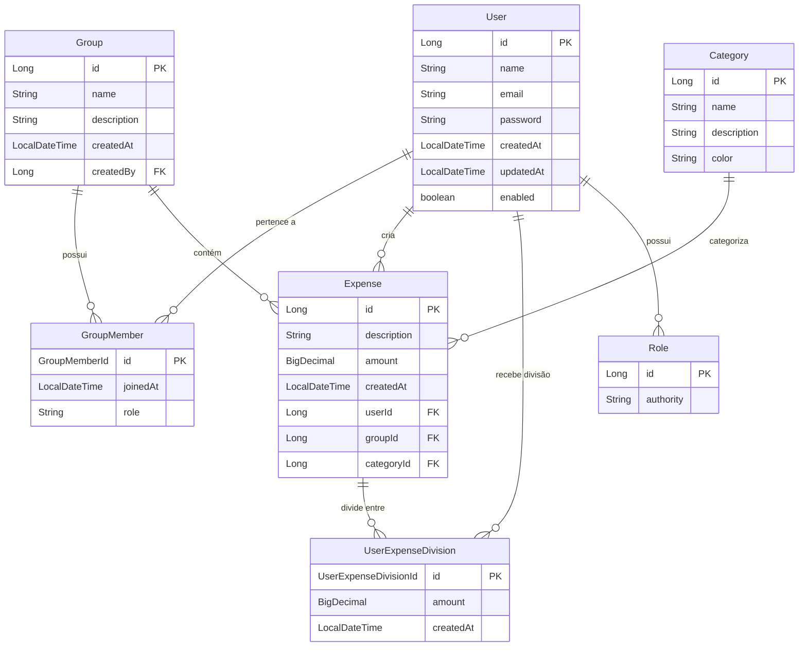

# Banco de Dados

## Visão Geral

O FinBoost+ utiliza **PostgreSQL** como banco principal e **H2** para testes. A estrutura foi projetada para suportar grupos financeiros colaborativos com controle granular de despesas e divisões entre membros.

## Diagrama de Relacionamentos



## Principais Entidades

### User  
Representa os usuários da aplicação.

| Campo     | Tipo          | Descrição              |
|-----------|--------------|-------------------------|
| id        | Long         | Identificador único     |
| name      | String       | Nome completo           |
| email     | String       | Email (único)           |
| password  | String       | Senha criptografada     |
| enabled   | Boolean      | Status da conta         |
| createdAt | LocalDateTime| Data de criação         |
| updatedAt | LocalDateTime| Última atualização      |

### Group  
Grupos financeiros onde usuários compartilham despesas.

| Campo     | Tipo          | Descrição              |
|-----------|--------------|-------------------------|
| id        | Long         | Identificador único     |
| name      | String       | Nome do grupo           |
| description | String     | Descrição opcional      |
| createdBy | Long         | ID do criador           |
| createdAt | LocalDateTime| Data de criação         |

### GroupMember  
Associação entre usuários e grupos com chave composta.

| Campo     | Tipo            | Descrição                              |
|-----------|----------------|-----------------------------------------|
| id        | GroupMemberId  | Chave composta (userId + groupId)      |
| role      | String         | Papel no grupo (ADMIN, MEMBER)         |
| joinedAt  | LocalDateTime  | Data de entrada                        |

### Expense  
Despesas registradas nos grupos.

| Campo     | Tipo          | Descrição              |
|-----------|--------------|-------------------------|
| id        | Long         | Identificador único     |
| description | String     | Descrição da despesa    |
| amount    | BigDecimal   | Valor total             |
| userId    | Long         | Quem pagou              |
| groupId   | Long         | Grupo associado         |
| categoryId| Long         | Categoria da despesa    |
| createdAt | LocalDateTime| Data de criação         |

### Category  
Categorias para organizar despesas.

| Campo     | Tipo          | Descrição              |
|-----------|--------------|-------------------------|
| id        | Long         | Identificador único     |
| name      | String       | Nome da categoria       |
| description | String     | Descrição               |
| color     | String       | Cor para UI             |

### UserExpenseDivision  
Como as despesas são divididas entre membros.

| Campo     | Tipo                | Descrição                           |
|-----------|--------------------|--------------------------------------|
| id        | UserExpenseDivisionId | Chave composta (userId + expenseId) |
| amount    | BigDecimal         | Valor que o usuário deve             |
| createdAt | LocalDateTime      | Data da divisão                      |

### Role  
Papéis e permissões dos usuários.

| Campo     | Tipo          | Descrição              |
|-----------|--------------|-------------------------|
| id        | Long         | Identificador único     |
| authority | String       | Nome do papel (ROLE_USER, ROLE_ADMIN) |

## Relacionamentos Principais

- **User ↔ Group**  
  Relacionamento: Many-to-Many através de GroupMember  
  Finalidade: Um usuário pode participar de múltiplos grupos  
  Chave: Composta por userId + groupId

- **Expense ↔ User**  
  Relacionamento: Many-to-Many através de UserExpenseDivision  
  Finalidade: Uma despesa pode ser dividida entre vários usuários  
  Lógica: Quem paga vs. quem deve

- **Group → Expense**  
  Relacionamento: One-to-Many  
  Finalidade: Cada despesa pertence a um grupo específico

## Configurações de Banco

**Desenvolvimento**
```
spring.datasource.url=jdbc:postgresql://localhost:5432/finboost
spring.datasource.username=finboost
spring.datasource.password=dev123
spring.jpa.hibernate.ddl-auto=update
```

**Testes**
```
spring.datasource.url=jdbc:h2:mem:testdb
spring.jpa.hibernate.ddl-auto=create-drop
spring.h2.console.enabled=true
```

**Produção**
```
spring.datasource.url=${DATABASE_URL}
spring.jpa.hibernate.ddl-auto=validate
spring.jpa.show-sql=false
```

## Segurança e Validações

- Senhas: Criptografadas com BCrypt
- Emails: Únicos e validados
- Relacionamentos: Integridade referencial mantida
- Auditoria: Campos de data automáticos