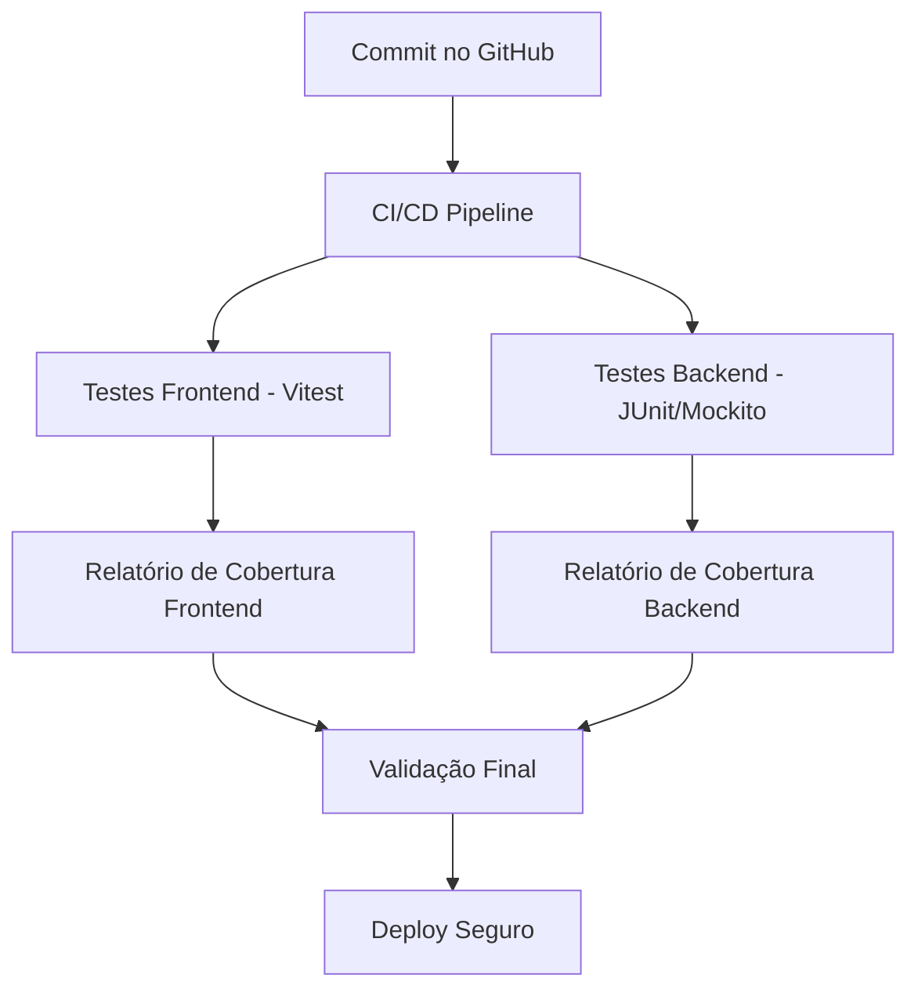

# Guia de Testes

Este projeto foi desenvolvido com **testes automatizados** desde o início, garantindo qualidade, confiabilidade e segurança na evolução do código.

A seguir, apresentamos uma visão geral de como os testes estão organizados.

---

## Estratégia de Testes

Adotamos uma abordagem **full-stack** de testes:

- **Frontend (React + Vite)**
    - Testes de componentes e interação de usuário com **Vitest** e **React Testing Library**.
    - Validação da experiência do usuário (UX) e fluxos principais da interface.

- **Backend (Spring Boot)**
    - Testes unitários com **JUnit 5** e **Mockito**.
    - Testes de integração com **Spring Boot Test**, validando APIs e regras de negócio.
    - Cobertura de segurança e autenticação com cenários controlados.

- **Cobertura de Código**
    - Meta: **≥ 70%** para frontend e backend.
    - Relatórios gerados automaticamente (JaCoCo no backend e coverage do Vitest no frontend).

---

## Como Executar os Testes

### Frontend

```bash
  cd frontend
  npm install
  npm test
```

- Executa todos os testes de componentes e integração.
- Para relatórios de cobertura:

```bash
  npm test -- --coverage
```

O relatório em HTML pode ser aberto em `frontend/coverage/index.html`.

---

### Backend

```bash
  cd backend
  ./mvnw test
```

- Executa todos os testes de serviços, controladores e repositórios.
- Para gerar relatório de cobertura (JaCoCo):

```bash
  ./mvnw test jacoco:report
```

O relatório pode ser aberto em `backend/target/site/jacoco/index.html`.

---

## Pipeline de Qualidade



---

## Exemplos de Validação

- **Fluxos críticos** são priorizados (cadastro, autenticação, criação de despesas, divisão de contas).
- **Regras de negócio** são validadas com testes unitários (ex.: cálculo de saldo compartilhado).
- **Integração com o banco** validada com Spring Boot Test.
- **Interface** validada com simulação de ações do usuário (cliques, formulários, navegação).
